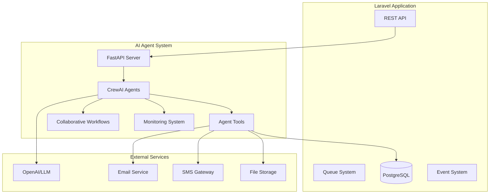

# CrewAI Collaborative Agent System - Complete Implementation

## 🤖 Overview

This CrewAI-powered collaborative AI agent system transforms your Laravel HR boilerplate into an intelligent, automated business platform. The system features **12 specialized AI agents** working together across **8 complete use cases** to automate HR processes, optimize project management, generate analytics insights, and streamline business operations with human-in-the-loop capabilities.

## 🎯 Key Features

### 🧠 Core Agents (6)
- **HR Management Agent**: Employee lifecycle management and policy enforcement
- **Project Management Agent**: Resource allocation and project coordination  
- **Analytics Agent**: Business intelligence and reporting
- **Workflow Engine Agent**: Process orchestration and automation
- **Integration Agent**: External system connectivity
- **Notification Agent**: Multi-channel communication management

### 🔧 Specialized Agents (6)
- **IT Support Agent**: System provisioning and technical support
- **Compliance Agent**: Document verification and policy compliance
- **Training Agent**: Learning and development coordination
- **Payroll Agent**: Compensation management and exception handling
- **Leave Processing Agent**: Leave request workflow management
- **Coverage Agent**: Employee absence coverage coordination

### 📋 Complete Use Cases (8)

#### 1. **Intelligent Employee Onboarding**
Multi-agent collaboration for streamlined new hire process
- **Agents**: HR + IT Support + Compliance + Training + Payroll
- **Workflow**: Document collection → System provisioning → Compliance verification → Training scheduling → Payroll setup
- **Duration**: 3-5 business days

#### 2. **Leave Management & Approval Workflow**
Automated leave processing with intelligent coverage management
- **Agents**: HR + Leave Processing + Coverage + Approval + Calendar
- **Workflow**: Request validation → Impact analysis → Coverage assignment → Approval routing → Calendar updates  
- **Duration**: 1-3 business days

#### 3. **Performance Review Coordination**
360-degree performance review automation
- **Agents**: HR + Analytics + Data Collection + Feedback Coordination
- **Workflow**: Review initiation → Data collection → Feedback coordination → Analysis compilation → Meeting scheduling
- **Duration**: 2-3 weeks

#### 4. **Payroll Exception Handling**
Automated detection and resolution of payroll discrepancies
- **Agents**: Payroll + Analytics + Approval + Notification
- **Workflow**: Exception detection → Pattern analysis → Auto-resolution → Escalation → Approval → Adjustment
- **Duration**: 1-2 business days

#### 5. **Employee Query Resolution**
Intelligent query routing and automated response generation
- **Agents**: HR + Knowledge Base + Classification + Escalation
- **Workflow**: Query classification → Knowledge search → Response generation → Quality check → Delivery
- **Duration**: Minutes to hours

#### 6. **Recruitment Process Automation**
End-to-end recruitment workflow with AI assistance
- **Agents**: HR + Screening + Scheduling + Evaluation + Offer Generation
- **Workflow**: Requirement analysis → Candidate screening → Interview scheduling → Evaluation → Offer generation
- **Duration**: 2-4 weeks

#### 7. **Compliance Monitoring**
Automated compliance checking and violation resolution
- **Agents**: Compliance + Document Verification + Training Check + Policy Verification
- **Workflow**: Audit initiation → Document verification → Training compliance → Policy check → Remediation planning
- **Duration**: 1 week

#### 8. **Employee Lifecycle Management**
Comprehensive lifecycle tracking and proactive management
- **Agents**: HR + Analytics + Career Planning + Performance Analysis + Retention Assessment
- **Workflow**: Stage assessment → Career planning → Performance analysis → Risk assessment → Action planning
- **Duration**: Ongoing

### 🔄 Human-in-the-Loop Features
- Intelligent escalation for complex decisions
- Approval workflows for critical actions
- Quality assurance checkpoints
- Manager override capabilities
- Audit trails for all decisions

### 📊 Monitoring & Analytics
- Real-time agent performance tracking
- System health monitoring with comprehensive metrics
- Business intelligence dashboards
- Workflow completion analytics
- User satisfaction tracking

## 🏗️ Architecture



## 🚀 Quick Start

### Prerequisites

- Python 3.8+
- PostgreSQL database
- Redis server
- OpenAI API key (or other LLM provider)
- Laravel application running

### Installation

1. **Clone and Setup**
```bash
cd laravel-boilerplate/ai-agents
chmod +x setup.sh
./setup.sh
```

2. **Configure Environment**
```bash
# Copy environment template
cp .env.example .env

# Edit configuration
nano .env
```

Required environment variables:
```env
# AI Model Configuration
OPENAI_API_KEY=your_openai_api_key_here
DEFAULT_LLM_MODEL=gpt-4-turbo-preview

# Database (should match Laravel .env)
DB_HOST=localhost
DB_PORT=5432
DB_DATABASE=laravel_hr_boilerplate
DB_USERNAME=postgres
DB_PASSWORD=your_password

# Redis
REDIS_HOST=localhost
REDIS_PORT=6379

# Laravel Integration
LARAVEL_API_URL=http://localhost:8000
LARAVEL_API_TOKEN=your_api_token
```

3. **Start the System**
```bash
# Start AI agent system
./start.sh

# Or manually
source venv/bin/activate
python main.py
```

4. **Verify Installation**
```bash
# Check system health
curl http://localhost:8001/health

# View available agents
curl http://localhost:8001/agents/status
```

### Docker Deployment

```bash
# Using Docker Compose
docker-compose -f docker-compose.ai-agents.yml up -d

# Check logs
docker-compose -f docker-compose.ai-agents.yml logs -f ai-agents
```

## 🎮 Usage

### Laravel Integration

The system integrates seamlessly with your Laravel application through the `AIAgentService`:

```php
use App\Services\AIAgentService;

class EmployeeController extends Controller
{
    public function __construct(private AIAgentService $agentService) {}
    
    public function store(StoreEmployeeRequest $request)
    {
        $employee = Employee::create($request->validated());
        
        // Trigger AI-powered onboarding
        $this->agentService->processEmployeeOnboarding([
            'employee_id' => $employee->id,
            'name' => $employee->name,
            'email' => $employee->email,
            'department_id' => $employee->department_id
        ]);
        
        return response()->json($employee);
    }
}
```

### Artisan Commands

```bash
# Check system health
php artisan agents:health --detailed

# Trigger employee onboarding
php artisan agents:onboard-employee 123

# Generate analytics report
php artisan agents:generate-analytics employee_summary
```

### Direct API Usage

```bash
# Process employee onboarding
curl -X POST http://localhost:8001/hr/onboard-employee \
  -H "Content-Type: application/json" \
  -d '{
    "employee_id": 123,
    "name": "John Doe",
    "email": "john@example.com",
    "department_id": 1
  }'

# Optimize project resources
curl -X POST http://localhost:8001/projects/optimize-resources \
  -H "Content-Type: application/json" \
  -d '{"project_id": 456}'

# Generate analytics
curl -X POST http://localhost:8001/analytics/employee-report \
  -H "Content-Type: application/json" \
  -d '{"time_period": "last_30_days"}'
```

## 🔧 Configuration

### Agent Configuration

Agents can be configured in `config/agent_config.py`:

```python
AGENT_ROLES = {
    "hr_agent": {
        "role": "HR Management Specialist",
        "capabilities": [
            "employee_onboarding",
            "leave_management",
            "compliance_monitoring"
        ],
        "tools": ["database_query", "email_sender", "workflow_engine"]
    }
}
```

### Laravel Configuration

Configure the Laravel integration in `config/ai_agents.php`:

```php
'agents' => [
    'hr_agent' => [
        'enabled' => true,
        'auto_onboarding' => true,
        'notification_channels' => ['email', 'database'],
    ],
    // ... other agents
],

'workflows' => [
    'employee_onboarding' => [
        'steps' => [
            ['name' => 'Document Collection', 'role' => 'hr', 'timeout' => 24],
            ['name' => 'System Setup', 'role' => 'it', 'timeout' => 8],
            // ... more steps
        ]
    ]
]
```

## 📊 Monitoring

### Health Monitoring

The system provides comprehensive health monitoring:

```bash
# System health check
curl http://localhost:8001/health

# Agent status
curl http://localhost:8001/agents/status

# Task status tracking
curl http://localhost:8001/tasks/{task_id}/status
```

### Prometheus Metrics

Available metrics:
- `agent_tasks_total`: Total agent tasks executed
- `agent_execution_seconds`: Task execution time
- `agent_memory_usage_bytes`: Memory usage per agent
- `agent_errors_total`: Error counts by agent and type
- `system_health_score`: Overall system health (0-100)

Access metrics at: `http://localhost:9090/metrics`

### Grafana Dashboards

Pre-configured dashboards available at `http://localhost:3000` (admin/admin):
- Agent Performance Dashboard
- System Health Overview
- Business Intelligence Metrics
- Workflow Execution Tracking

## 🔒 Security

### Authentication
- API token-based authentication
- Role-based access control
- Request rate limiting

### Data Protection
- Input validation and sanitization
- SQL injection prevention
- Encrypted sensitive data storage
- Audit logging for all operations

### Network Security
- HTTPS/TLS encryption
- IP whitelisting support
- CORS configuration
- Security headers

## 🚨 Troubleshooting

### Common Issues

**Connection Errors**
```bash
# Check database connectivity
python -c "from tools.agent_tools import AGENT_TOOLS; print(AGENT_TOOLS['database_query']._run('SELECT 1'))"

# Check Redis connectivity
python -c "import redis; redis.Redis.from_url('redis://localhost:6379/1').ping()"
```

**Agent Errors**
```bash
# Check agent logs
tail -f logs/agent_system.log

# Health check with details
curl http://localhost:8001/health | jq '.'
```

**Performance Issues**
```bash
# Monitor system resources
curl http://localhost:8001/monitoring/system-metrics

# Check agent statistics
curl http://localhost:8001/agents/hr_agent/statistics
```

### Debug Mode

Enable debug mode for detailed logging:
```env
DEBUG=true
AGENT_LOG_LEVEL=DEBUG
```

## 📚 API Documentation

### Interactive API Docs
- Swagger UI: `http://localhost:8001/docs`
- ReDoc: `http://localhost:8001/redoc`

### Key Endpoints

| Endpoint | Method | Description |
|----------|--------|-------------|
| `/health` | GET | System health check |
| `/agents/status` | GET | Agent availability status |
| `/agents/execute-task` | POST | Execute generic agent task |
| `/hr/onboard-employee` | POST | Employee onboarding workflow |
| `/hr/process-leave-request` | POST | Leave request processing |
| `/projects/optimize-resources` | POST | Project resource optimization |
| `/analytics/employee-report` | POST | Employee analytics generation |
| `/tools/{tool_name}/execute` | POST | Direct tool execution |

## 🤝 Contributing

1. Fork the repository
2. Create a feature branch
3. Make your changes
4. Add tests for new functionality
5. Submit a pull request

## 📄 License

This project is licensed under the MIT License - see the LICENSE file for details.

## 🆘 Support

- **Documentation**: See `/docs` directory for detailed guides
- **Issues**: Report bugs and feature requests via GitHub issues
- **Discussions**: Join community discussions for help and ideas

---

**Built with ❤️ using CrewAI, FastAPI, and Laravel**