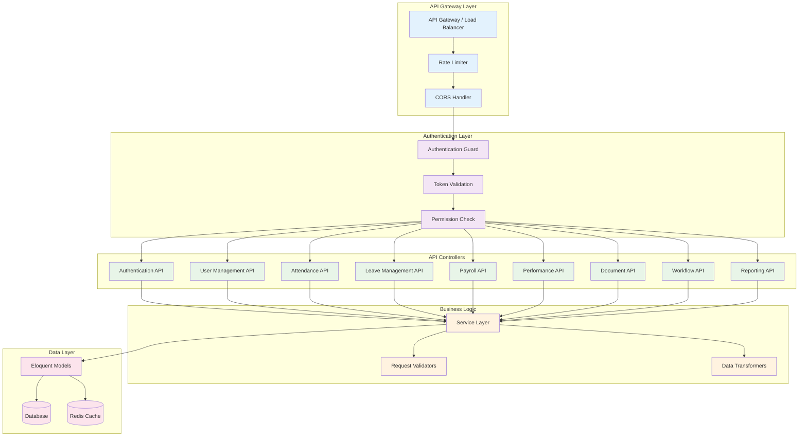
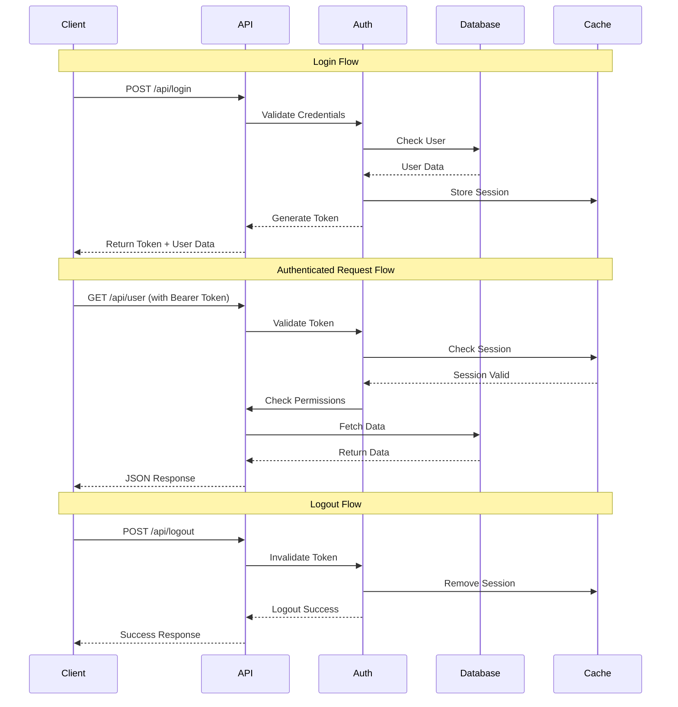
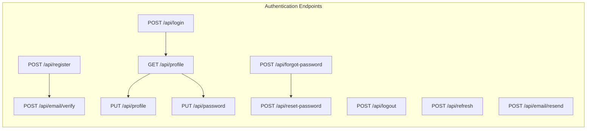
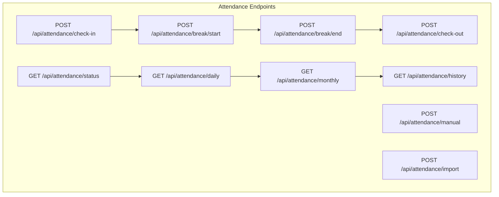

# REST API Documentation

## 🔗 API Overview

The Laravel HR Boilerplate provides a comprehensive RESTful API that follows industry standards and best practices. The API is designed to be consumed by web applications, mobile apps, and third-party integrations.

## 🏗️ API Architecture



## 🔐 Authentication Flow



## 📋 API Endpoints Overview

### Base URL
- **Development**: `http://localhost:8000/api`
- **Octane**: `http://localhost:8001/api`
- **Production**: `https://your-domain.com/api`

### API Versioning
- Current Version: `v1`
- Versioning Strategy: URL-based (`/api/v1/`)
- Header-based versioning: `Accept: application/vnd.api+json;version=1`

## 🔑 Authentication Endpoints



### Authentication API Details

#### Login
```http
POST /api/login
Content-Type: application/json

{
    "email": "admin@hr-system.com",
    "password": "password",
    "remember": true
}
```

**Response:**
```json
{
    "status": "success",
    "message": "Login successful",
    "data": {
        "user": {
            "id": "4eefd7f7-c063-4f8b-89cd-579ad57fb059",
            "first_name": "Admin",
            "last_name": "User",
            "email": "admin@hr-system.com",
            "company_id": null,
            "department": null,
            "position": null,
            "permissions": ["view-users", "create-users", "edit-users"],
            "roles": ["super-admin"]
        },
        "token": {
            "access_token": "eyJ0eXAiOiJKV1QiLCJhbGciOiJIUzI1NiJ9...",
            "token_type": "Bearer",
            "expires_in": 3600
        }
    }
}
```

## 👥 User Management API

```mermaid
graph TB
    subgraph "User Management Endpoints"
        List_Users[GET /api/users]
        Create_User[POST /api/users]
        Show_User[GET /api/users/{id}]
        Update_User[PUT /api/users/{id}]
        Delete_User[DELETE /api/users/{id}]
        User_Profile[GET /api/users/{id}/profile]
        Update_Profile[PUT /api/users/{id}/profile]
        User_Documents[GET /api/users/{id}/documents]
        User_Attendance[GET /api/users/{id}/attendance]
        User_Leaves[GET /api/users/{id}/leaves]
        User_Payroll[GET /api/users/{id}/payroll]
    end
    
    List_Users --> Show_User
    Show_User --> User_Profile
    Show_User --> User_Documents
    Show_User --> User_Attendance
    Show_User --> User_Leaves
    Show_User --> User_Payroll
    Create_User --> Update_User
    Update_User --> Delete_User
```

### User API Examples

#### Get Users List
```http
GET /api/users?page=1&per_page=15&department=hr&status=active
Authorization: Bearer {token}
```

**Response:**
```json
{
    "status": "success",
    "data": {
        "users": [
            {
                "id": "uuid",
                "first_name": "John",
                "last_name": "Doe",
                "email": "john.doe@company.com",
                "employee_id": "EMP001",
                "department": {
                    "id": "uuid",
                    "name": "Human Resources"
                },
                "position": {
                    "id": "uuid",
                    "title": "HR Manager"
                },
                "manager": {
                    "id": "uuid",
                    "name": "Jane Smith"
                },
                "employment_status": "active",
                "hire_date": "2024-01-15"
            }
        ],
        "pagination": {
            "current_page": 1,
            "per_page": 15,
            "total": 150,
            "last_page": 10
        }
    }
}
```

## ⏰ Attendance API



### Attendance API Examples

#### Check In
```http
POST /api/attendance/check-in
Authorization: Bearer {token}
Content-Type: application/json

{
    "location": "Office",
    "latitude": 25.2048,
    "longitude": 55.2708,
    "notes": "On time arrival"
}
```

**Response:**
```json
{
    "status": "success",
    "message": "Checked in successfully",
    "data": {
        "attendance": {
            "id": "uuid",
            "user_id": "uuid",
            "attendance_date": "2024-10-07",
            "check_in": "09:00:00",
            "location": "Office",
            "status": "present"
        }
    }
}
```

## 🏖️ Leave Management API

```mermaid
graph TB
    subgraph "Leave Management Endpoints"
        Leave_Types[GET /api/leave-types]
        Leave_Balance[GET /api/leave/balance]
        Submit_Request[POST /api/leave/request]
        My_Requests[GET /api/leave/my-requests]
        Pending_Approvals[GET /api/leave/pending-approvals]
        Approve_Leave[PUT /api/leave/{id}/approve]
        Reject_Leave[PUT /api/leave/{id}/reject]
        Cancel_Request[DELETE /api/leave/{id}]
        Leave_Calendar[GET /api/leave/calendar]
        Team_Leaves[GET /api/leave/team]
    end
    
    Leave_Types --> Submit_Request
    Leave_Balance --> Submit_Request
    Submit_Request --> My_Requests
    My_Requests --> Cancel_Request
    Pending_Approvals --> Approve_Leave
    Pending_Approvals --> Reject_Leave
```

### Leave API Examples

#### Submit Leave Request
```http
POST /api/leave/request
Authorization: Bearer {token}
Content-Type: application/json

{
    "leave_type_id": "uuid",
    "start_date": "2024-10-15",
    "end_date": "2024-10-17",
    "reason": "Family vacation",
    "half_day": false,
    "attachments": ["file1.pdf", "file2.jpg"]
}
```

**Response:**
```json
{
    "status": "success",
    "message": "Leave request submitted successfully",
    "data": {
        "leave_request": {
            "id": "uuid",
            "leave_type": {
                "id": "uuid",
                "name": "Annual Leave"
            },
            "start_date": "2024-10-15",
            "end_date": "2024-10-17",
            "days_requested": 3,
            "status": "pending",
            "reason": "Family vacation",
            "submitted_at": "2024-10-07T09:00:00Z"
        }
    }
}
```

## 💰 Payroll API

```mermaid
graph TB
    subgraph "Payroll Endpoints"
        Salary_Components[GET /api/payroll/components]
        Current_Payroll[GET /api/payroll/current]
        Payroll_History[GET /api/payroll/history]
        Payslip_Download[GET /api/payroll/{id}/payslip]
        Tax_Documents[GET /api/payroll/tax-documents]
        Salary_Certificate[GET /api/payroll/salary-certificate]
        Payroll_Summary[GET /api/payroll/summary]
        Generate_Payroll[POST /api/payroll/generate]
        Bulk_Process[POST /api/payroll/bulk-process]
    end
    
    Salary_Components --> Current_Payroll
    Current_Payroll --> Payroll_History
    Payroll_History --> Payslip_Download
    Generate_Payroll --> Bulk_Process
```

## 📊 Performance Management API

```mermaid
graph TB
    subgraph "Performance Endpoints"
        Review_Templates[GET /api/performance/templates]
        My_Reviews[GET /api/performance/my-reviews]
        Pending_Reviews[GET /api/performance/pending]
        Submit_Review[POST /api/performance/review]
        Goals[GET /api/performance/goals]
        Create_Goal[POST /api/performance/goals]
        Update_Goal[PUT /api/performance/goals/{id}]
        360_Feedback[GET /api/performance/360-feedback]
        Performance_Reports[GET /api/performance/reports]
    end
    
    Review_Templates --> Submit_Review
    My_Reviews --> 360_Feedback
    Goals --> Create_Goal
    Create_Goal --> Update_Goal
```

## 📄 Document Management API

```mermaid
graph TB
    subgraph "Document Endpoints"
        Document_Categories[GET /api/documents/categories]
        My_Documents[GET /api/documents/my-documents]
        Upload_Document[POST /api/documents/upload]
        Download_Document[GET /api/documents/{id}/download]
        Share_Document[POST /api/documents/{id}/share]
        Document_Versions[GET /api/documents/{id}/versions]
        Delete_Document[DELETE /api/documents/{id}]
        Bulk_Upload[POST /api/documents/bulk-upload]
        Document_Search[GET /api/documents/search]
    end
    
    Document_Categories --> Upload_Document
    My_Documents --> Download_Document
    Upload_Document --> Share_Document
    Document_Versions --> Delete_Document
```

## 🔄 Workflow API

```mermaid
graph TB
    subgraph "Workflow Endpoints"
        Workflow_Templates[GET /api/workflows/templates]
        Start_Workflow[POST /api/workflows/start]
        My_Tasks[GET /api/workflows/my-tasks]
        Pending_Approvals[GET /api/workflows/pending-approvals]
        Approve_Task[PUT /api/workflows/tasks/{id}/approve]
        Reject_Task[PUT /api/workflows/tasks/{id}/reject]
        Workflow_History[GET /api/workflows/history]
        Workflow_Status[GET /api/workflows/{id}/status]
    end
    
    Workflow_Templates --> Start_Workflow
    My_Tasks --> Approve_Task
    My_Tasks --> Reject_Task
    Pending_Approvals --> Workflow_Status
```

## 📈 Reporting API

```mermaid
graph TB
    subgraph "Reporting Endpoints"
        Dashboard_Stats[GET /api/reports/dashboard]
        Attendance_Reports[GET /api/reports/attendance]
        Leave_Reports[GET /api/reports/leave]
        Payroll_Reports[GET /api/reports/payroll]
        Performance_Reports[GET /api/reports/performance]
        Custom_Reports[POST /api/reports/custom]
        Export_Report[GET /api/reports/{id}/export]
        Scheduled_Reports[GET /api/reports/scheduled]
    end
    
    Dashboard_Stats --> Attendance_Reports
    Attendance_Reports --> Leave_Reports
    Leave_Reports --> Payroll_Reports
    Custom_Reports --> Export_Report
```

## 🔒 API Security Features

### Rate Limiting
```http
X-RateLimit-Limit: 60
X-RateLimit-Remaining: 59
X-RateLimit-Reset: 1696723200
```

### Error Responses
```json
{
    "status": "error",
    "message": "Validation failed",
    "errors": {
        "email": ["The email field is required."],
        "password": ["The password must be at least 8 characters."]
    },
    "error_code": "VALIDATION_ERROR"
}
```

### Standard HTTP Status Codes
- `200` - Success
- `201` - Created
- `400` - Bad Request
- `401` - Unauthorized
- `403` - Forbidden
- `404` - Not Found
- `422` - Validation Error
- `429` - Too Many Requests
- `500` - Internal Server Error

## 📝 API Request/Response Standards

### Request Headers
```http
Authorization: Bearer {access_token}
Content-Type: application/json
Accept: application/json
X-Requested-With: XMLHttpRequest
```

### Response Format
```json
{
    "status": "success|error",
    "message": "Human readable message",
    "data": {
        // Response data
    },
    "meta": {
        "timestamp": "2024-10-07T09:00:00Z",
        "version": "1.0.0",
        "request_id": "uuid"
    }
}
```

### Pagination Format
```json
{
    "data": [...],
    "pagination": {
        "current_page": 1,
        "per_page": 15,
        "total": 150,
        "last_page": 10,
        "from": 1,
        "to": 15,
        "path": "/api/users",
        "links": {
            "first": "/api/users?page=1",
            "last": "/api/users?page=10",
            "prev": null,
            "next": "/api/users?page=2"
        }
    }
}
```

---

**Next**: [Security Architecture](../architecture/security-architecture.md) | [Deployment Guide](../deployment/docker-deployment.md)