# Security Architecture Documentation

## 🔐 Security Framework Overview

The Laravel HR Boilerplate implements a multi-layered security architecture designed to protect sensitive employee data and ensure compliance with data protection regulations.

```mermaid
graph TB
    subgraph "Security Layers"
        Network[Network Security]
        Application[Application Security]
        Data[Data Security]
        Access[Access Control]
        Audit[Audit & Monitoring]
        Compliance[Compliance & Privacy]
    end
    
    subgraph "Network Protection"
        Firewall[Firewall Rules]
        VPN[VPN Access]
        SSL[SSL/TLS Encryption]
        DDoS[DDoS Protection]
        CDN[CDN Security]
    end
    
    subgraph "Application Protection"
        Auth[Authentication]
        Authorization[Authorization]
        CSRF[CSRF Protection]
        XSS[XSS Prevention]
        Input_Validation[Input Validation]
        Rate_Limiting[Rate Limiting]
    end
    
    subgraph "Data Protection"
        Encryption[Data Encryption]
        Hashing[Password Hashing]
        Masking[Data Masking]
        Backup[Secure Backup]
        PII[PII Protection]
    end
    
    Network --> Network_Protection[Network Protection]
    Application --> App_Protection[Application Protection]
    Data --> Data_Protection[Data Protection]
    
    Network_Protection --> Firewall
    Network_Protection --> VPN
    Network_Protection --> SSL
    Network_Protection --> DDoS
    Network_Protection --> CDN
    
    App_Protection --> Auth
    App_Protection --> Authorization
    App_Protection --> CSRF
    App_Protection --> XSS
    App_Protection --> Input_Validation
    App_Protection --> Rate_Limiting
    
    Data_Protection --> Encryption
    Data_Protection --> Hashing
    Data_Protection --> Masking
    Data_Protection --> Backup
    Data_Protection --> PII
    
    classDef layer fill:#e3f2fd
    classDef protection fill:#f3e5f5
    classDef feature fill:#e8f5e8
    
    class Network,Application,Data,Access,Audit,Compliance layer
    class Network_Protection,App_Protection,Data_Protection protection
    class Firewall,VPN,SSL,DDoS,CDN,Auth,Authorization,CSRF,XSS,Input_Validation,Rate_Limiting,Encryption,Hashing,Masking,Backup,PII feature
```

## 🔑 Authentication & Authorization

### Authentication Flow
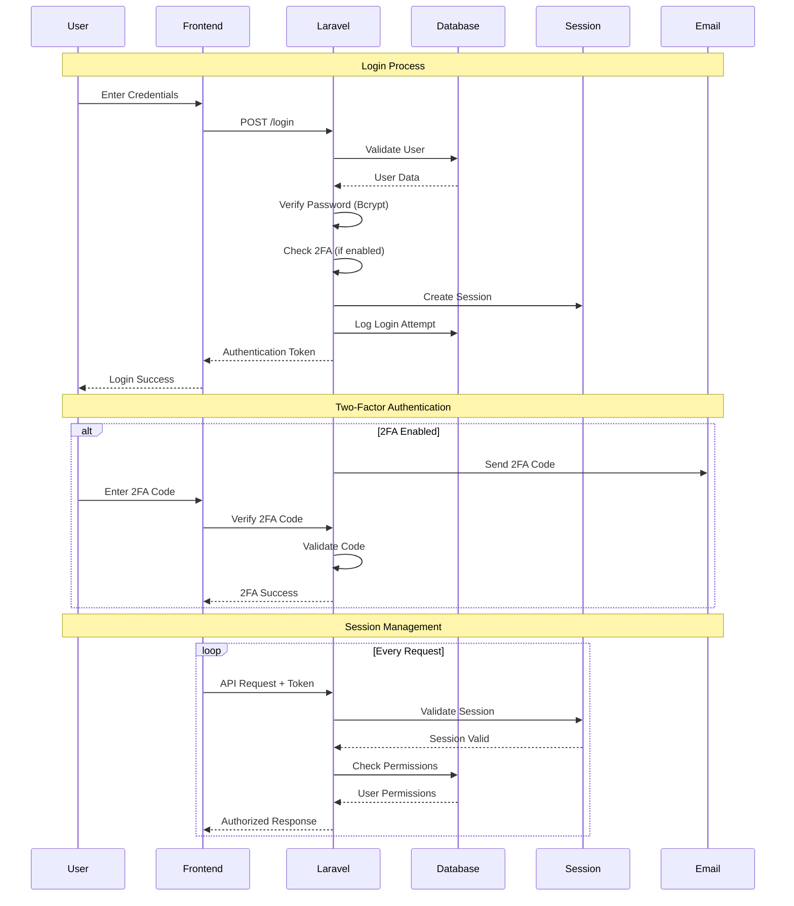

### Role-Based Access Control (RBAC)
```mermaid
graph TB
    subgraph "User Hierarchy"
        SuperAdmin[Super Admin]
        CompanyAdmin[Company Admin]
        HRManager[HR Manager]
        HRUser[HR User]
        Manager[Department Manager]
        Employee[Employee]
        Guest[Guest User]
    end
    
    subgraph "Permission Categories"
        System[System Management]
        Company[Company Management]
        Employee_Mgmt[Employee Management]
        Attendance_Mgmt[Attendance Management]
        Leave_Mgmt[Leave Management]
        Payroll_Mgmt[Payroll Management]
        Reports[Reporting]
        Personal[Personal Data]
    end
    
    subgraph "Permission Levels"
        Create[Create]
        Read[Read]
        Update[Update]
        Delete[Delete]
        Approve[Approve]
        View_All[View All]
        View_Team[View Team]
        View_Self[View Self Only]
    end
    
    SuperAdmin --> System
    SuperAdmin --> Company
    SuperAdmin --> Employee_Mgmt
    SuperAdmin --> Attendance_Mgmt
    SuperAdmin --> Leave_Mgmt
    SuperAdmin --> Payroll_Mgmt
    SuperAdmin --> Reports
    
    CompanyAdmin --> Company
    CompanyAdmin --> Employee_Mgmt
    CompanyAdmin --> Attendance_Mgmt
    CompanyAdmin --> Leave_Mgmt
    CompanyAdmin --> Payroll_Mgmt
    CompanyAdmin --> Reports
    
    HRManager --> Employee_Mgmt
    HRManager --> Attendance_Mgmt
    HRManager --> Leave_Mgmt
    HRManager --> Payroll_Mgmt
    HRManager --> Reports
    
    HRUser --> Employee_Mgmt
    HRUser --> Attendance_Mgmt
    HRUser --> Leave_Mgmt
    
    Manager --> View_Team
    Manager --> Approve
    
    Employee --> View_Self
    Employee --> Personal
    
    System --> Create
    System --> Read
    System --> Update
    System --> Delete
    
    Company --> View_All
    Employee_Mgmt --> View_All
    Attendance_Mgmt --> View_All
    Leave_Mgmt --> Approve
    Payroll_Mgmt --> View_All
    Reports --> View_All
    
    classDef admin fill:#ffcdd2
    classDef manager fill:#f8bbd9
    classDef user fill:#e1bee7
    classDef permission fill:#c8e6c9
    classDef level fill:#bbdefb
    
    class SuperAdmin,CompanyAdmin admin
    class HRManager,Manager manager
    class HRUser,Employee,Guest user
    class System,Company,Employee_Mgmt,Attendance_Mgmt,Leave_Mgmt,Payroll_Mgmt,Reports,Personal permission
    class Create,Read,Update,Delete,Approve,View_All,View_Team,View_Self level
```

### Multi-Factor Authentication (MFA)
```mermaid
graph TB
    subgraph "MFA Methods"
        SMS[SMS Token]
        Email_Token[Email Token]
        TOTP[TOTP App (Google Authenticator)]
        Backup_Codes[Backup Codes]
        Biometric[Biometric (Future)]
    end
    
    subgraph "MFA Flow"
        Login[User Login]
        Primary_Auth[Primary Authentication]
        MFA_Required[MFA Required?]
        Send_Token[Send MFA Token]
        Verify_Token[Verify Token]
        Grant_Access[Grant Access]
        Deny_Access[Deny Access]
    end
    
    subgraph "Security Rules"
        Admin_Required[Admin Roles Require MFA]
        High_Risk[High-Risk Actions Require MFA]
        IP_Change[New IP Requires MFA]
        Time_Based[Time-Based MFA]
        Device_Trust[Trusted Device List]
    end
    
    Login --> Primary_Auth
    Primary_Auth --> MFA_Required
    MFA_Required -->|Yes| Send_Token
    MFA_Required -->|No| Grant_Access
    Send_Token --> Verify_Token
    Verify_Token -->|Valid| Grant_Access
    Verify_Token -->|Invalid| Deny_Access
    
    SMS --> Send_Token
    Email_Token --> Send_Token
    TOTP --> Verify_Token
    Backup_Codes --> Verify_Token
    
    Admin_Required --> MFA_Required
    High_Risk --> MFA_Required
    IP_Change --> MFA_Required
    Time_Based --> MFA_Required
    Device_Trust --> MFA_Required
    
    classDef method fill:#e3f2fd
    classDef flow fill:#f3e5f5
    classDef rule fill:#e8f5e8
    
    class SMS,Email_Token,TOTP,Backup_Codes,Biometric method
    class Login,Primary_Auth,MFA_Required,Send_Token,Verify_Token,Grant_Access,Deny_Access flow
    class Admin_Required,High_Risk,IP_Change,Time_Based,Device_Trust rule
```

## 🛡️ Data Protection & Privacy

### Data Encryption Strategy
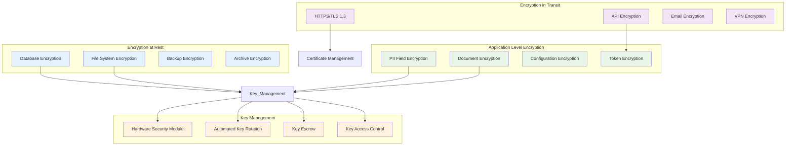

### Personal Data Protection (GDPR/CCPA Compliance)
```mermaid
graph TB
    subgraph "Data Classification"
        Public[Public Data]
        Internal[Internal Data]
        Confidential[Confidential Data]
        PII[Personal Identifiable Information]
        Sensitive[Sensitive Personal Data]
        Financial[Financial Data]
    end
    
    subgraph "Data Rights"
        Access_Right[Right to Access]
        Rectification[Right to Rectification]
        Erasure[Right to Erasure]
        Portability[Data Portability]
        Restrict_Processing[Restrict Processing]
        Object_Processing[Object to Processing]
    end
    
    subgraph "Privacy Controls"
        Consent_Management[Consent Management]
        Data_Minimization[Data Minimization]
        Purpose_Limitation[Purpose Limitation]
        Retention_Policy[Data Retention Policy]
        Anonymization[Data Anonymization]
        Pseudonymization[Data Pseudonymization]
    end
    
    subgraph "Compliance Reporting"
        Privacy_Impact[Privacy Impact Assessment]
        Breach_Notification[Data Breach Notification]
        DPO_Reports[Data Protection Officer Reports]
        Audit_Trail[Compliance Audit Trail]
        Consent_Records[Consent Records]
    end
    
    PII --> Access_Right
    PII --> Rectification
    PII --> Erasure
    PII --> Portability
    
    Sensitive --> Consent_Management
    Sensitive --> Data_Minimization
    Sensitive --> Purpose_Limitation
    
    All_Data[All Data Types] --> Retention_Policy
    All_Data --> Anonymization
    
    Consent_Management --> Privacy_Impact
    Data_Minimization --> Privacy_Impact
    Erasure --> Breach_Notification
    
    classDef classification fill:#e3f2fd
    classDef rights fill:#f3e5f5
    classDef controls fill:#e8f5e8
    classDef reporting fill:#fff3e0
    
    class Public,Internal,Confidential,PII,Sensitive,Financial classification
    class Access_Right,Rectification,Erasure,Portability,Restrict_Processing,Object_Processing rights
    class Consent_Management,Data_Minimization,Purpose_Limitation,Retention_Policy,Anonymization,Pseudonymization controls
    class Privacy_Impact,Breach_Notification,DPO_Reports,Audit_Trail,Consent_Records reporting
```

## 🔍 Security Monitoring & Audit

### Security Event Monitoring
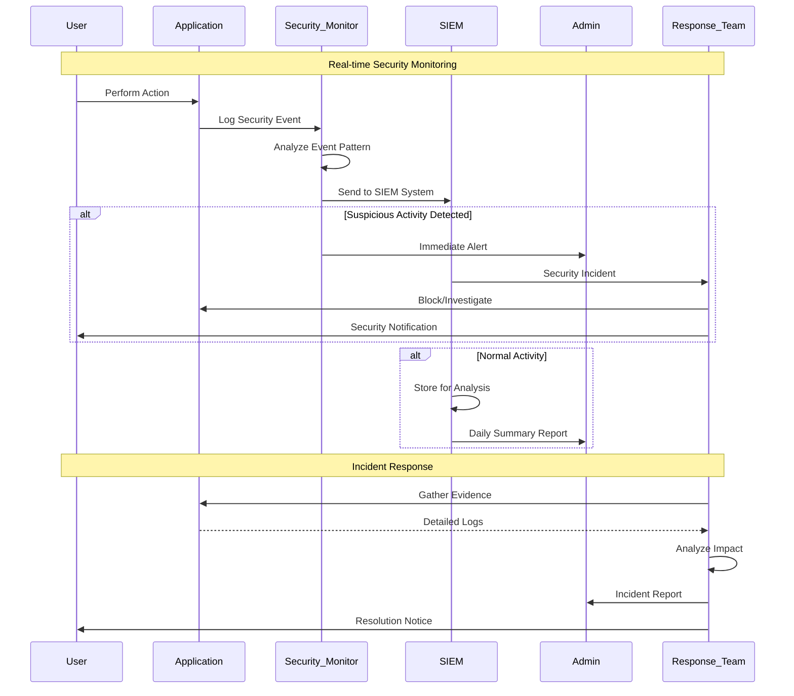

### Audit Trail System
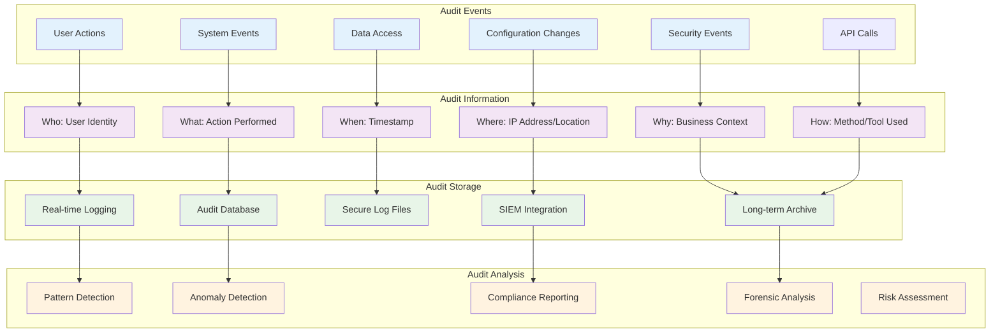

## 🚨 Incident Response & Recovery

### Security Incident Response Plan
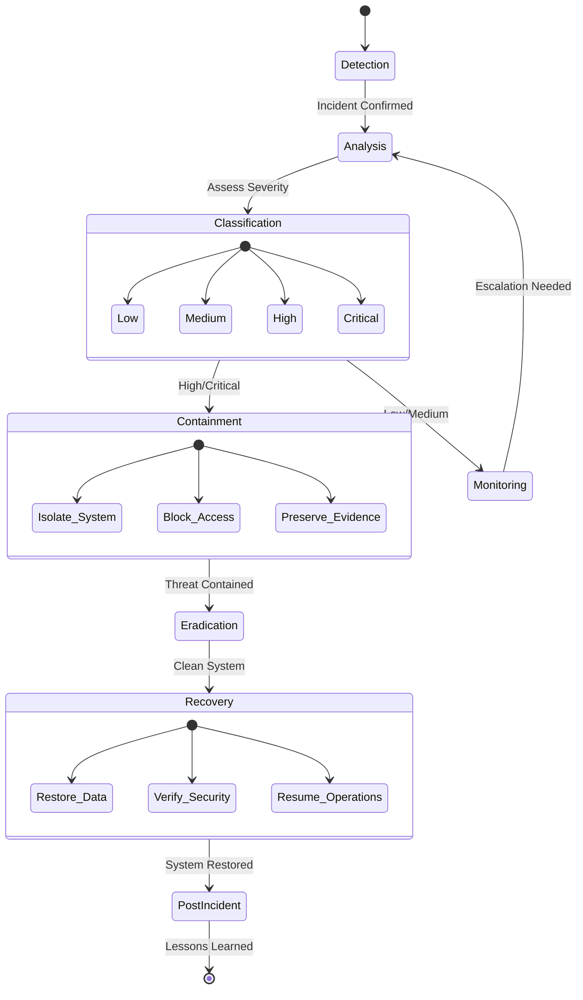

### Business Continuity & Disaster Recovery
```mermaid
graph TB
    subgraph "Backup Strategy"
        Real_Time[Real-time Replication]
        Daily_Backup[Daily Full Backup]
        Incremental[Incremental Backup]
        Archive_Backup[Archive Backup]
        Offsite_Storage[Offsite Storage]
    end
    
    subgraph "Recovery Objectives"
        RTO[Recovery Time Objective]
        RPO[Recovery Point Objective]
        MTTR[Mean Time to Recovery]
        MTBF[Mean Time Between Failures]
    end
    
    subgraph "Disaster Scenarios"
        Hardware_Failure[Hardware Failure]
        Data_Corruption[Data Corruption]
        Cyber_Attack[Cyber Attack]
        Natural_Disaster[Natural Disaster]
        Human_Error[Human Error]
        Power_Outage[Power Outage]
    end
    
    subgraph "Recovery Procedures"
        Failover[Automatic Failover]
        Manual_Recovery[Manual Recovery]
        Data_Restore[Data Restoration]
        System_Rebuild[System Rebuild]
        Partial_Recovery[Partial Recovery]
        Full_Recovery[Full Recovery]
    end
    
    Real_Time --> RTO
    Daily_Backup --> RPO
    Incremental --> MTTR
    
    Hardware_Failure --> Failover
    Data_Corruption --> Data_Restore
    Cyber_Attack --> System_Rebuild
    Natural_Disaster --> Full_Recovery
    Human_Error --> Partial_Recovery
    Power_Outage --> Failover
    
    classDef backup fill:#e3f2fd
    classDef objective fill:#f3e5f5
    classDef scenario fill:#e8f5e8
    classDef procedure fill:#fff3e0
    
    class Real_Time,Daily_Backup,Incremental,Archive_Backup,Offsite_Storage backup
    class RTO,RPO,MTTR,MTBF objective
    class Hardware_Failure,Data_Corruption,Cyber_Attack,Natural_Disaster,Human_Error,Power_Outage scenario
    class Failover,Manual_Recovery,Data_Restore,System_Rebuild,Partial_Recovery,Full_Recovery procedure
```

## 🔒 Security Configuration & Hardening

### Laravel Security Configuration
```mermaid
graph TB
    subgraph "Framework Security"
        CSRF_Protection[CSRF Protection]
        XSS_Prevention[XSS Prevention]
        SQL_Injection[SQL Injection Protection]
        Mass_Assignment[Mass Assignment Protection]
        Input_Validation[Input Validation]
        Output_Encoding[Output Encoding]
    end
    
    subgraph "Session Security"
        Secure_Cookies[Secure Cookies]
        HTTPOnly_Cookies[HTTPOnly Cookies]
        SameSite_Cookies[SameSite Cookies]
        Session_Regeneration[Session Regeneration]
        Session_Timeout[Session Timeout]
        Concurrent_Sessions[Concurrent Session Control]
    end
    
    subgraph "HTTP Security Headers"
        HSTS[HTTP Strict Transport Security]
        CSP[Content Security Policy]
        X_Frame_Options[X-Frame-Options]
        X_Content_Type[X-Content-Type-Options]
        Referrer_Policy[Referrer-Policy]
        Permissions_Policy[Permissions-Policy]
    end
    
    subgraph "API Security"
        Rate_Limiting[API Rate Limiting]
        Token_Auth[Token Authentication]
        CORS[CORS Configuration]
        API_Versioning[API Versioning]
        Request_Signing[Request Signing]
        Throttling[Request Throttling]
    end
    
    CSRF_Protection --> Secure_Cookies
    XSS_Prevention --> CSP
    SQL_Injection --> Input_Validation
    
    Session_Security --> HTTP_Security[HTTP Security Headers]
    HTTP_Security --> HSTS
    HTTP_Security --> CSP
    HTTP_Security --> X_Frame_Options
    
    API_Security --> Rate_Limiting
    API_Security --> Token_Auth
    API_Security --> CORS
    
    classDef framework fill:#e3f2fd
    classDef session fill:#f3e5f5
    classDef headers fill:#e8f5e8
    classDef api fill:#fff3e0
    
    class CSRF_Protection,XSS_Prevention,SQL_Injection,Mass_Assignment,Input_Validation,Output_Encoding framework
    class Secure_Cookies,HTTPOnly_Cookies,SameSite_Cookies,Session_Regeneration,Session_Timeout,Concurrent_Sessions session
    class HSTS,CSP,X_Frame_Options,X_Content_Type,Referrer_Policy,Permissions_Policy headers
    class Rate_Limiting,Token_Auth,CORS,API_Versioning,Request_Signing,Throttling api
```

### Infrastructure Security
```mermaid
graph TB
    subgraph "Server Hardening"
        OS_Updates[Regular OS Updates]
        Service_Disable[Disable Unused Services]
        Firewall_Config[Firewall Configuration]
        SSH_Security[SSH Security]
        User_Access[Limited User Access]
        File_Permissions[Secure File Permissions]
    end
    
    subgraph "Database Security"
        DB_Firewall[Database Firewall]
        User_Privileges[Minimal User Privileges]
        Connection_Encryption[Encrypted Connections]
        Query_Monitoring[Query Monitoring]
        Backup_Encryption[Encrypted Backups]
        Access_Logging[Database Access Logging]
    end
    
    subgraph "Application Security"
        Code_Scanning[Static Code Analysis]
        Dependency_Scanning[Dependency Vulnerability Scanning]
        Container_Scanning[Container Security Scanning]
        Secrets_Management[Secrets Management]
        Environment_Separation[Environment Separation]
        Security_Testing[Security Testing]
    end
    
    subgraph "Network Security"
        VPN_Access[VPN-Only Access]
        Network_Segmentation[Network Segmentation]
        IDS_IPS[Intrusion Detection/Prevention]
        DDoS_Protection[DDoS Protection]
        WAF[Web Application Firewall]
        Load_Balancer[Secure Load Balancing]
    end
    
    OS_Updates --> Firewall_Config
    Service_Disable --> SSH_Security
    User_Access --> File_Permissions
    
    DB_Firewall --> User_Privileges
    Connection_Encryption --> Query_Monitoring
    Backup_Encryption --> Access_Logging
    
    Code_Scanning --> Dependency_Scanning
    Container_Scanning --> Secrets_Management
    Environment_Separation --> Security_Testing
    
    VPN_Access --> Network_Segmentation
    IDS_IPS --> DDoS_Protection
    WAF --> Load_Balancer
    
    classDef server fill:#e3f2fd
    classDef database fill:#f3e5f5
    classDef application fill:#e8f5e8
    classDef network fill:#fff3e0
    
    class OS_Updates,Service_Disable,Firewall_Config,SSH_Security,User_Access,File_Permissions server
    class DB_Firewall,User_Privileges,Connection_Encryption,Query_Monitoring,Backup_Encryption,Access_Logging database
    class Code_Scanning,Dependency_Scanning,Container_Scanning,Secrets_Management,Environment_Separation,Security_Testing application
    class VPN_Access,Network_Segmentation,IDS_IPS,DDoS_Protection,WAF,Load_Balancer network
```

---

**Next**: [Development Guide](../development/getting-started.md) | [API Documentation](../api/rest-api.md)