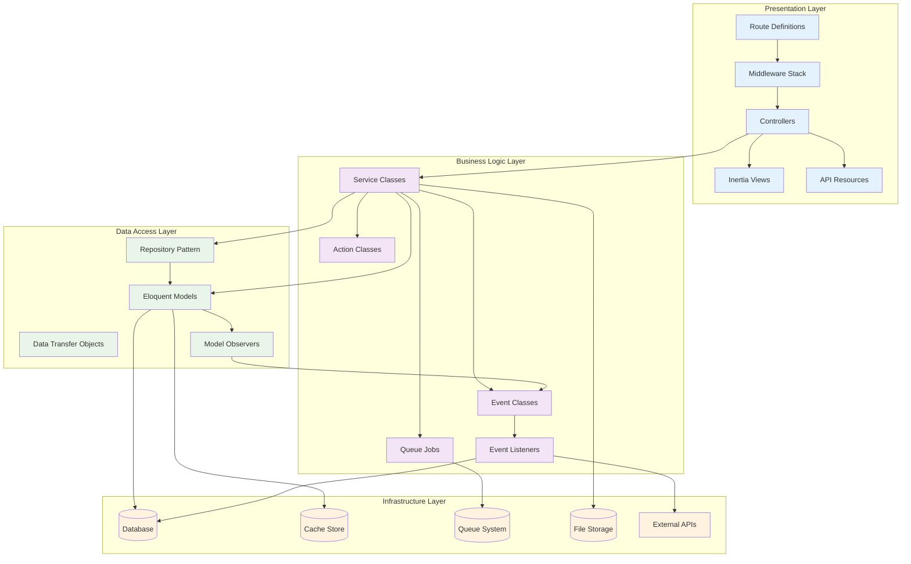
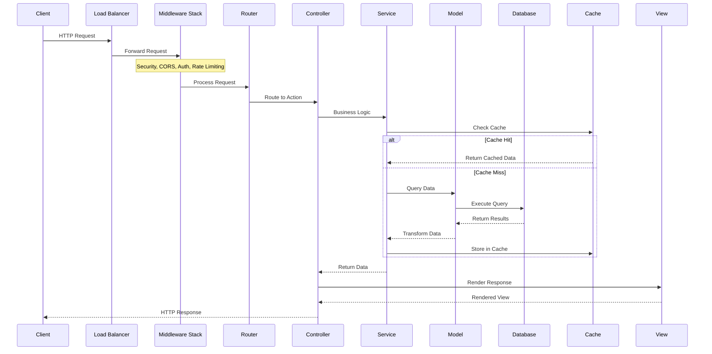
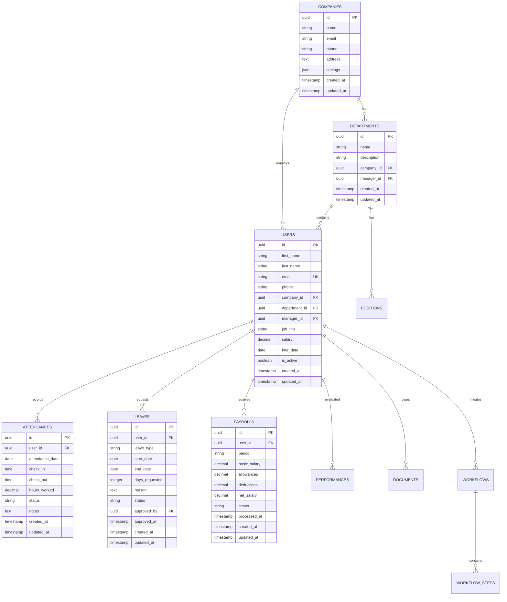
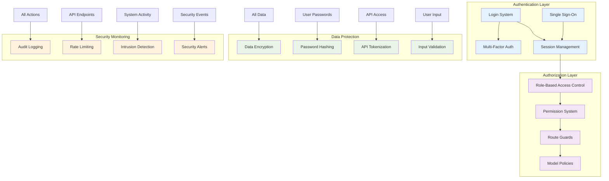

```mermaid
graph TB
    subgraph "Frontend Performance"
        CDN[Content Delivery Network]
        Asset_Optimization[Asset Optimization]
        Lazy_Loading[Lazy Loading]
        Code_Splitting[Code Splitting]
    end
    
    subgraph "Application Performance"
        Octane[Laravel Octane]
        OPcache[OPcache]
        JIT[JIT Compilation]
        Memory_Optimization[Memory Optimization]
    end
    
    subgraph "Caching Strategies"
        Redis_Cache[Redis Cache]
        Query_Cache[Query Cache]
        Route_Cache[Route Cache]
        Config_Cache[Config Cache]
        View_Cache[View Cache]
    end
    
    subgraph "Database Performance"
        Query_Optimization[Query Optimization]
        Indexing[Database Indexing]
        Read_Replicas[Read Replicas]
        Connection_Pooling[Connection Pooling]
    end
    
    subgraph "Monitoring & Optimization"
        APM[Application Performance Monitoring]
        Query_Profiling[Query Profiling]
        Memory_Profiling[Memory Profiling]
        Performance_Testing[Performance Testing]
    end
    
    CDN --> Asset_Optimization
    Asset_Optimization --> Lazy_Loading
    Lazy_Loading --> Code_Splitting
    
    Octane --> OPcache
    Octane --> JIT
    JIT --> Memory_Optimization
    
    Redis_Cache --> Query_Cache
    Query_Cache --> Route_Cache
    Route_Cache --> Config_Cache
    Config_Cache --> View_Cache
    
    Query_Optimization --> Indexing
    Indexing --> Read_Replicas
    Read_Replicas --> Connection_Pooling
    
    APM --> Query_Profiling
    Query_Profiling --> Memory_Profiling
    Memory_Profiling --> Performance_Testing
    
    classDef frontend fill:#e3f2fd
    classDef app fill:#f3e5f5
    classDef cache fill:#e8f5e8
    classDef database fill:#fff3e0
    classDef monitoring fill:#fce4ec
    
    class CDN,Asset_Optimization,Lazy_Loading,Code_Splitting frontend
    class Octane,OPcache,JIT,Memory_Optimization app
    class Redis_Cache,Query_Cache,Route_Cache,Config_Cache,View_Cache cache
    class Query_Optimization,Indexing,Read_Replicas,Connection_Pooling database
    class APM,Query_Profiling,Memory_Profiling,Performance_Testing monitoring
```

# System Architecture Overview

## 📐 High-Level System Architecture

```mermaid
graph TB
    subgraph "Client Layer"
        Web[Web Browser]
        Mobile[Mobile App]
        API_Client[API Clients]
    end
    
    subgraph "Load Balancer"
        LB[Load Balancer / Reverse Proxy]
    end
    
    subgraph "Application Layer"
        subgraph "Laravel Application Servers"
            App1[Laravel App Server 1<br/>Port 8000 - Standard]
            App2[Laravel App Server 2<br/>Port 8001 - Octane]
        end
        
        subgraph "Queue Workers"
            QW1[Queue Worker 1]
            QW2[Queue Worker 2]
            QW3[Queue Worker 3]
        end
    end
    
    subgraph "Caching Layer"
        Redis[(Redis Cache)]
        Session[(Session Store)]
    end
    
    subgraph "Search Engine"
        Meilisearch[(Meilisearch)]
    end
    
    subgraph "Database Layer"
        MySQL[(MySQL 8.0<br/>Primary Database)]
        MySQL_Read[(MySQL Read Replica)]
    end
    
    subgraph "Storage Layer"
        Local_Storage[Local File Storage]
        S3[AWS S3 / Cloud Storage]
    end
    
    subgraph "External Services"
        SMTP[SMTP Email Service]
        SMS[SMS Gateway]
        Payment[Payment Gateway]
    end
    
    subgraph "Monitoring & Logging"
        Logs[Application Logs]
        Metrics[Performance Metrics]
        Health[Health Checks]
    end
    
    %% Client connections
    Web --> LB
    Mobile --> LB
    API_Client --> LB
    
    %% Load balancer to app servers
    LB --> App1
    LB --> App2
    
    %% Application connections
    App1 --> Redis
    App1 --> MySQL
    App1 --> MySQL_Read
    App1 --> Meilisearch
    App1 --> Local_Storage
    App1 --> S3
    
    App2 --> Redis
    App2 --> MySQL
    App2 --> MySQL_Read
    App2 --> Meilisearch
    App2 --> Local_Storage
    App2 --> S3
    
    %% Queue workers
    QW1 --> Redis
    QW1 --> MySQL
    QW2 --> Redis
    QW2 --> MySQL
    QW3 --> Redis
    QW3 --> MySQL
    
    %% External service connections
    App1 --> SMTP
    App1 --> SMS
    App1 --> Payment
    App2 --> SMTP
    App2 --> SMS
    App2 --> Payment
    
    %% Queue workers to external services
    QW1 --> SMTP
    QW2 --> SMS
    QW3 --> Payment
    
    %% Session management
    App1 --> Session
    App2 --> Session
    
    %% Monitoring
    App1 --> Logs
    App1 --> Metrics
    App1 --> Health
    App2 --> Logs
    App2 --> Metrics
    App2 --> Health
    
    %% Database replication
    MySQL --> MySQL_Read
    
    classDef client fill:#e1f5fe
    classDef app fill:#f3e5f5
    classDef cache fill:#fff3e0
    classDef database fill:#e8f5e8
    classDef storage fill:#fce4ec
    classDef external fill:#f1f8e9
    classDef monitor fill:#fff8e1
    
    class Web,Mobile,API_Client client
    class App1,App2,QW1,QW2,QW3 app
    class Redis,Session cache
    class MySQL,MySQL_Read,Meilisearch database
    class Local_Storage,S3 storage
    class SMTP,SMS,Payment external
    class Logs,Metrics,Health monitor
```

## 🏗️ Laravel Application Architecture

## 🔄 Request Lifecycle Flow

## 🏢 HR System Component Architecture

```mermaid
graph TB
    subgraph "Core HR Components"
        Employee[Employee Management]
        Department[Department Management]
        Attendance[Attendance System]
        Leave[Leave Management]
        Payroll[Payroll System]
        Performance[Performance Management]
        Document[Document Management]
        Workflow[Workflow Engine]
        Reporting[Reporting System]
        Settings[System Settings]
    end
    
    subgraph "Shared Services"
        Auth[Authentication Service]
        Permission[Permission Service]
        Notification[Notification Service]
        Email[Email Service]
        File[File Management Service]
        Audit[Audit Log Service]
        Cache_Service[Cache Service]
        Search[Search Service]
    end
    
    subgraph "External Integrations"
        LDAP[LDAP/Active Directory]
        Payment_Gateway[Payment Gateways]
        Email_Provider[Email Providers]
        SMS_Gateway[SMS Gateway]
        Calendar[Calendar Systems]
        Biometric[Biometric Devices]
    end
    
    %% Core component relationships
    Employee --> Department
    Employee --> Attendance
    Employee --> Leave
    Employee --> Payroll
    Employee --> Performance
    Employee --> Document
    
    Attendance --> Leave
    Leave --> Payroll
    Performance --> Payroll
    
    %% Workflow connections
    Workflow --> Leave
    Workflow --> Performance
    Workflow --> Document
    
    %% Shared service connections
    Employee --> Auth
    Employee --> Permission
    Department --> Permission
    
    Attendance --> Notification
    Leave --> Notification
    Payroll --> Notification
    Performance --> Notification
    
    Document --> File
    Employee --> File
    
    All_Components[All Components] --> Audit
    All_Components --> Cache_Service
    Reporting --> Search
    
    %% External integrations
    Auth --> LDAP
    Payroll --> Payment_Gateway
    Notification --> Email_Provider
    Notification --> SMS_Gateway
    Attendance --> Biometric
    Leave --> Calendar
    
    classDef core fill:#e3f2fd
    classDef shared fill:#f3e5f5
    classDef external fill:#e8f5e8
    
    class Employee,Department,Attendance,Leave,Payroll,Performance,Document,Workflow,Reporting,Settings core
    class Auth,Permission,Notification,Email,File,Audit,Cache_Service,Search shared
    class LDAP,Payment_Gateway,Email_Provider,SMS_Gateway,Calendar,Biometric external
```

## 🗄️ Database Architecture

## 🔐 Security Architecture

## ⚡ Performance Architecture

---

## Technology Stack Details

| Layer | Technology | Purpose | Version |
|-------|------------|---------|---------|
| **Backend Framework** | Laravel | Web application framework | 10.x |
| **Runtime** | PHP | Server-side language | 8.3+ |
| **Performance** | Laravel Octane + FrankenPHP | High-performance application server | Latest |
| **Frontend Framework** | Vue.js | Progressive JavaScript framework | 3.x |
| **Frontend Bridge** | Inertia.js | Modern monolith approach | 1.x |
| **Styling** | Tailwind CSS | Utility-first CSS framework | 3.x |
| **Database** | MySQL | Relational database | 8.0 |
| **Cache** | Redis | In-memory data store | 7.x |
| **Search** | Meilisearch | Fast, typo-tolerant search engine | Latest |
| **Queue** | Redis | Background job processing | - |
| **File Storage** | Local/S3 | File and media storage | - |
| **Container** | Docker | Containerization platform | Latest |
| **Development** | Laravel Sail | Docker development environment | Latest |

## Key Architectural Decisions

### 1. **Monolithic Architecture with API-First Design**
- Single deployable unit for simplicity
- API endpoints for all functionality
- Future-ready for microservices migration

### 2. **Event-Driven Architecture**
- Loose coupling between components
- Extensible workflow system
- Audit trail and notifications

### 3. **Multi-Tenant Ready**
- UUID primary keys
- Company-based data isolation
- Scalable tenant management

### 4. **Performance-First Approach**
- Laravel Octane for high performance
- Multiple caching layers
- Optimized database queries

### 5. **Security by Design**
- Role-based access control
- Comprehensive audit logging
- Data encryption and validation

---

**Next**: [Application Structure](./application-structure.md) | [Data Flow](./data-flow.md)