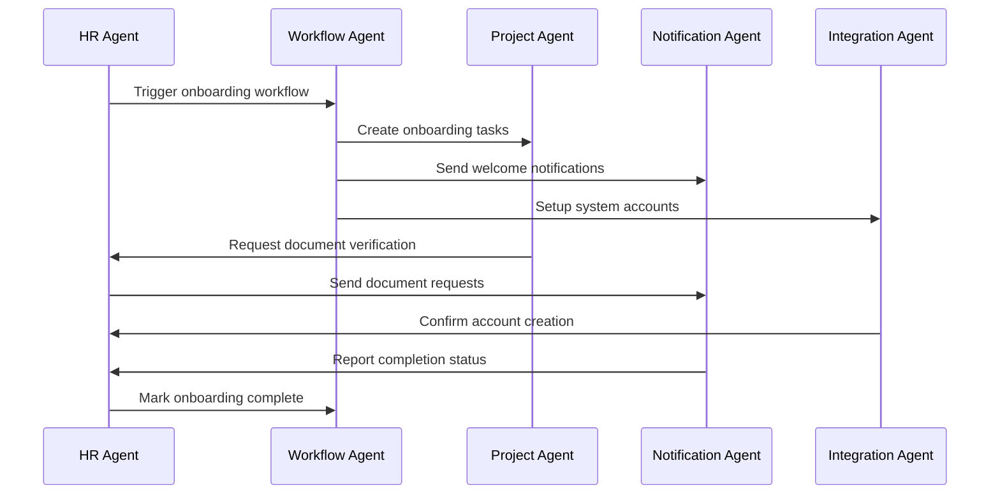
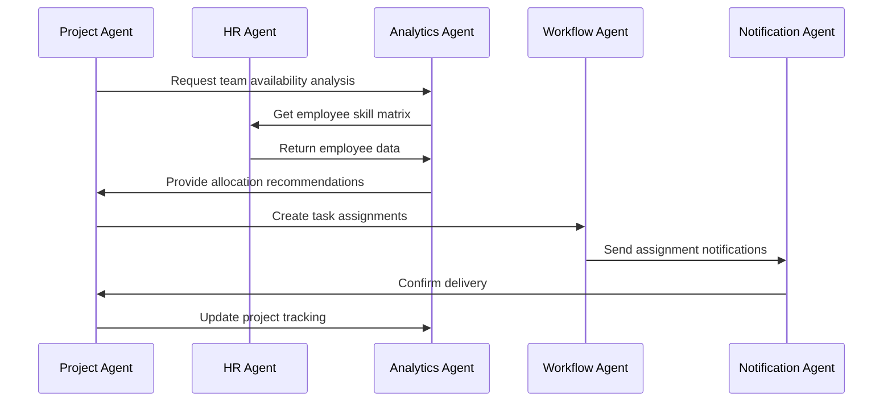

# CrewAI Collaborative Agent System Design

## 🤖 Overview

This document outlines the design and implementation of a collaborative AI agent system using CrewAI to autonomously automate system functionalities within the Laravel HR Boilerplate project.

## 🎯 System Architecture

```mermaid
graph TB
    subgraph "Laravel Application"
        API[REST API Endpoints]
        Queue[Laravel Queue System]
        DB[(PostgreSQL Database)]
        Events[Laravel Events]
        Workflows[Workflow Engine]
    end
    
    subgraph "CrewAI Agent System"
        Orchestrator[Agent Orchestrator]
        
        subgraph "Core Agents"
            HR_Agent[HR Management Agent]
            PM_Agent[Project Management Agent]
            Analytics_Agent[Analytics Agent]
            Workflow_Agent[Workflow Automation Agent]
            Integration_Agent[System Integration Agent]
            Notification_Agent[Notification Agent]
        end
        
        subgraph "Agent Infrastructure"
            Memory[Agent Memory Store]
            Tools[Agent Tools Registry]
            LLM[Language Model Interface]
            Scheduler[Task Scheduler]
        end
    end
    
    subgraph "External Systems"
        Email[Email Service]
        SMS[SMS Gateway]
        Calendar[Calendar APIs]
        FileStorage[File Storage]
        Analytics[Analytics APIs]
    end
    
    API --> Orchestrator
    Queue --> Orchestrator
    Events --> Orchestrator
    
    Orchestrator --> HR_Agent
    Orchestrator --> PM_Agent
    Orchestrator --> Analytics_Agent
    Orchestrator --> Workflow_Agent
    Orchestrator --> Integration_Agent
    Orchestrator --> Notification_Agent
    
    HR_Agent --> Memory
    PM_Agent --> Memory
    Analytics_Agent --> Memory
    Workflow_Agent --> Memory
    Integration_Agent --> Memory
    Notification_Agent --> Memory
    
    HR_Agent --> Tools
    PM_Agent --> Tools
    Analytics_Agent --> Tools
    Workflow_Agent --> Tools
    Integration_Agent --> Tools
    Notification_Agent --> Tools
    
    Integration_Agent --> Email
    Integration_Agent --> SMS
    Integration_Agent --> Calendar
    Integration_Agent --> FileStorage
    Integration_Agent --> Analytics
    
    Orchestrator --> DB
    Memory --> DB
```

## 🎭 Agent Roles and Responsibilities

### 1. HR Management Agent
**Role**: Human Resources Specialist
**Responsibilities**:
- Employee onboarding automation
- Leave request processing and approval workflows
- Performance evaluation scheduling and reminders
- Compliance monitoring and reporting
- Employee data analysis and insights
- Attendance tracking and anomaly detection
- Document verification and management

**Key Capabilities**:
- Process leave requests with intelligent approval routing
- Generate HR reports and analytics
- Monitor employee performance metrics
- Automate onboarding checklists
- Handle compliance deadlines and notifications

### 2. Project Management Agent
**Role**: Project Coordinator
**Responsibilities**:
- Project planning and resource allocation
- Task assignment optimization
- Deadline monitoring and risk assessment
- Team collaboration facilitation
- Progress tracking and reporting
- Resource utilization analysis
- Milestone achievement tracking

**Key Capabilities**:
- Automatically assign tasks based on team member skills and availability
- Predict project delays and suggest mitigation strategies
- Optimize resource allocation across multiple projects
- Generate project status reports
- Facilitate team communication and updates

### 3. Analytics Agent
**Role**: Data Analyst
**Responsibilities**:
- Business intelligence and reporting
- Predictive analytics and forecasting
- Performance metrics analysis
- Data visualization and dashboards
- Trend identification and insights
- ROI analysis and optimization
- Custom report generation

**Key Capabilities**:
- Generate automated business intelligence reports
- Perform predictive analysis on HR and project data
- Create dynamic dashboards and visualizations
- Identify trends and patterns in business data
- Provide actionable insights and recommendations

### 4. Workflow Automation Agent
**Role**: Process Automation Specialist
**Responsibilities**:
- Business process optimization
- Workflow orchestration and management
- Approval process automation
- Integration workflow creation
- Process monitoring and optimization
- Exception handling and resolution
- Workflow performance analysis

**Key Capabilities**:
- Design and implement automated approval workflows
- Optimize business processes for efficiency
- Handle workflow exceptions and escalations
- Monitor workflow performance and bottlenecks
- Create custom automation rules

### 5. System Integration Agent
**Role**: Integration Specialist
**Responsibilities**:
- External system connectivity
- Data synchronization and mapping
- API management and monitoring
- Third-party service integration
- System health monitoring
- Error handling and recovery
- Integration testing and validation

**Key Capabilities**:
- Manage integrations with external HR systems
- Synchronize data across multiple platforms
- Monitor API health and performance
- Handle integration errors and failures
- Validate data integrity across systems

### 6. Notification Agent
**Role**: Communication Coordinator
**Responsibilities**:
- Multi-channel notification delivery
- Communication scheduling and timing
- Message personalization and templating
- Notification priority management
- Delivery tracking and analytics
- User preference management
- Emergency communication handling

**Key Capabilities**:
- Send personalized notifications across multiple channels
- Schedule and manage communication campaigns
- Track notification delivery and engagement
- Handle urgent and emergency communications
- Manage user communication preferences

## 🔄 Agent Collaboration Workflows

### Workflow 1: Employee Onboarding

### Workflow 2: Project Resource Allocation

## 🛠️ Technical Implementation

### Agent Communication Protocol
- **Inter-agent messaging**: Redis-based message queuing
- **Task delegation**: Priority-based task distribution
- **Data sharing**: Centralized memory store with access control
- **Event synchronization**: Laravel event broadcasting

### Memory Management
- **Short-term memory**: Redis cache for active tasks
- **Long-term memory**: PostgreSQL for persistent data
- **Shared memory**: Vector database for knowledge sharing
- **Context retention**: Session-based conversation history

### Tool Integration
- **Laravel API**: Direct database operations
- **External APIs**: HTTP clients with retry logic
- **File operations**: Secure file handling and processing
- **Email/SMS**: Multi-provider communication services

## 📊 Performance Metrics

### Agent Performance KPIs
- Task completion rate and time
- Decision accuracy and quality
- Resource utilization efficiency
- Error rate and recovery time
- User satisfaction scores
- System availability and reliability

### Monitoring and Alerting
- Real-time agent activity monitoring
- Performance threshold alerting
- Error tracking and logging
- Resource usage monitoring
- Business metric tracking
- Compliance and audit trails

## 🔒 Security and Compliance

### Security Measures
- Role-based access control (RBAC)
- API authentication and authorization
- Data encryption at rest and in transit
- Audit logging and trail maintenance
- Secure credential management
- Input validation and sanitization

### Compliance Features
- GDPR data protection compliance
- SOX financial reporting compliance
- HIPAA healthcare data protection
- Industry-specific regulatory compliance
- Data retention and purging policies
- Audit trail maintenance

## 🚀 Deployment Strategy

### Development Environment
- Docker containerization
- Local development setup
- Testing and validation framework
- CI/CD pipeline integration

### Production Environment
- Scalable microservices architecture
- Load balancing and failover
- Monitoring and logging systems
- Backup and disaster recovery
- Performance optimization
- Security hardening

This design provides a comprehensive foundation for implementing collaborative AI agents that can autonomously manage and optimize various aspects of the Laravel HR boilerplate system.