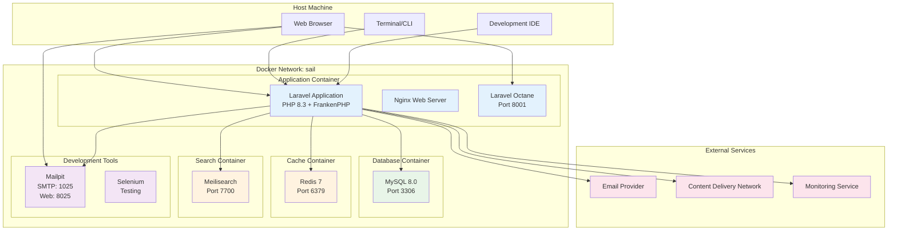
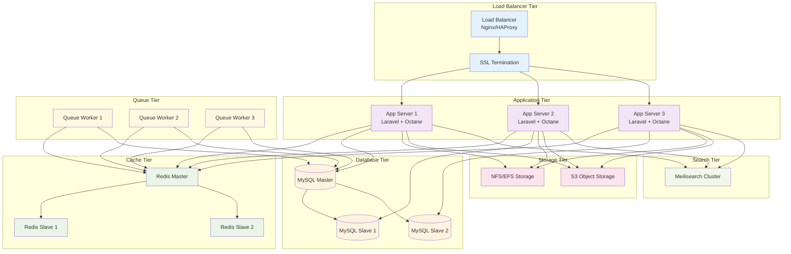

# Docker Deployment Guide

## 🐳 Docker Architecture Overview



## 🚀 Quick Start Deployment

### Prerequisites
- Docker Desktop 4.0+
- Docker Compose 2.0+
- Git
- 8GB+ RAM recommended
- 10GB+ free disk space

### 1. Clone and Setup
```bash
# Clone the repository
git clone https://github.com/yasir2000/laravel-boilerplate.git
cd laravel-boilerplate

# Copy environment file
cp .env.example .env

# Generate application key
docker-compose exec laravel.test php artisan key:generate
```

### 2. Environment Configuration
```bash
# .env file configuration
APP_NAME="Laravel HR Boilerplate"
APP_ENV=local
APP_KEY=base64:...
APP_DEBUG=true
APP_URL=http://localhost:8000

# Database Configuration
DB_CONNECTION=mysql
DB_HOST=mysql
DB_PORT=3306
DB_DATABASE=sail
DB_USERNAME=sail
DB_PASSWORD=password

# Cache Configuration
CACHE_DRIVER=redis
SESSION_DRIVER=redis
QUEUE_CONNECTION=redis

# Redis Configuration
REDIS_HOST=redis
REDIS_PASSWORD=null
REDIS_PORT=6379

# Search Configuration
SCOUT_DRIVER=meilisearch
MEILISEARCH_HOST=http://meilisearch:7700

# Mail Configuration (Development)
MAIL_MAILER=smtp
MAIL_HOST=mailpit
MAIL_PORT=1025
MAIL_USERNAME=null
MAIL_PASSWORD=null
MAIL_ENCRYPTION=null

# Laravel Octane Configuration
OCTANE_SERVER=frankenphp
OCTANE_HOST=0.0.0.0
OCTANE_PORT=8001
OCTANE_WORKERS=auto
OCTANE_MAX_REQUESTS=500
```

### 3. Build and Start Containers
```bash
# Build containers (first time or after changes)
docker-compose build --no-cache

# Start all services
docker-compose up -d

# Check container status
docker-compose ps
```

### 4. Application Setup
```bash
# Install dependencies
docker-compose exec laravel.test composer install

# Run database migrations
docker-compose exec laravel.test php artisan migrate

# Seed the database
docker-compose exec laravel.test php artisan db:seed

# Start Laravel Octane
docker-compose exec -d laravel.test php artisan octane:start --host=0.0.0.0 --port=8001

# Create admin user
docker-compose exec laravel.test php artisan make:admin-user
```

## 🔧 Docker Compose Configuration

### Complete docker-compose.yml
```yaml
version: '3.8'

services:
  # Laravel Application
  laravel.test:
    build:
      context: .
      dockerfile: Dockerfile.sail
    image: laravel-boilerplate/app
    extra_hosts:
      - 'host.docker.internal:host-gateway'
    ports:
      - '80:80'
      - '5173:5173'
      - '8000:8000'
      - '8001:8001'  # Octane port
    environment:
      WWWUSER: 1000
      LARAVEL_SAIL: 1
      XDEBUG_MODE: '${SAIL_XDEBUG_MODE:-off}'
      XDEBUG_CONFIG: '${SAIL_XDEBUG_CONFIG:-client_host=host.docker.internal}'
    volumes:
      - '.:/var/www/html'
    networks:
      - sail
    depends_on:
      - mysql
      - redis
      - meilisearch
      - mailpit

  # MySQL Database
  mysql:
    image: 'mysql/mysql-server:8.0'
    ports:
      - '${FORWARD_DB_PORT:-3306}:3306'
    environment:
      MYSQL_ROOT_PASSWORD: '${DB_PASSWORD}'
      MYSQL_ROOT_HOST: "%"
      MYSQL_DATABASE: '${DB_DATABASE}'
      MYSQL_USER: '${DB_USERNAME}'
      MYSQL_PASSWORD: '${DB_PASSWORD}'
      MYSQL_ALLOW_EMPTY_PASSWORD: 1
    volumes:
      - 'sail-mysql:/var/lib/mysql'
      - './docker/mysql/create-testing-database.sh:/docker-entrypoint-initdb.d/10-create-testing-database.sh'
    networks:
      - sail
    healthcheck:
      test: ["CMD", "mysqladmin", "ping", "-p${DB_PASSWORD}"]
      retries: 3
      timeout: 5s

  # Redis Cache
  redis:
    image: 'redis:7-alpine'
    ports:
      - '${FORWARD_REDIS_PORT:-6379}:6379'
    volumes:
      - 'sail-redis:/data'
    networks:
      - sail
    healthcheck:
      test: ["CMD", "redis-cli", "ping"]
      retries: 3
      timeout: 5s

  # Meilisearch
  meilisearch:
    image: 'getmeili/meilisearch:latest'
    ports:
      - '${FORWARD_MEILISEARCH_PORT:-7700}:7700'
    volumes:
      - 'sail-meilisearch:/data.ms'
    networks:
      - sail
    healthcheck:
      test: ["CMD", "wget", "--no-verbose", "--spider", "http://localhost:7700/health"]
      retries: 3
      timeout: 5s

  # Mailpit (Email Testing)
  mailpit:
    image: 'axllent/mailpit:latest'
    ports:
      - '${FORWARD_MAILPIT_PORT:-1025}:1025'
      - '${FORWARD_MAILPIT_DASHBOARD_PORT:-8025}:8025'
    networks:
      - sail

  # Selenium (Testing)
  selenium:
    image: 'selenium/standalone-chromium'
    volumes:
      - '/dev/shm:/dev/shm'
    networks:
      - sail

networks:
  sail:
    driver: bridge

volumes:
  sail-mysql:
    driver: local
  sail-redis:
    driver: local
  sail-meilisearch:
    driver: local
```

## 🏗️ Custom Dockerfile

### Dockerfile.sail
```dockerfile
FROM ubuntu:22.04

LABEL maintainer="Laravel HR Boilerplate Team"

ARG WWWGROUP=1000
ARG NODE_VERSION=18
ARG POSTGRES_VERSION=15

WORKDIR /var/www/html

ENV DEBIAN_FRONTEND=noninteractive
ENV TZ=UTC

RUN ln -snf /usr/share/zoneinfo/$TZ /etc/localtime && echo $TZ > /etc/timezone

# Install system dependencies
RUN apt-get update \
    && apt-get install -y gnupg gosu curl ca-certificates zip unzip git supervisor sqlite3 libcap2-bin libpng-dev python2 dnsutils \
    && curl -sS 'https://keyserver.ubuntu.com/pks/lookup?op=get&search=0x14aa40ec0831756756d7f66c4f4ea0aae5267a6c' | gpg --dearmor | tee /etc/apt/keyrings/ppa_ondrej_php.gpg > /dev/null \
    && echo "deb [signed-by=/etc/apt/keyrings/ppa_ondrej_php.gpg] https://ppa.launchpadcontent.net/ondrej/php/ubuntu jammy main" > /etc/apt/sources.list.d/ppa_ondrej_php.list \
    && apt-get update \
    && apt-get install -y php8.3-cli php8.3-dev \
       php8.3-pgsql php8.3-sqlite3 php8.3-gd php8.3-imagick \
       php8.3-curl php8.3-imap php8.3-mysql php8.3-mbstring \
       php8.3-xml php8.3-zip php8.3-bcmath php8.3-soap \
       php8.3-intl php8.3-readline php8.3-ldap \
       php8.3-msgpack php8.3-igbinary php8.3-redis \
       php8.3-swoole php8.3-memcached php8.3-pcov php8.3-xdebug \
    && curl -sLS https://getcomposer.org/installer | php -- --install-dir=/usr/bin/ --filename=composer \
    && curl -fsSL https://deb.nodesource.com/setup_$NODE_VERSION.x | bash - \
    && apt-get install -y nodejs \
    && npm install -g npm \
    && curl -sS https://dl.yarnpkg.com/debian/pubkey.gpg | gpg --dearmor | tee /etc/apt/keyrings/yarn.gpg >/dev/null \
    && echo "deb [signed-by=/etc/apt/keyrings/yarn.gpg] https://dl.yarnpkg.com/debian/ stable main" > /etc/apt/sources.list.d/yarn.list \
    && curl -sS https://www.postgresql.org/media/keys/ACCC4CF8.asc | gpg --dearmor | tee /etc/apt/keyrings/pgdg.gpg >/dev/null \
    && echo "deb [signed-by=/etc/apt/keyrings/pgdg.gpg] http://apt.postgresql.org/pub/repos/apt jammy-pgdg main" > /etc/apt/sources.list.d/pgdg.list \
    && apt-get update \
    && apt-get install -y yarn \
    && apt-get install -y mysql-client \
    && apt-get install -y postgresql-client-$POSTGRES_VERSION \
    && apt-get -y autoremove \
    && apt-get clean \
    && rm -rf /var/lib/apt/lists/* /tmp/* /var/tmp/*

# Install FrankenPHP
RUN curl -sL https://github.com/dunglas/frankenphp/releases/download/v1.0.0/frankenphp-linux-x86_64 -o /usr/local/bin/frankenphp \
    && chmod +x /usr/local/bin/frankenphp

# Set user permissions
RUN setcap "cap_net_bind_service=+ep" /usr/bin/php8.3
RUN groupadd --force -g $WWWGROUP sail
RUN useradd -ms /bin/bash --no-user-group -g $WWWGROUP -u 1337 sail

# Copy PHP configuration
COPY docker/php/php.ini /etc/php/8.3/cli/conf.d/99-custom.ini
COPY docker/php/php.ini /etc/php/8.3/fpm/conf.d/99-custom.ini

# Copy supervisor configuration
COPY docker/supervisord.conf /etc/supervisor/conf.d/supervisord.conf

# Copy application files
COPY --chown=sail:sail . /var/www/html

# Install PHP dependencies
RUN composer install --no-dev --optimize-autoloader

# Install Node dependencies and build assets
RUN npm ci && npm run build

# Set permissions
RUN chown -R sail:sail /var/www/html \
    && chmod -R 755 /var/www/html/storage \
    && chmod -R 755 /var/www/html/bootstrap/cache

EXPOSE 8000 8001

ENTRYPOINT ["docker/start-container"]
```

## 🎯 Production Deployment Architecture



## 🔧 Docker Optimization

### Multi-stage Production Dockerfile
```dockerfile
# Build stage
FROM node:18-alpine AS node-builder
WORKDIR /app
COPY package*.json ./
RUN npm ci --only=production
COPY . .
RUN npm run build

# PHP dependencies stage
FROM composer:2 AS composer-builder
WORKDIR /app
COPY composer*.json ./
RUN composer install --no-dev --optimize-autoloader --no-scripts

# Production stage
FROM ubuntu:22.04
# ... (base configuration)

# Copy built assets
COPY --from=node-builder /app/public/build /var/www/html/public/build
COPY --from=composer-builder /app/vendor /var/www/html/vendor

# Final optimizations
RUN php artisan config:cache \
    && php artisan route:cache \
    && php artisan view:cache
```

### Docker Compose Override for Production
```yaml
# docker-compose.prod.yml
version: '3.8'

services:
  laravel.test:
    build:
      context: .
      dockerfile: Dockerfile.prod
    environment:
      APP_ENV: production
      APP_DEBUG: false
    volumes:
      - './storage:/var/www/html/storage'
      - './bootstrap/cache:/var/www/html/bootstrap/cache'
    restart: unless-stopped

  mysql:
    volumes:
      - 'mysql-data:/var/lib/mysql'
    restart: unless-stopped
    
  redis:
    volumes:
      - 'redis-data:/data'
    restart: unless-stopped
```

## 📊 Performance Monitoring

### Health Check Configuration
```yaml
# Health checks for all services
healthcheck:
  test: ["CMD", "curl", "-f", "http://localhost:8000/health"]
  interval: 30s
  timeout: 10s
  retries: 3
  start_period: 40s
```

### Logging Configuration
```yaml
# Centralized logging
logging:
  driver: "json-file"
  options:
    max-size: "10m"
    max-file: "3"
```

## 🚀 Deployment Commands

### Development Deployment
```bash
# Quick development setup
make dev-setup

# Start development environment
make dev-start

# Stop development environment
make dev-stop

# Reset development environment
make dev-reset
```

### Production Deployment
```bash
# Production build
docker-compose -f docker-compose.yml -f docker-compose.prod.yml build

# Production deployment
docker-compose -f docker-compose.yml -f docker-compose.prod.yml up -d

# Scale application servers
docker-compose -f docker-compose.yml -f docker-compose.prod.yml up -d --scale laravel.test=3

# Update deployment
docker-compose -f docker-compose.yml -f docker-compose.prod.yml pull
docker-compose -f docker-compose.yml -f docker-compose.prod.yml up -d
```

## 🔒 Security Considerations

### Container Security
- Non-root user execution
- Read-only root filesystem where possible
- Minimal base images
- Security scanning with Trivy
- Secret management with Docker secrets

### Network Security
- Isolated Docker networks
- Internal service communication
- Firewall rules for exposed ports
- SSL/TLS encryption

---

**Next**: [Cloud Deployment](./cloud-deployment.md) | [Performance Optimization](./performance-optimization.md)