# HR Modules Documentation

## 🏢 HR System Component Overview

The Laravel HR Boilerplate consists of 10 comprehensive HR modules that work together to provide a complete human resources management solution.

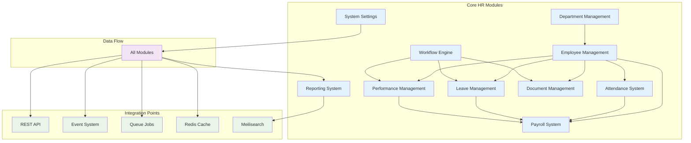

## 👥 Employee Management Module

### Architecture
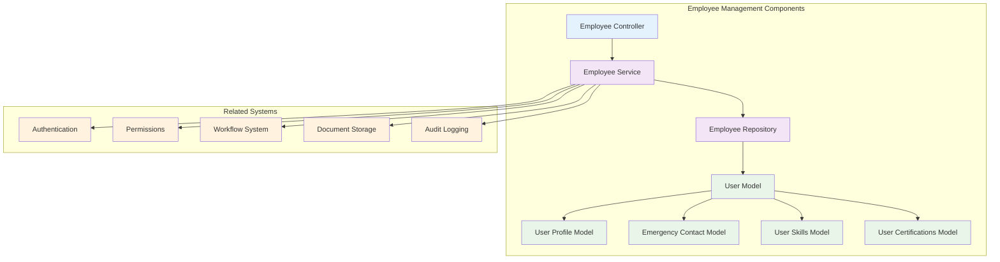

### Key Features
- **Employee Profiles**: Complete employee information management
- **Organizational Hierarchy**: Manager-employee relationships
- **Multi-tenant Support**: Company-based employee isolation
- **Skills & Certifications**: Track employee capabilities
- **Emergency Contacts**: Critical contact information
- **Document Attachments**: Employee-related documents
- **Audit Trail**: Complete history of changes

### Employee Lifecycle Flow
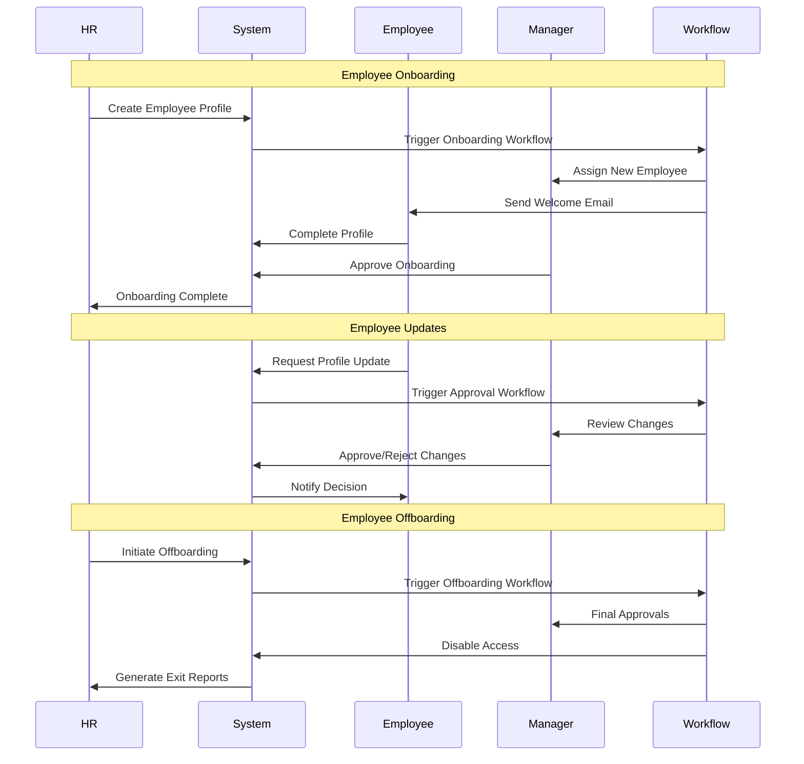

## 🏢 Department Management Module

### Department Hierarchy
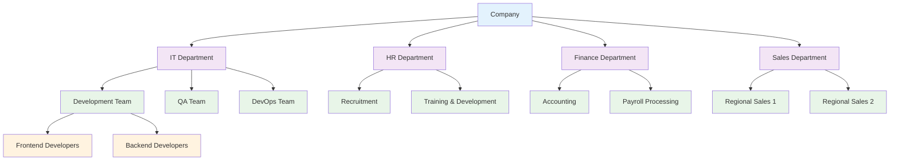

### Department Features
- **Hierarchical Structure**: Multi-level department organization
- **Budget Management**: Department-wise budget tracking
- **Cost Centers**: Financial reporting by department
- **Manager Assignment**: Department head management
- **Employee Transfer**: Inter-department movement workflows

## ⏰ Attendance System Module

### Attendance Flow
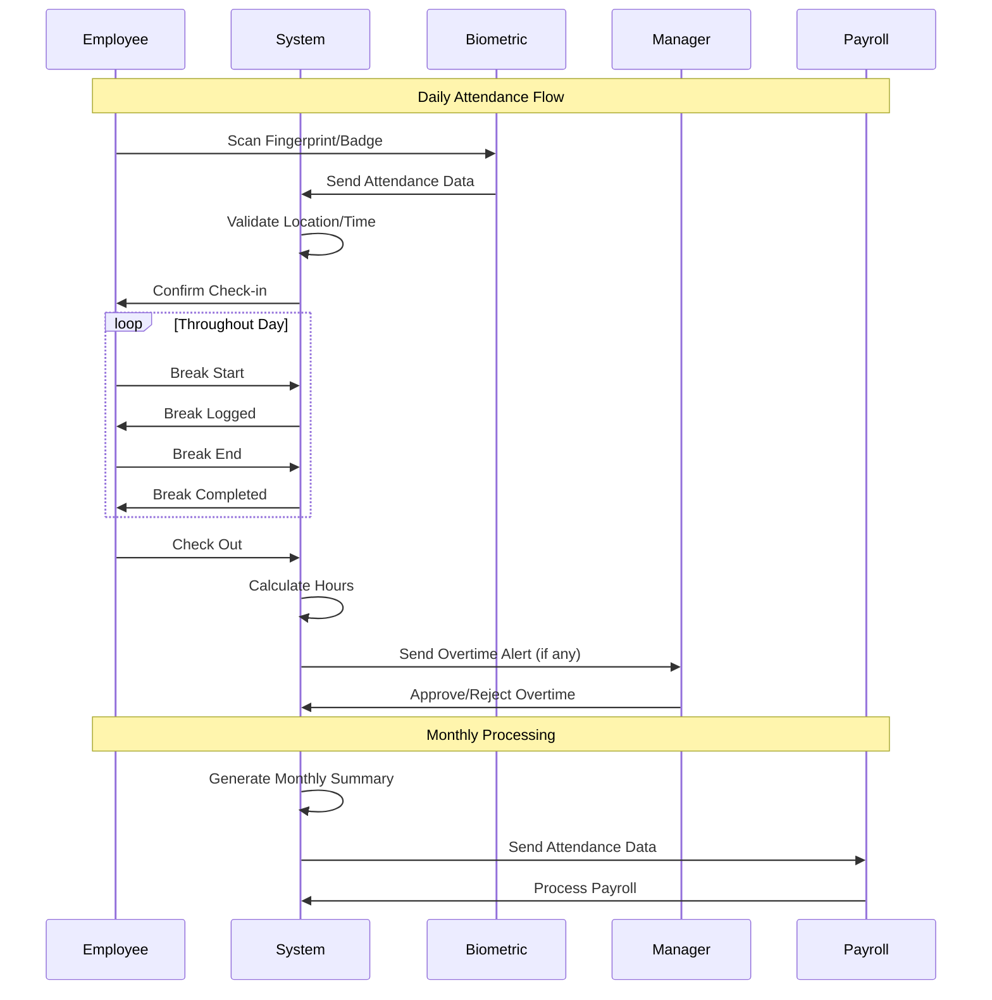

### Attendance Features
- **Multiple Check-in Methods**: Biometric, mobile app, web portal
- **Location Tracking**: GPS-based attendance validation
- **Break Management**: Track break times and duration
- **Overtime Calculation**: Automatic overtime detection
- **Shift Management**: Multiple shift support
- **Attendance Policies**: Flexible policy configuration
- **Real-time Monitoring**: Live attendance dashboard

### Attendance Analytics
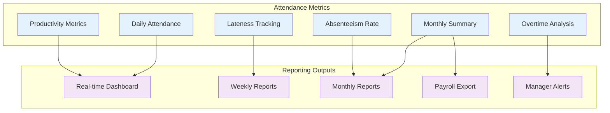

## 🏖️ Leave Management Module

### Leave Request Workflow
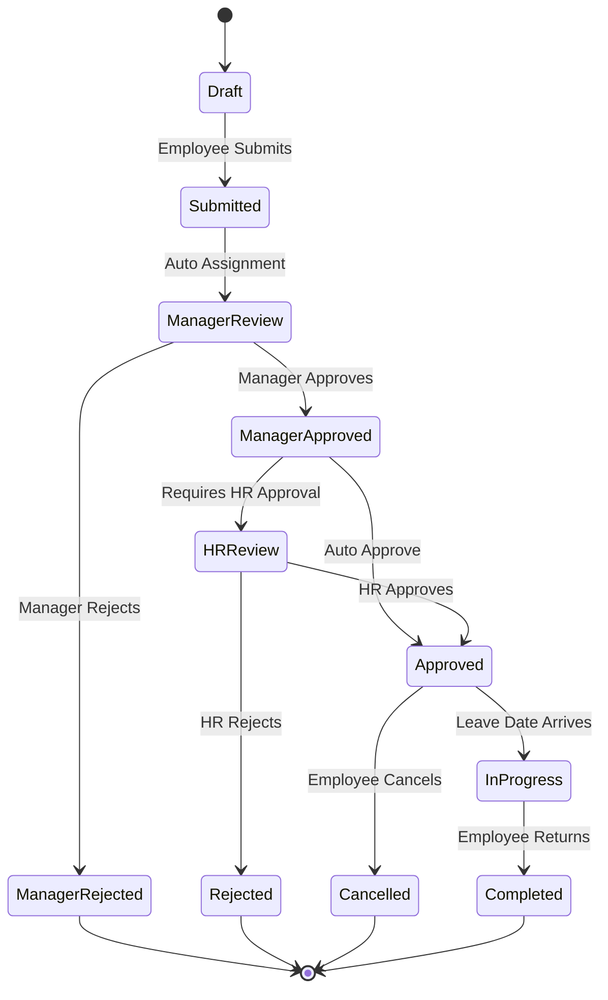

### Leave Types & Policies
```mermaid
graph TB
    subgraph "Leave Types"
        Annual[Annual Leave]
        Sick[Sick Leave]
        Maternity[Maternity Leave]
        Paternity[Paternity Leave]
        Emergency[Emergency Leave]
        Study[Study Leave]
        Unpaid[Unpaid Leave]
        Compensatory[Compensatory Leave]
    end
    
    subgraph "Policy Rules"
        Allocation[Annual Allocation]
        Approval[Approval Requirements]
        Carryover[Carryover Rules]
        Encashment[Leave Encashment]
        Prorating[Pro-rating Rules]
        Blackout[Blackout Periods]
    end
    
    subgraph "Integration Points"
        Calendar[Company Calendar]
        Payroll_Sys[Payroll System]
        Attendance_Sys[Attendance System]
        Workflow_Sys[Workflow System]
    end
    
    Annual --> Allocation
    Annual --> Carryover
    Annual --> Encashment
    
    Sick --> Approval
    Maternity --> Approval
    Paternity --> Approval
    
    All_Leave[All Leave Types] --> Calendar
    All_Leave --> Payroll_Sys
    All_Leave --> Attendance_Sys
    All_Leave --> Workflow_Sys
    
    classDef leave fill:#e3f2fd
    classDef policy fill:#f3e5f5
    classDef integration fill:#e8f5e8
    
    class Annual,Sick,Maternity,Paternity,Emergency,Study,Unpaid,Compensatory leave
    class Allocation,Approval,Carryover,Encashment,Prorating,Blackout policy
    class Calendar,Payroll_Sys,Attendance_Sys,Workflow_Sys integration
```

## 💰 Payroll System Module

### Payroll Processing Flow
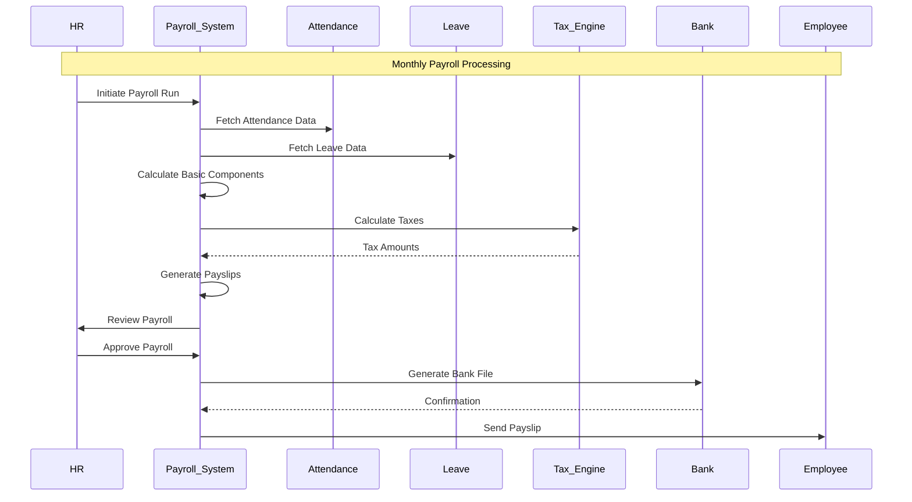

### Salary Components
```mermaid
graph TB
    subgraph "Earnings"
        Basic[Basic Salary]
        HRA[House Rent Allowance]
        Transport[Transport Allowance]
        Medical[Medical Allowance]
        Overtime[Overtime Pay]
        Bonus[Performance Bonus]
        Commission[Sales Commission]
        Other_Allowances[Other Allowances]
    end
    
    subgraph "Deductions"
        Tax[Income Tax]
        PF[Provident Fund]
        ESI[Employee State Insurance]
        Loan[Loan Deduction]
        Advance[Salary Advance]
        LOP[Loss of Pay]
        Other_Deductions[Other Deductions]
    end
    
    subgraph "Calculations"
        Gross[Gross Salary]
        Total_Deductions[Total Deductions]
        Net[Net Salary]
    end
    
    Basic --> Gross
    HRA --> Gross
    Transport --> Gross
    Medical --> Gross
    Overtime --> Gross
    Bonus --> Gross
    Commission --> Gross
    Other_Allowances --> Gross
    
    Tax --> Total_Deductions
    PF --> Total_Deductions
    ESI --> Total_Deductions
    Loan --> Total_Deductions
    Advance --> Total_Deductions
    LOP --> Total_Deductions
    Other_Deductions --> Total_Deductions
    
    Gross --> Net
    Total_Deductions --> Net
    
    classDef earnings fill:#e8f5e8
    classDef deductions fill:#ffebee
    classDef calculations fill:#e3f2fd
    
    class Basic,HRA,Transport,Medical,Overtime,Bonus,Commission,Other_Allowances earnings
    class Tax,PF,ESI,Loan,Advance,LOP,Other_Deductions deductions
    class Gross,Total_Deductions,Net calculations
```

## 📊 Performance Management Module

### Performance Review Cycle
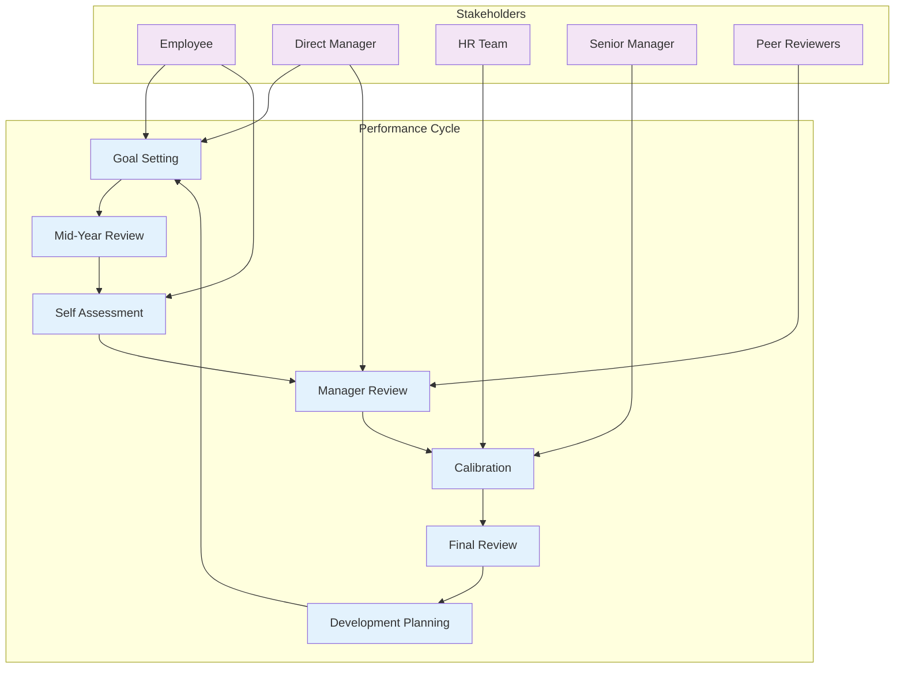

### Performance Metrics
```mermaid
graph TB
    subgraph "Performance Categories"
        Technical[Technical Skills]
        Behavioral[Behavioral Competencies]
        Goals[Goal Achievement]
        Leadership[Leadership Skills]
        Innovation[Innovation & Creativity]
    end
    
    subgraph "Rating Methods"
        Numeric[Numeric Scale (1-5)]
        Descriptive[Descriptive Ratings]
        Ranking[Forced Ranking]
        Continuous[Continuous Feedback]
    end
    
    subgraph "Review Types"
        Annual[Annual Review]
        Quarterly[Quarterly Check-in]
        Project[Project-based Review]
        Peer[360-Degree Feedback]
        Probation[Probation Review]
    end
    
    Technical --> Numeric
    Behavioral --> Descriptive
    Goals --> Numeric
    Leadership --> Peer
    Innovation --> Continuous
    
    All_Categories[All Categories] --> Annual
    All_Categories --> Quarterly
    Technical --> Project
    All_Categories --> Peer
    All_Categories --> Probation
    
    classDef category fill:#e3f2fd
    classDef method fill:#f3e5f5
    classDef type fill:#e8f5e8
    
    class Technical,Behavioral,Goals,Leadership,Innovation category
    class Numeric,Descriptive,Ranking,Continuous method
    class Annual,Quarterly,Project,Peer,Probation type
```

## 📄 Document Management Module

### Document Lifecycle
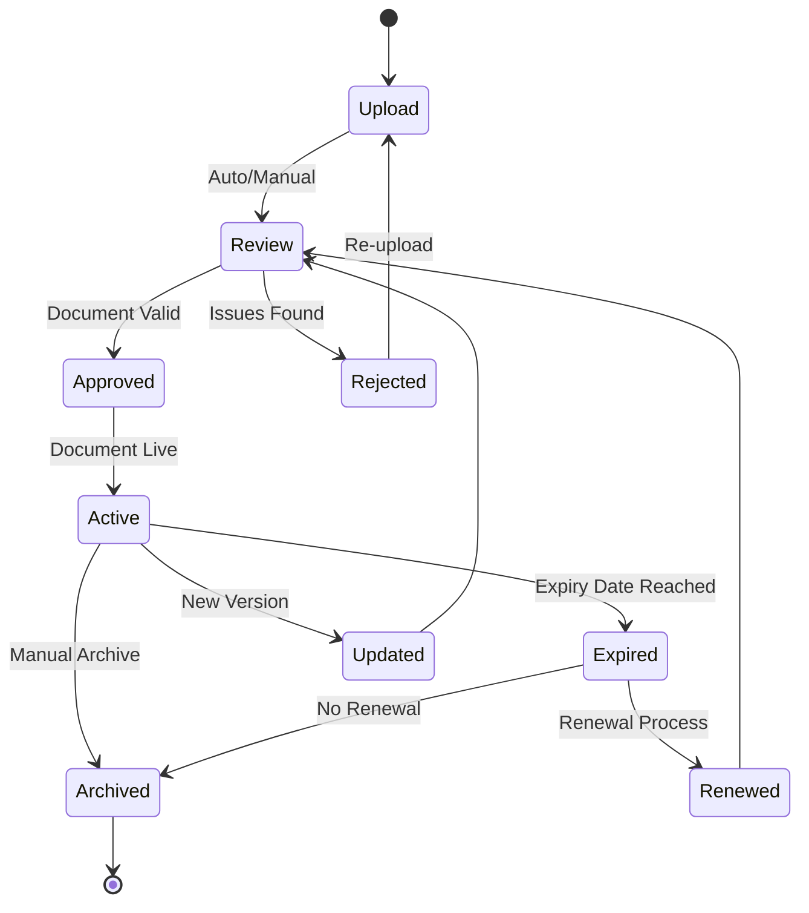

### Document Categories & Security
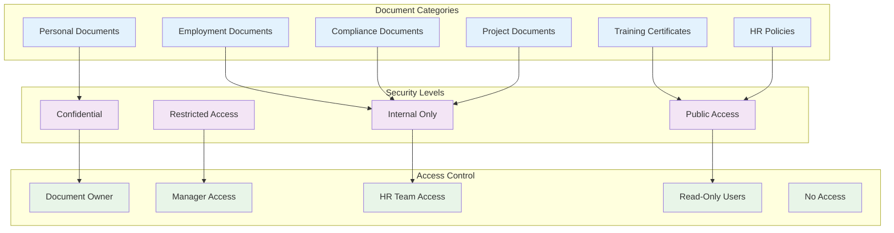

## 🔄 Workflow Engine Module

### Workflow Types
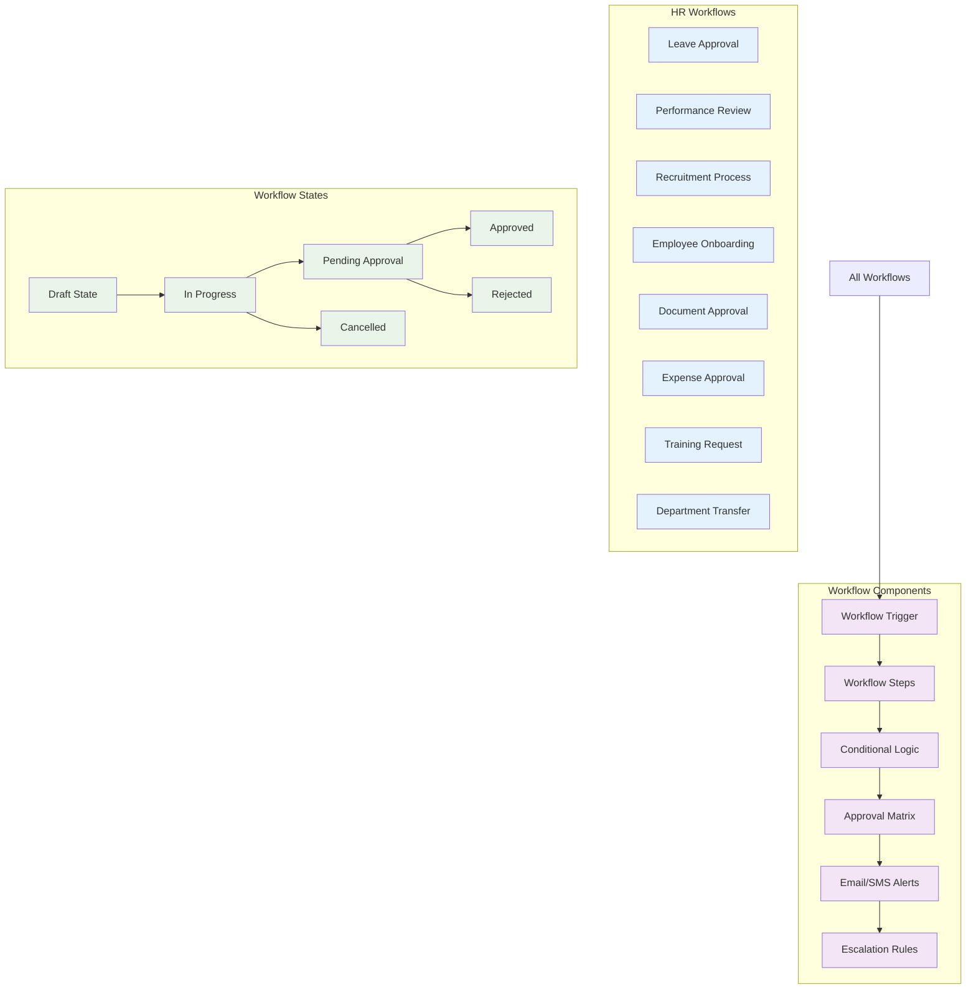

## 📊 Reporting System Module

### Report Categories
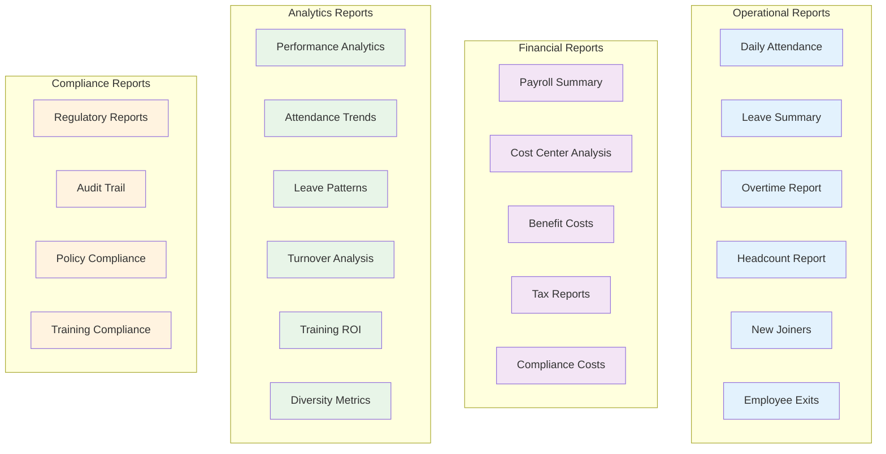

## ⚙️ System Settings Module

### Configuration Areas
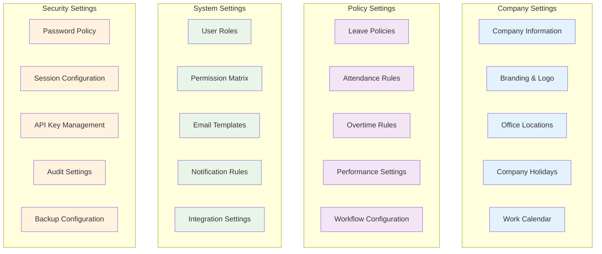

---

**Next**: [Security Architecture](../architecture/security-architecture.md) | [Development Guide](../development/getting-started.md)