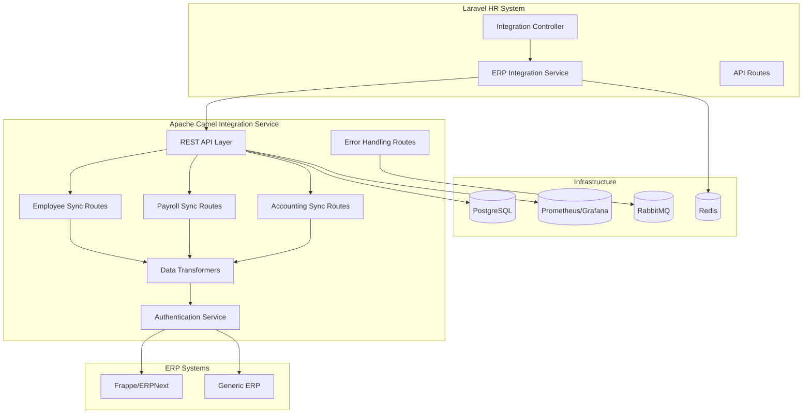

# ERP Integration Implementation Guide

## 🎯 Overview

This implementation provides a complete Apache Camel-based integration solution for connecting your Laravel HR system with legacy ERP systems like Frappe. The integration supports bidirectional data synchronization for employees, payroll, and accounting data.

## 🏗️ Architecture



## 🚀 Quick Start

### 1. Prerequisites

- Java 17+
- Maven 3.6+
- Docker & Docker Compose
- Laravel 10+
- PostgreSQL 12+
- RabbitMQ 3.12+

### 2. Environment Setup

1. Copy the integration environment template:
   ```bash
   cp .env.integration.example .env.integration
   ```

2. Update the configuration values in `.env.integration`:
   ```env
   FRAPPE_BASE_URL=http://your-frappe-instance:8000
   FRAPPE_API_KEY=your-api-key
   FRAPPE_API_SECRET=your-api-secret
   ```

3. Add the integration routes to your Laravel routes:
   ```php
   // In routes/api.php
   require __DIR__.'/api_integration.php';
   ```

### 3. Start Services

Using Docker Compose:
```bash
docker-compose -f docker-compose.integration.yml up -d
```

Or manually:
```bash
# Start the integration service
cd microservices/services/integration-service
./mvnw spring-boot:run

# Start supporting services
docker run -d --name rabbitmq -p 5672:5672 -p 15672:15672 rabbitmq:3.12-management
docker run -d --name redis -p 6379:6379 redis:7-alpine
```

## 📋 Features

### ✅ Completed Features

1. **Apache Camel Integration Service**
   - Spring Boot application with Camel routes
   - REST API endpoints for manual triggering
   - Scheduled synchronization jobs
   - Comprehensive configuration management

2. **Data Synchronization Routes**
   - Employee synchronization (Laravel ↔ ERP)
   - Payroll processing integration
   - Accounting data exchange
   - Leave management integration

3. **Data Transformation**
   - Bidirectional data mapping
   - Format conversion between systems
   - Field validation and sanitization
   - Custom transformation rules

4. **Authentication & Security**
   - Multiple auth methods (API key, Bearer token, Basic auth)
   - Secure credential management
   - Token refresh mechanisms
   - Rate limiting and IP restrictions

5. **Error Handling & Monitoring**
   - Comprehensive error handling routes
   - Retry mechanisms with exponential backoff
   - Dead letter queue for failed messages
   - Health checks and metrics collection

6. **Laravel Integration Points**
   - Service classes for ERP communication
   - REST API controllers
   - Webhook endpoints for real-time updates
   - Caching for performance optimization

## 🔌 API Endpoints

### Laravel Endpoints

| Method | Endpoint | Description |
|--------|----------|-------------|
| GET | `/api/integration/dashboard` | Integration dashboard data |
| GET | `/api/integration/status` | Overall integration status |
| GET | `/api/integration/health` | Health check |
| POST | `/api/integration/employee/sync` | Trigger employee sync |
| POST | `/api/integration/payroll/sync` | Trigger payroll sync |
| POST | `/api/integration/accounting/sync` | Trigger accounting sync |
| POST | `/api/integration/sync-all` | Trigger all synchronizations |

### Camel Service Endpoints

| Method | Endpoint | Description |
|--------|----------|-------------|
| GET | `/integration/camel/health` | Service health check |
| POST | `/integration/camel/employee/sync` | Employee synchronization |
| POST | `/integration/camel/payroll/sync` | Payroll synchronization |
| POST | `/integration/camel/accounting/sync` | Accounting synchronization |

## 🔧 Configuration

### Laravel Configuration

Edit `config/integration.php`:

```php
'erp' => [
    'frappe' => [
        'enabled' => true,
        'base_url' => env('FRAPPE_BASE_URL'),
        'api_key' => env('FRAPPE_API_KEY'),
        'api_secret' => env('FRAPPE_API_SECRET'),
    ],
],
```

### Camel Service Configuration

Edit `src/main/resources/application.yml`:

```yaml
erp:
  frappe:
    enabled: true
    base-url: ${FRAPPE_BASE_URL:http://localhost:8000}
    api-key: ${FRAPPE_API_KEY:your-api-key}
    api-secret: ${FRAPPE_API_SECRET:your-api-secret}
```

## 📊 Data Mapping

### Employee Data Mapping

| Laravel Field | Frappe Field | Description |
|---------------|--------------|-------------|
| `employee_id` | `employee_number` | Employee identifier |
| `full_name` | `employee_name` | Full name |
| `email` | `personal_email` | Email address |
| `position` | `designation` | Job title |
| `hire_date` | `date_of_joining` | Start date |

### Payroll Data Mapping

| Laravel Field | Frappe Field | Description |
|---------------|--------------|-------------|
| `employee_id` | `employee` | Employee reference |
| `gross_pay` | `gross_pay` | Gross salary |
| `net_pay` | `net_pay` | Net salary |
| `pay_period` | `posting_date` | Pay period |

## 🔍 Monitoring

### Health Checks
- Service health: `GET /integration/camel/health`
- Database connectivity
- ERP system availability
- Message queue status

### Metrics
- Synchronization success/failure rates
- Processing times
- Error counts by type
- API response times

### Grafana Dashboards
Access Grafana at `http://localhost:3000` (admin/admin123):
- Integration Overview Dashboard
- Error Monitoring Dashboard
- Performance Metrics Dashboard

## 🚨 Error Handling

### Retry Logic
- Maximum 3 retry attempts
- Exponential backoff (5s, 10s, 20s)
- Different strategies per error type

### Error Types
- **Authentication Errors**: Auto token refresh
- **Rate Limiting**: Automatic delays
- **Server Errors**: Admin notifications
- **Validation Errors**: Data correction attempts

## 🔒 Security

### Authentication Methods
1. **Frappe**: API Key + Secret
2. **Generic ERP**: Bearer token, Basic auth, or API key
3. **Laravel**: Bearer token

### Security Features
- Encrypted credential storage
- Rate limiting (100 req/min default)
- IP allowlist support
- Secure headers on all requests

## 📅 Scheduling

### Default Schedules
- **Employee Sync**: Daily at 2:00 AM
- **Payroll Sync**: Daily at 3:00 AM
- **Accounting Sync**: Daily at 4:00 AM

### Custom Scheduling
Use Laravel's task scheduling or Camel's cron expressions:

```php
// Laravel scheduler
$schedule->call(function () {
    app(ErpIntegrationService::class)->syncEmployees();
})->daily();
```

## 🧪 Testing

### Unit Tests
```bash
# Test the integration service
cd microservices/services/integration-service
./mvnw test

# Test Laravel integration
php artisan test --filter Integration
```

### Manual Testing
1. Check service health: `GET /integration/camel/health`
2. Trigger employee sync: `POST /api/integration/employee/sync`
3. Monitor logs and metrics

## 🔧 Troubleshooting

### Common Issues

1. **Connection Refused**
   - Check if integration service is running
   - Verify port configuration (8083)

2. **Authentication Failures**
   - Validate API credentials in `.env`
   - Check Frappe user permissions

3. **Data Not Syncing**
   - Check logs: `docker logs integration-service`
   - Verify data format and field mappings

4. **Performance Issues**
   - Reduce batch sizes
   - Check database indexes
   - Monitor memory usage

### Log Locations
- Integration Service: `/app/logs` (in container)
- Laravel: `storage/logs/laravel.log`
- RabbitMQ: Management UI at `http://localhost:15672`

## 🔄 Deployment

### Production Deployment
1. Build the integration service:
   ```bash
   cd microservices/services/integration-service
   ./mvnw clean package
   ```

2. Deploy using Docker:
   ```bash
   docker-compose -f docker-compose.integration.yml up -d
   ```

3. Configure production environment variables
4. Set up monitoring and alerting
5. Configure backup strategies

## 📚 Additional Resources

- [Apache Camel Documentation](https://camel.apache.org/manual/)
- [Frappe API Documentation](https://frappeframework.com/docs/user/en/api)
- [Spring Boot Reference](https://spring.io/projects/spring-boot)
- [Laravel HTTP Client](https://laravel.com/docs/http-client)

## 🤝 Support

For issues and questions:
1. Check the logs first
2. Review configuration settings
3. Test connectivity manually
4. Consult the documentation

The integration is now ready for use! 🎉