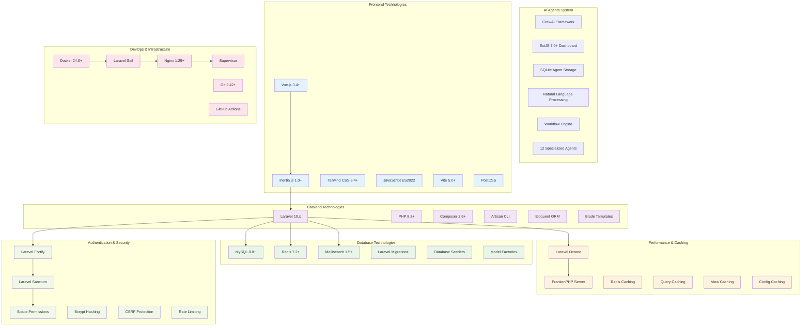
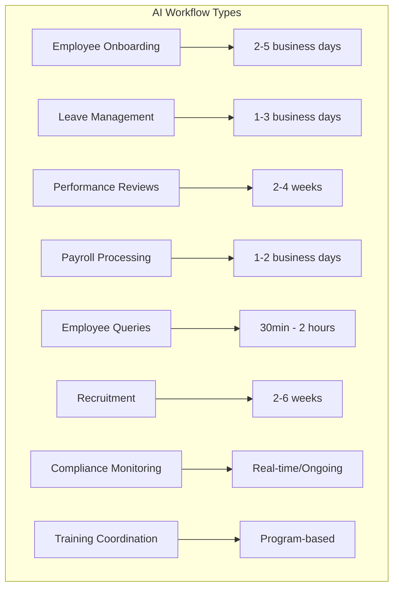
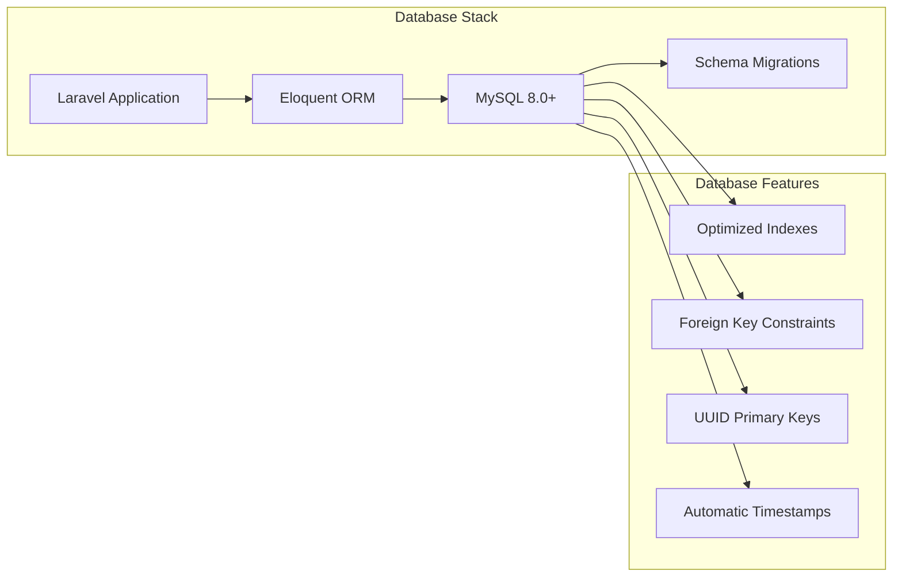
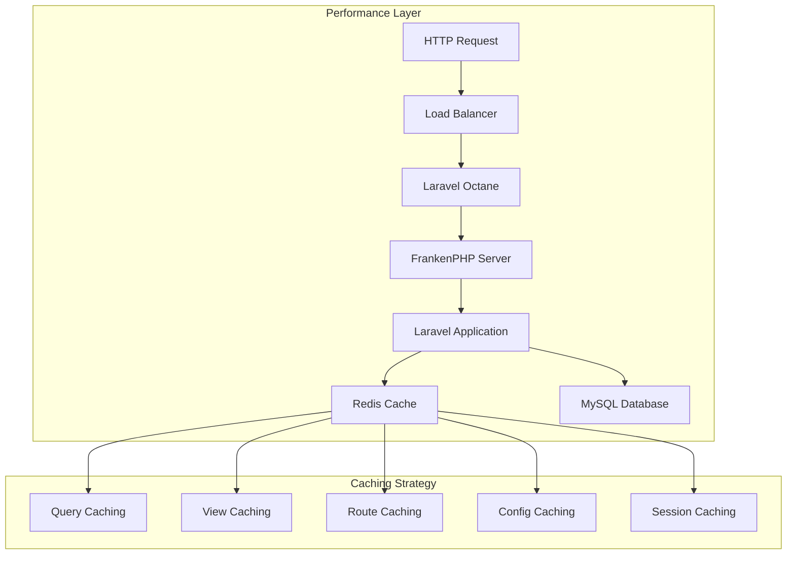
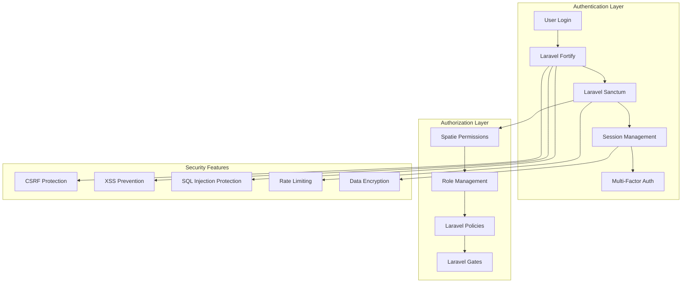
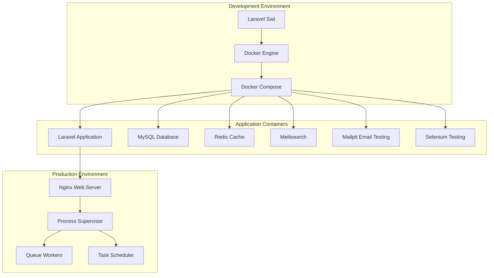
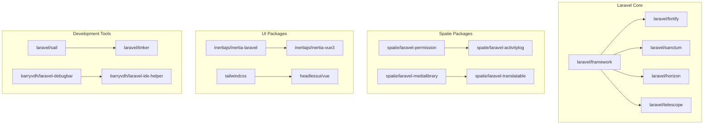
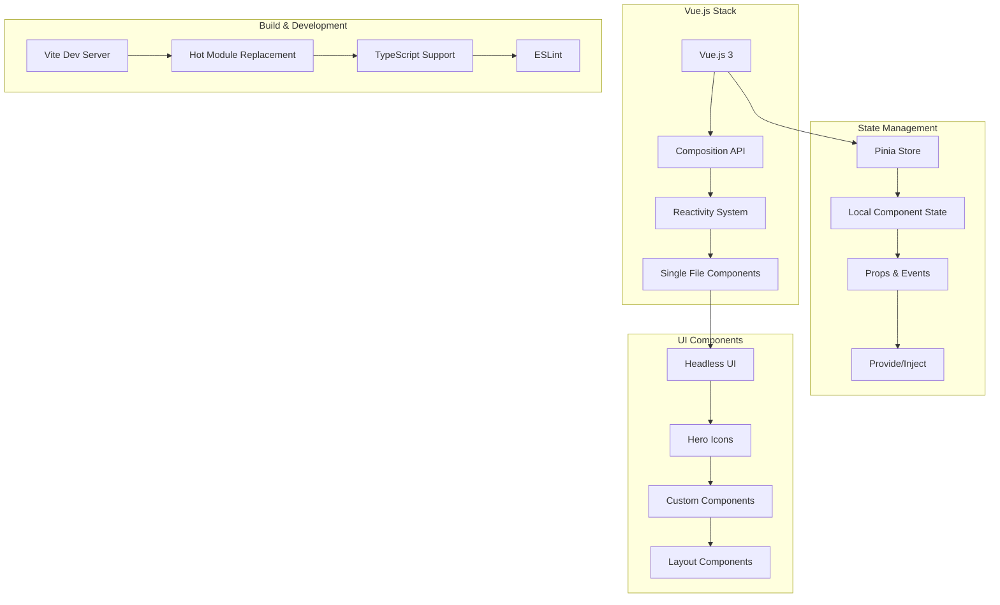

# Technology Stack Reference

## 🛠️ Complete Technology Stack Overview

This document provides a comprehensive reference of all technologies, tools, frameworks, and libraries used in the Laravel HR Boilerplate system, including the advanced **AI Agents automation system**.

## 🤖 AI Agents System

### AI Framework & Engine
| Technology | Version | Purpose | Documentation |
|------------|---------|---------|---------------|
| **CrewAI** | Latest | Multi-Agent Collaboration Framework | [CrewAI Docs](https://crewai.com/docs) |
| **ExtJS** | 7.0+ | Rich Dashboard Interface | [ExtJS Docs](https://docs.sencha.com/extjs/7.0.0/) |
| **SQLite** | 3.45+ | Agent Data Storage | [SQLite Docs](https://sqlite.org/docs.html) |

### Core Agents (6)
| Agent | ID | Role | Purpose |
|-------|----|----- |---------|
| **HR Agent** | hr_001 | Human Resources Coordinator | Employee relations and HR processes |
| **Project Manager** | pm_001 | Project Coordination Specialist | Workflow orchestration and task coordination |
| **Analytics Agent** | analytics_001 | Data Analysis Specialist | Insights, reporting, and data analysis |
| **Workflow Engine** | workflow_001 | Process Automation Manager | Workflow execution and state management |
| **Integration Agent** | integration_001 | System Integration Coordinator | Data flow and system integrations |
| **Notification Agent** | notification_001 | Communication Manager | All notifications and communications |

### Specialized Agents (6)
| Agent | ID | Specialization | Queue Management |
|-------|----|----- |---------|
| **IT Support** | it_001 | System Administration | 10 tasks queue |
| **Compliance** | compliance_001 | Regulatory Compliance | Policy adherence monitoring |
| **Training** | training_001 | Employee Development | Training coordination |
| **Payroll** | payroll_001 | Payroll Processing | Exception handling |
| **Leave Processing** | leave_001 | Leave Management | Approval workflows |
| **Coverage** | coverage_001 | Staff Scheduling | Coverage optimization |

### Workflow Types (8)

### Dashboard Technology
| Component | Technology | Purpose |
|-----------|------------|---------|
| **Frontend** | ExtJS 7.0+ | Rich interactive dashboard |
| **Real-time** | WebSockets | Live agent monitoring |
| **Visualization** | ExtJS Charts | Performance metrics and analytics |
| **API Integration** | Laravel Sanctum | Secure API communication |

## 🎯 Core Framework & Runtime

### Backend Framework
| Technology | Version | Purpose | Documentation |
|------------|---------|---------|---------------|
| **Laravel** | 10.48+ | PHP Web Framework | [Laravel Docs](https://laravel.com/docs/10.x) |
| **PHP** | 8.3+ | Server-side Language | [PHP Manual](https://www.php.net/manual/en/) |
| **Composer** | 2.6+ | Dependency Manager | [Composer Docs](https://getcomposer.org/doc/) |

### Frontend Framework
| Technology | Version | Purpose | Documentation |
|------------|---------|---------|---------------|
| **Vue.js** | 3.4+ | Progressive JavaScript Framework | [Vue.js Guide](https://vuejs.org/guide/) |
| **Inertia.js** | 1.0+ | Modern Monolith Architecture | [Inertia.js Docs](https://inertiajs.com/) |
| **Tailwind CSS** | 3.4+ | Utility-first CSS Framework | [Tailwind Docs](https://tailwindcss.com/docs) |

### Build Tools
| Technology | Version | Purpose | Documentation |
|------------|---------|---------|---------------|
| **Vite** | 5.0+ | Frontend Build Tool | [Vite Guide](https://vitejs.dev/guide/) |
| **PostCSS** | 8.4+ | CSS Processor | [PostCSS Docs](https://postcss.org/) |
| **ESLint** | 8.57+ | JavaScript Linter | [ESLint Docs](https://eslint.org/docs/) |

## 🗄️ Database & Storage

### Primary Database

| Technology | Version | Purpose | Configuration |
|------------|---------|---------|---------------|
| **MySQL** | 8.0+ | Primary Database | UTF8MB4, InnoDB Engine |
| **Redis** | 7.2+ | Cache & Sessions | Persistent Storage |
| **Meilisearch** | 1.5+ | Full-text Search | Real-time Indexing |

### ORM & Database Tools
| Technology | Version | Purpose | Features |
|------------|---------|---------|----------|
| **Eloquent ORM** | Laravel 10.x | Database Abstraction | Relations, Scopes, Mutators |
| **Laravel Migrations** | Laravel 10.x | Schema Management | Version Control for DB |
| **Database Seeders** | Laravel 10.x | Test Data Generation | Realistic Sample Data |
| **Model Factories** | Laravel 10.x | Test Data Creation | Faker Integration |

## ⚡ Performance & Optimization

### High-Performance Stack

| Technology | Version | Purpose | Performance Benefit |
|------------|---------|---------|-------------------|
| **Laravel Octane** | 2.0+ | Application Server | 10x faster requests |
| **FrankenPHP** | 1.2+ | PHP Application Server | Built-in HTTP/2, HTTP/3 |
| **Redis** | 7.2+ | In-memory Caching | Sub-millisecond response |
| **OpCache** | PHP 8.3+ | Bytecode Caching | Faster PHP execution |

### Optimization Features
- **Query Optimization**: Eager loading, indexes, query caching
- **Asset Optimization**: Minification, compression, CDN ready
- **Memory Management**: Efficient memory usage with Octane
- **Connection Pooling**: Persistent database connections

## 🔐 Security & Authentication

### Security Stack

| Component | Technology | Version | Purpose |
|-----------|------------|---------|---------|
| **Authentication** | Laravel Fortify | 1.21+ | User login/registration |
| **API Authentication** | Laravel Sanctum | 4.0+ | API token management |
| **Authorization** | Spatie Permissions | 6.4+ | Role-based permissions |
| **Password Hashing** | Bcrypt/Argon2 | PHP 8.3+ | Secure password storage |
| **Encryption** | AES-256-CBC | Laravel 10.x | Data encryption at rest |

### Security Features
- **CSRF Protection**: Built-in Laravel protection
- **XSS Prevention**: Auto-escaping, CSP headers
- **SQL Injection Protection**: Eloquent ORM protection
- **Rate Limiting**: Redis-based throttling
- **Session Security**: Secure cookies, regeneration

## 🐳 DevOps & Infrastructure

### Container Stack

| Technology | Version | Purpose | Configuration |
|------------|---------|---------|---------------|
| **Docker** | 24.0+ | Containerization | Multi-stage builds |
| **Laravel Sail** | 1.28+ | Development Environment | Docker Compose wrapper |
| **Nginx** | 1.25+ | Web Server | Reverse proxy, SSL termination |
| **Supervisor** | 4.2+ | Process Management | Queue workers, scheduler |

### CI/CD Pipeline
| Technology | Purpose | Configuration |
|------------|---------|---------------|
| **GitHub Actions** | Automated CI/CD | Testing, deployment |
| **PHPUnit** | Unit Testing | Feature & unit tests |
| **Laravel Dusk** | Browser Testing | End-to-end testing |
| **PHP CodeSniffer** | Code Quality | PSR-12 standards |

## 📦 Package Dependencies

### Core Laravel Packages

### Backend Packages
| Package | Version | Purpose | Documentation |
|---------|---------|---------|---------------|
| **spatie/laravel-permission** | ^6.4 | Role & Permission Management | [Docs](https://spatie.be/docs/laravel-permission) |
| **spatie/laravel-medialibrary** | ^11.0 | File Management | [Docs](https://spatie.be/docs/laravel-medialibrary) |
| **spatie/laravel-activitylog** | ^4.8 | Activity Logging | [Docs](https://spatie.be/docs/laravel-activitylog) |
| **laravel/horizon** | ^5.24 | Queue Monitoring | [Docs](https://laravel.com/docs/horizon) |
| **laravel/telescope** | ^5.0 | Debug Assistant | [Docs](https://laravel.com/docs/telescope) |

### Frontend Packages
| Package | Version | Purpose | Documentation |
|---------|---------|---------|---------------|
| **@inertiajs/vue3** | ^1.0 | Vue.js Adapter | [Docs](https://inertiajs.com/client-side-setup) |
| **@headlessui/vue** | ^1.7 | Unstyled UI Components | [Docs](https://headlessui.com/) |
| **@heroicons/vue** | ^2.0 | SVG Icon Library | [Docs](https://heroicons.com/) |
| **vue-toastification** | ^2.0 | Toast Notifications | [Docs](https://vue-toastification.maronato.dev/) |

### Development Dependencies
| Package | Version | Purpose |
|---------|---------|---------|
| **phpunit/phpunit** | ^10.5 | Testing Framework |
| **mockery/mockery** | ^1.6 | Mocking Library |
| **fakerphp/faker** | ^1.23 | Test Data Generation |
| **laravel/dusk** | ^8.0 | Browser Testing |

## 🌐 Frontend Technology Stack

### JavaScript & Vue.js Ecosystem

### CSS & Styling
| Technology | Version | Purpose | Features |
|------------|---------|---------|----------|
| **Tailwind CSS** | 3.4+ | Utility-first CSS | JIT compilation, dark mode |
| **PostCSS** | 8.4+ | CSS Processing | Autoprefixer, plugins |
| **CSS Grid** | Native | Layout System | Responsive grids |
| **Flexbox** | Native | Layout System | Flexible layouts |

## 🧪 Testing & Quality Assurance

### Testing Stack

```mermaid
graph TB
    subgraph "Backend Testing"
        PHPUnit[PHPUnit]
        Feature_Tests[Feature Tests]
        Unit_Tests[Unit Tests]
        Database_Tests[Database Tests]
    end
    
    subgraph "Frontend Testing"
        Vitest[Vitest]
        Vue_Test_Utils[Vue Test Utils]
        Component_Tests[Component Tests]
        Integration_Tests[Integration Tests]
    end
    
    subgraph "E2E Testing"
        Dusk[Laravel Dusk]
        Browser_Tests[Browser Tests]
        Selenium[Selenium]
        Automation[Test Automation]
    end
    
    subgraph "Code Quality"
        PHP_CS[PHP CodeSniffer]
        ESLint_Quality[ESLint]
        Prettier[Prettier]
        Static_Analysis[Static Analysis]
    end
    
    PHPUnit --> Feature_Tests
    PHPUnit --> Unit_Tests
    PHPUnit --> Database_Tests
    
    Vitest --> Vue_Test_Utils
    Vue_Test_Utils --> Component_Tests
    Component_Tests --> Integration_Tests
    
    Dusk --> Browser_Tests
    Browser_Tests --> Selenium
    Selenium --> Automation
    
    PHP_CS --> ESLint_Quality
    ESLint_Quality --> Prettier
    Prettier --> Static_Analysis
```

### Testing Tools
| Tool | Purpose | Coverage |
|------|---------|----------|
| **PHPUnit** | Backend Testing | Unit, Feature, Database tests |
| **Vitest** | Frontend Testing | Component, integration tests |
| **Laravel Dusk** | E2E Testing | Browser automation |
| **Pest** | Testing Framework | Alternative to PHPUnit |

## 📈 Monitoring & Analytics

### Application Monitoring
| Technology | Purpose | Features |
|------------|---------|----------|
| **Laravel Telescope** | Debug Assistant | Query monitoring, logs, cache |
| **Laravel Horizon** | Queue Monitoring | Real-time queue analytics |
| **Application Logs** | Error Tracking | Structured logging |
| **Performance Metrics** | Performance Monitoring | Response times, memory usage |

### Production Monitoring
- **Health Checks**: Automated system monitoring
- **Error Tracking**: Exception monitoring and alerts
- **Performance Metrics**: Response time and throughput
- **Security Monitoring**: Intrusion detection and logging

## 🔧 Development Tools & Utilities

### Code Quality Tools
| Tool | Purpose | Configuration |
|------|---------|---------------|
| **PHP CodeSniffer** | Code Standards | PSR-12 compliance |
| **PHPStan** | Static Analysis | Level 8 analysis |
| **ESLint** | JavaScript Linting | Vue.js specific rules |
| **Prettier** | Code Formatting | Consistent formatting |

### Development Utilities
| Tool | Purpose | Usage |
|------|---------|-------|
| **Laravel Tinker** | REPL Environment | Interactive debugging |
| **Laravel Debugbar** | Debug Information | Development profiling |
| **IDE Helper** | IDE Support | Better autocomplete |
| **Laravel Sail** | Development Environment | Docker wrapper |

---

## 🚀 Getting Started with the Stack

1. **Prerequisites**: Docker, PHP 8.3+, Node.js 18+
2. **Setup**: `./vendor/bin/sail up -d`
3. **Frontend**: `npm install && npm run dev`
4. **Database**: `./vendor/bin/sail artisan migrate:fresh --seed`
5. **Performance**: `./vendor/bin/sail artisan octane:start`

---

**Last Updated**: October 7, 2025  
**Version**: 1.0.0  
**Maintained by**: Laravel HR Boilerplate Team