# Cloud-Native Messaging & Event Patterns

## 🌊 Event-Driven Architecture Overview

The microservices architecture uses a combination of synchronous and asynchronous communication patterns to ensure loose coupling, scalability, and resilience.

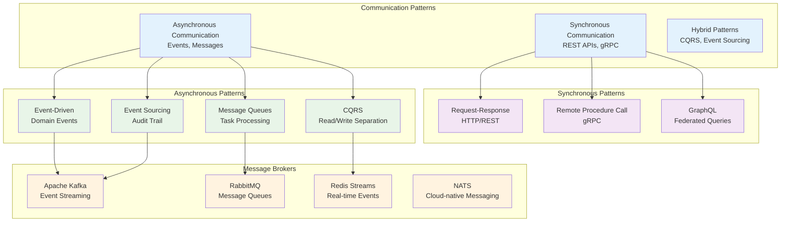

## 🚀 Apache Kafka Event Streaming

### Kafka Cluster Architecture
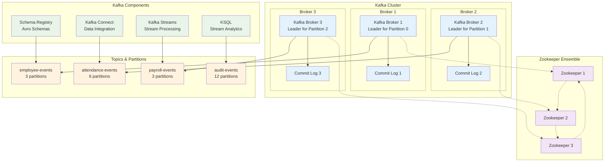

### Event Schema Design
```mermaid
graph TB
    subgraph "Event Schema Strategy"
        BaseEvent[Base Event Schema]
        DomainEvents[Domain-Specific Events]
        SchemaEvolution[Schema Evolution Strategy]
    end
    
    subgraph "Base Event Structure"
        EventMetadata[Event Metadata<br/>eventId, timestamp, version]
        EventType[Event Type<br/>domain.entity.action]
        EventData[Event Data<br/>Business payload]
        EventContext[Event Context<br/>correlation, causation]
    end
    
    subgraph "Employee Domain Events"
        EmployeeCreated[EmployeeCreated]
        EmployeeUpdated[EmployeeUpdated]
        EmployeeDeactivated[EmployeeDeactivated]
        EmployeeDepartmentChanged[DepartmentChanged]
    end
    
    subgraph "Attendance Domain Events"
        CheckInRecorded[CheckInRecorded]
        CheckOutRecorded[CheckOutRecorded]
        BreakStarted[BreakStarted]
        BreakEnded[BreakEnded]
        OvertimeCalculated[OvertimeCalculated]
    end
    
    subgraph "Payroll Domain Events"
        SalaryCalculated[SalaryCalculated]
        PayslipGenerated[PayslipGenerated]
        PaymentProcessed[PaymentProcessed]
        TaxDeducted[TaxDeducted]
    end
    
    BaseEvent --> EventMetadata
    BaseEvent --> EventType
    BaseEvent --> EventData
    BaseEvent --> EventContext
    
    DomainEvents --> EmployeeCreated
    DomainEvents --> EmployeeUpdated
    DomainEvents --> EmployeeDeactivated
    DomainEvents --> EmployeeDepartmentChanged
    
    DomainEvents --> CheckInRecorded
    DomainEvents --> CheckOutRecorded
    DomainEvents --> BreakStarted
    DomainEvents --> BreakEnded
    DomainEvents --> OvertimeCalculated
    
    DomainEvents --> SalaryCalculated
    DomainEvents --> PayslipGenerated
    DomainEvents --> PaymentProcessed
    DomainEvents --> TaxDeducted
    
    classDef schema fill:#e3f2fd
    classDef base fill:#f3e5f5
    classDef employee fill:#e8f5e8
    classDef attendance fill:#fff3e0
    classDef payroll fill:#fce4ec
    
    class BaseEvent,DomainEvents,SchemaEvolution schema
    class EventMetadata,EventType,EventData,EventContext base
    class EmployeeCreated,EmployeeUpdated,EmployeeDeactivated,EmployeeDepartmentChanged employee
    class CheckInRecorded,CheckOutRecorded,BreakStarted,BreakEnded,OvertimeCalculated attendance
    class SalaryCalculated,PayslipGenerated,PaymentProcessed,TaxDeducted payroll
```

### Event Flow Patterns

#### 1. Employee Lifecycle Events
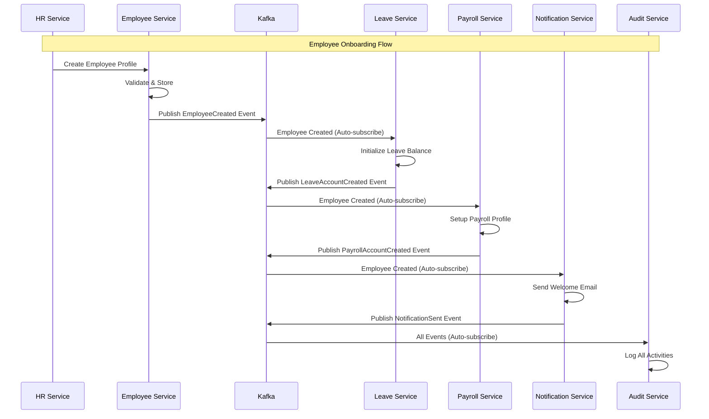

#### 2. Attendance Processing Events
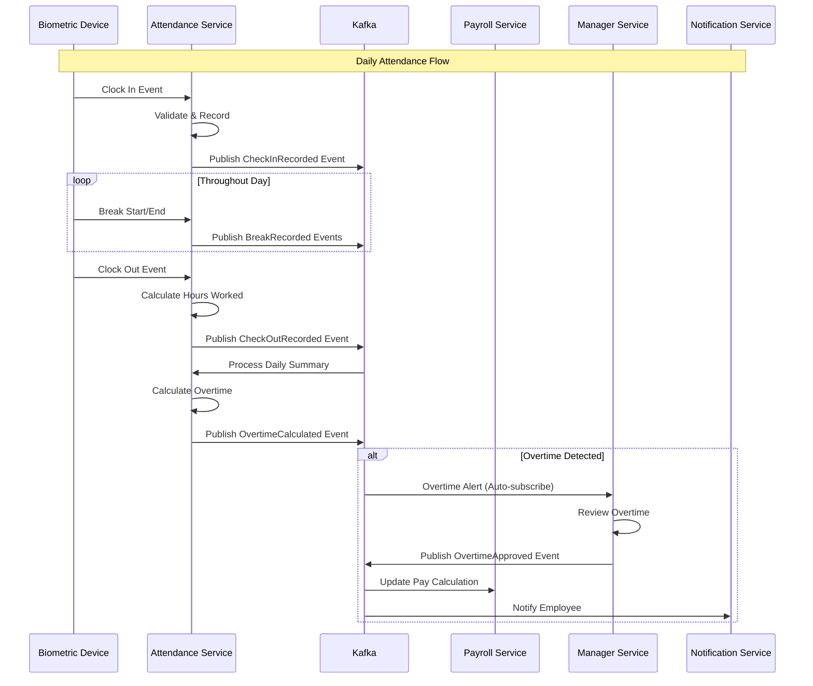

### Schema Evolution Strategy
```json
{
  "name": "EmployeeCreated",
  "type": "record",
  "namespace": "com.hr.employee.events",
  "version": "1.0",
  "fields": [
    {
      "name": "eventMetadata",
      "type": {
        "name": "EventMetadata",
        "type": "record",
        "fields": [
          {"name": "eventId", "type": "string"},
          {"name": "eventType", "type": "string"},
          {"name": "timestamp", "type": "long"},
          {"name": "version", "type": "string"},
          {"name": "source", "type": "string"},
          {"name": "correlationId", "type": ["null", "string"], "default": null},
          {"name": "causationId", "type": ["null", "string"], "default": null}
        ]
      }
    },
    {
      "name": "employeeData",
      "type": {
        "name": "EmployeeData",
        "type": "record",
        "fields": [
          {"name": "employeeId", "type": "string"},
          {"name": "email", "type": "string"},
          {"name": "firstName", "type": "string"},
          {"name": "lastName", "type": "string"},
          {"name": "departmentId", "type": "string"},
          {"name": "managerId", "type": ["null", "string"], "default": null},
          {"name": "jobTitle", "type": "string"},
          {"name": "startDate", "type": "string"},
          {"name": "employmentType", "type": "string"},
          {"name": "status", "type": "string"},
          {"name": "salary", "type": ["null", "double"], "default": null},
          {"name": "currency", "type": ["null", "string"], "default": null}
        ]
      }
    }
  ]
}
```

## 🐰 RabbitMQ Message Queues

### Queue Architecture
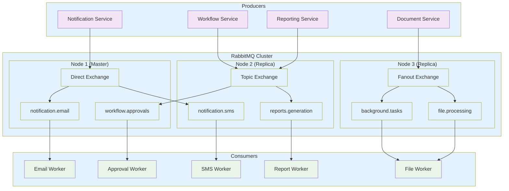

### Message Patterns

#### 1. Work Queue Pattern
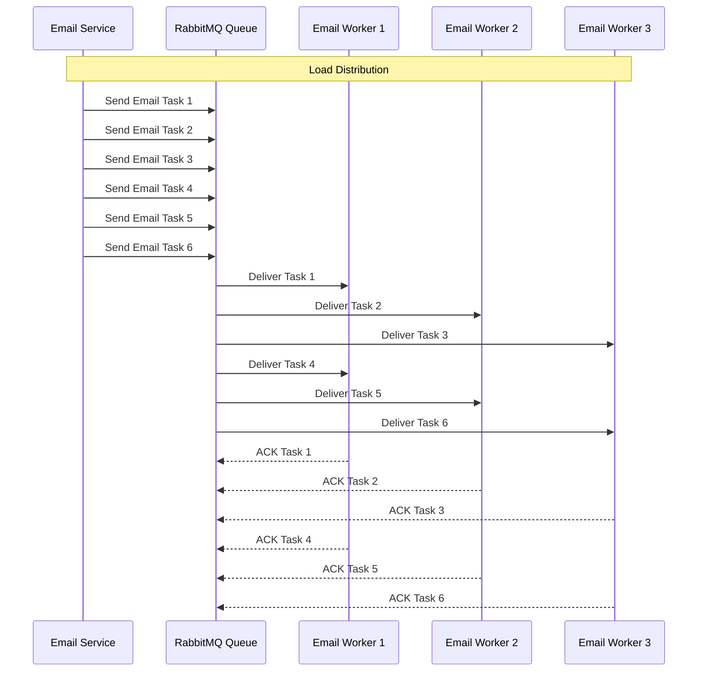

#### 2. Publish-Subscribe Pattern
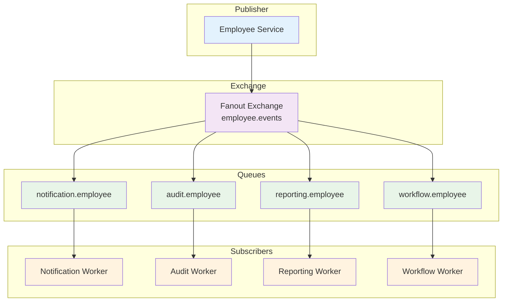

#### 3. RPC Pattern
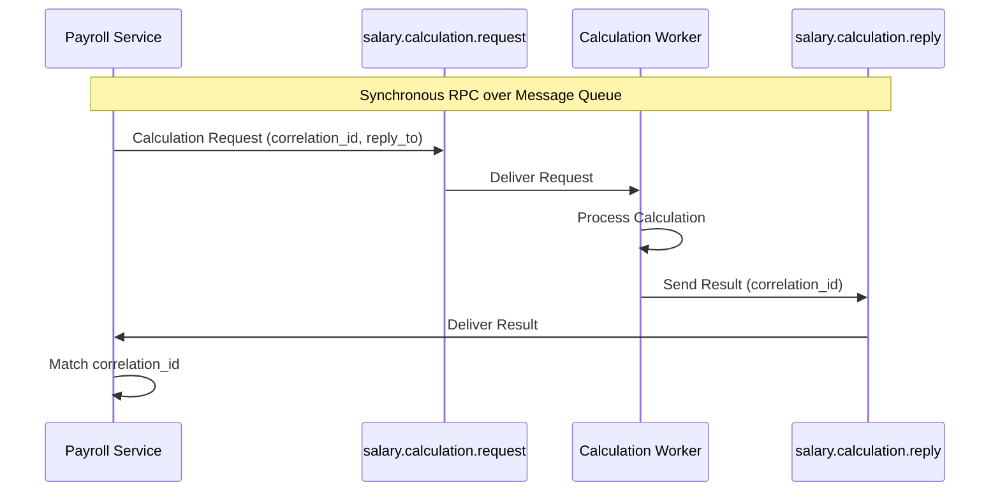

## 📊 Redis Streams for Real-time Events

### Redis Streams Architecture
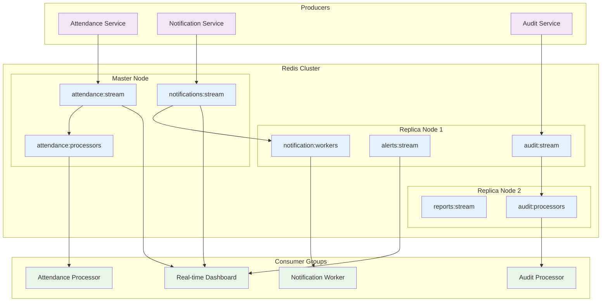

## 🔄 Event Sourcing Pattern

### Event Store Design
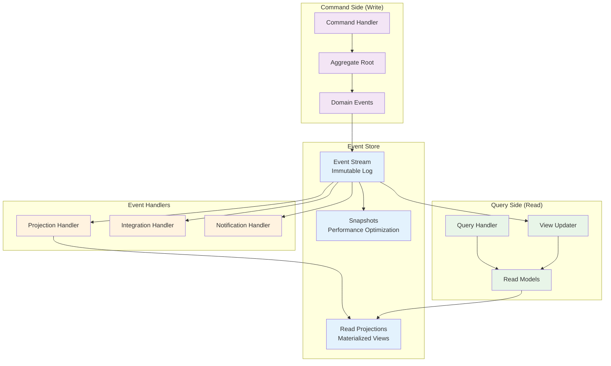

### Employee Aggregate Example
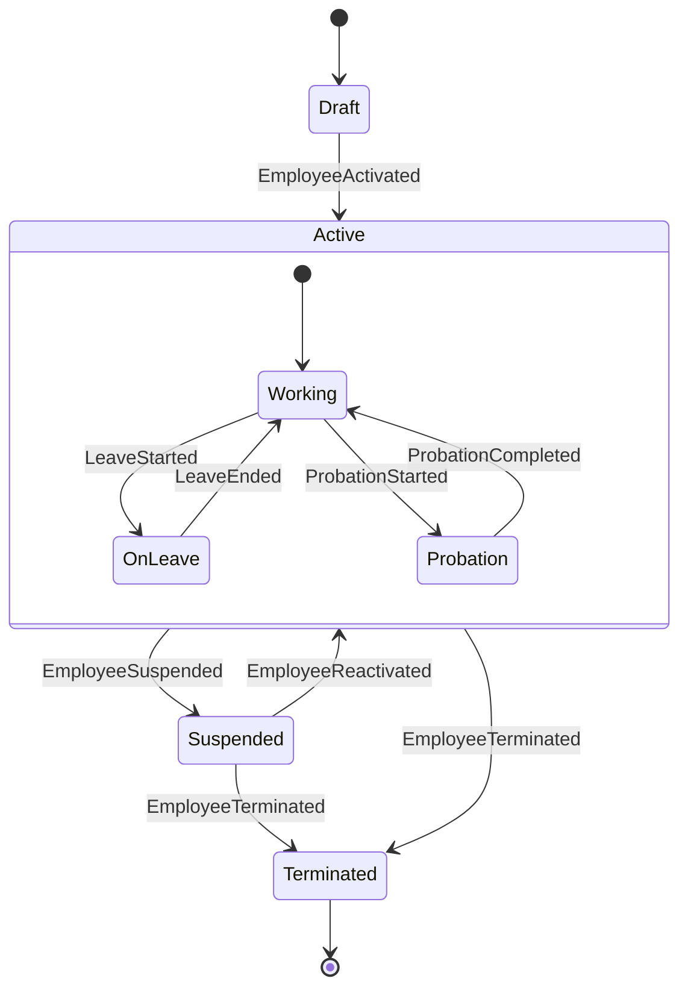

## 🔒 Message Security & Reliability

### Security Patterns
```mermaid
graph TB
    subgraph "Message Security"
        Encryption[Message Encryption<br/>TLS/AES-256]
        Authentication[Authentication<br/>SASL/OAuth 2.0]
        Authorization[Authorization<br/>ACL/RBAC]
        Signing[Message Signing<br/>Digital Signatures]
    end
    
    subgraph "Reliability Patterns"
        Persistence[Message Persistence<br/>Durable Queues]
        Replication[Message Replication<br/>Multiple Replicas]
        Acknowledgment[Message Acknowledgment<br/>At-least-once Delivery]
        DeadLetter[Dead Letter Queues<br/>Error Handling]
    end
    
    subgraph "Monitoring & Observability"
        MessageTracing[Message Tracing<br/>Distributed Tracing]
        Metrics[Message Metrics<br/>Throughput, Latency]
        Alerting[Message Alerting<br/>Error Detection]
        Audit[Message Audit<br/>Compliance Logging]
    end
    
    Encryption --> Authentication
    Authentication --> Authorization
    Authorization --> Signing
    
    Persistence --> Replication
    Replication --> Acknowledgment
    Acknowledgment --> DeadLetter
    
    MessageTracing --> Metrics
    Metrics --> Alerting
    Alerting --> Audit
    
    classDef security fill:#e3f2fd
    classDef reliability fill:#f3e5f5
    classDef monitoring fill:#e8f5e8
    
    class Encryption,Authentication,Authorization,Signing security
    class Persistence,Replication,Acknowledgment,DeadLetter reliability
    class MessageTracing,Metrics,Alerting,Audit monitoring
```

---

**Next**: [Service Implementations](../services/README.md) | [API Gateway](../infrastructure/api-gateway.md) | [Deployment](../deployment/README.md)