# Cloud-Native Microservices Architecture

## 🚀 Architecture Overview

This document outlines the transformation of the Laravel HR Boilerplate from a monolithic architecture to a cloud-native microservices architecture using modern patterns and technologies.

```mermaid
graph TB
    subgraph "Client Layer"
        WebApp[Web Application<br/>Vue.js + Inertia.js]
        MobileApp[Mobile Application<br/>React Native]
        ThirdParty[Third-party Integrations]
    end
    
    subgraph "Edge Layer"
        CDN[Content Delivery Network]
        WAF[Web Application Firewall]
        DDoS[DDoS Protection]
    end
    
    subgraph "API Gateway Cluster"
        Gateway1[API Gateway 1<br/>Kong/Traefik]
        Gateway2[API Gateway 2<br/>Kong/Traefik]
        Gateway3[API Gateway 3<br/>Kong/Traefik]
        LB[Load Balancer<br/>HAProxy/NGINX]
    end
    
    subgraph "Service Mesh"
        Istio[Istio Service Mesh]
        Envoy[Envoy Sidecar Proxies]
        Pilot[Pilot - Service Discovery]
        Citadel[Citadel - Security]
    end
    
    subgraph "Core Services Cluster 1"
        UserService[User Management<br/>Node.js/Go]
        AuthService[Authentication<br/>Node.js/Go]
        EmployeeService[Employee Management<br/>Laravel/Node.js]
        DepartmentService[Department Management<br/>Laravel/Node.js]
    end
    
    subgraph "Core Services Cluster 2"
        AttendanceService[Attendance Tracking<br/>Go/Java]
        LeaveService[Leave Management<br/>Laravel/Node.js]
        PayrollService[Payroll Processing<br/>Java/Go]
        PerformanceService[Performance Mgmt<br/>Laravel/Node.js]
    end
    
    subgraph "Supporting Services"
        DocumentService[Document Management<br/>Node.js/Go]
        WorkflowService[Workflow Engine<br/>Java/Go]
        NotificationService[Notifications<br/>Node.js/Python]
        ReportingService[Reporting & Analytics<br/>Python/Go]
        SearchService[Search Engine<br/>Elasticsearch]
        AuditService[Audit Logging<br/>Go/Java]
    end
    
    subgraph "Event Streaming Platform"
        Kafka[Apache Kafka Cluster]
        KafkaConnect[Kafka Connect]
        SchemaRegistry[Schema Registry]
        KSQL[KSQL Streaming]
    end
    
    subgraph "Message Queue"
        RabbitMQ[RabbitMQ Cluster]
        Redis[Redis Cluster<br/>Cache & Sessions]
    end
    
    subgraph "Data Layer"
        PostgreSQL[PostgreSQL Cluster<br/>Transactional Data]
        MongoDB[MongoDB Cluster<br/>Document Storage]
        TimescaleDB[TimescaleDB<br/>Time Series Data]
        ClickHouse[ClickHouse<br/>Analytics]
        S3[Object Storage<br/>MinIO/AWS S3]
    end
    
    subgraph "Observability Stack"
        Prometheus[Prometheus<br/>Metrics]
        Grafana[Grafana<br/>Dashboards]
        Jaeger[Jaeger<br/>Distributed Tracing]
        ELK[ELK Stack<br/>Centralized Logging]
        AlertManager[AlertManager<br/>Alerting]
    end
    
    subgraph "Infrastructure"
        K8s[Kubernetes Cluster]
        Helm[Helm Charts]
        ArgoCD[ArgoCD<br/>GitOps]
        Vault[HashiCorp Vault<br/>Secrets Management]
    end
    
    %% Client connections
    WebApp --> CDN
    MobileApp --> CDN
    ThirdParty --> WAF
    
    %% Edge to Gateway
    CDN --> WAF
    WAF --> DDoS
    DDoS --> LB
    
    %% Gateway cluster
    LB --> Gateway1
    LB --> Gateway2
    LB --> Gateway3
    
    %% Service mesh
    Gateway1 --> Istio
    Gateway2 --> Istio
    Gateway3 --> Istio
    
    %% Services
    Istio --> UserService
    Istio --> AuthService
    Istio --> EmployeeService
    Istio --> DepartmentService
    Istio --> AttendanceService
    Istio --> LeaveService
    Istio --> PayrollService
    Istio --> PerformanceService
    Istio --> DocumentService
    Istio --> WorkflowService
    Istio --> NotificationService
    Istio --> ReportingService
    
    %% Event streaming
    UserService --> Kafka
    EmployeeService --> Kafka
    AttendanceService --> Kafka
    LeaveService --> Kafka
    PayrollService --> Kafka
    
    %% Message queues
    NotificationService --> RabbitMQ
    WorkflowService --> RabbitMQ
    ReportingService --> RabbitMQ
    
    %% Data connections
    UserService --> PostgreSQL
    EmployeeService --> PostgreSQL
    AttendanceService --> TimescaleDB
    PayrollService --> PostgreSQL
    DocumentService --> MongoDB
    DocumentService --> S3
    ReportingService --> ClickHouse
    
    %% Cache
    UserService --> Redis
    AuthService --> Redis
    EmployeeService --> Redis
    
    %% Search
    EmployeeService --> SearchService
    DocumentService --> SearchService
    
    %% Observability
    All_Services[All Services] --> Prometheus
    All_Services --> Jaeger
    All_Services --> ELK
    
    classDef client fill:#e3f2fd
    classDef edge fill:#f3e5f5
    classDef gateway fill:#e8f5e8
    classDef service fill:#fff3e0
    classDef data fill:#fce4ec
    classDef message fill:#f1f8e9
    classDef observability fill:#ede7f6
    classDef infrastructure fill:#e0f2f1
    
    class WebApp,MobileApp,ThirdParty client
    class CDN,WAF,DDoS edge
    class Gateway1,Gateway2,Gateway3,LB gateway
    class UserService,AuthService,EmployeeService,DepartmentService,AttendanceService,LeaveService,PayrollService,PerformanceService,DocumentService,WorkflowService,NotificationService,ReportingService,SearchService,AuditService service
    class PostgreSQL,MongoDB,TimescaleDB,ClickHouse,S3 data
    class Kafka,RabbitMQ,Redis message
    class Prometheus,Grafana,Jaeger,ELK,AlertManager observability
    class K8s,Helm,ArgoCD,Vault infrastructure
```

## 🏗️ Service Architecture Patterns

### 1. API Gateway Pattern
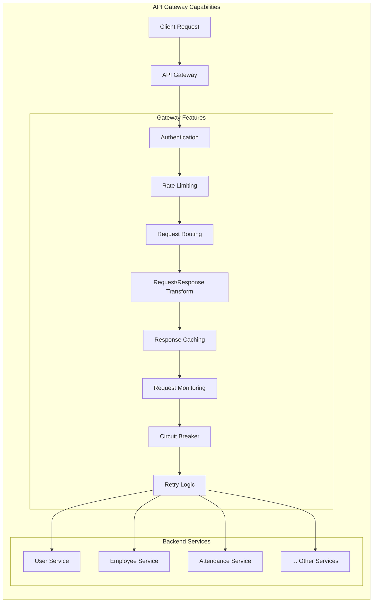

### 2. Service Discovery Pattern
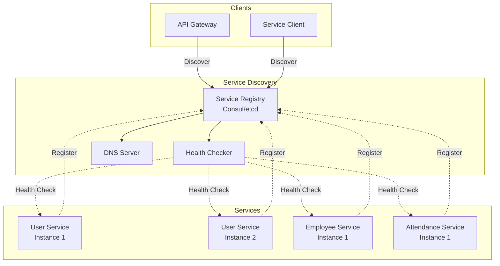

### 3. Circuit Breaker Pattern
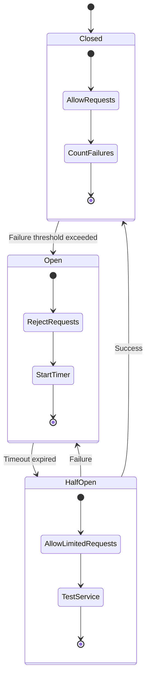

## 🔄 Event-Driven Architecture

### Event Streaming with Apache Kafka
```mermaid
graph TB
    subgraph "Event Producers"
        EmployeeService[Employee Service]
        AttendanceService[Attendance Service]
        LeaveService[Leave Service]
        PayrollService[Payroll Service]
    end
    
    subgraph "Apache Kafka Cluster"
        Topic1[employee-events]
        Topic2[attendance-events]
        Topic3[leave-events]
        Topic4[payroll-events]
        Topic5[audit-events]
        
        Partition1[Partition 0]
        Partition2[Partition 1]
        Partition3[Partition 2]
    end
    
    subgraph "Event Consumers"
        NotificationService[Notification Service]
        AuditService[Audit Service]
        ReportingService[Reporting Service]
        WorkflowService[Workflow Service]
        PayrollConsumer[Payroll Calculator]
    end
    
    subgraph "Stream Processing"
        KafkaStreams[Kafka Streams]
        KSQL_Engine[KSQL Engine]
        ConnectCluster[Kafka Connect]
    end
    
    EmployeeService --> Topic1
    AttendanceService --> Topic2
    LeaveService --> Topic3
    PayrollService --> Topic4
    
    Topic1 --> Partition1
    Topic1 --> Partition2
    Topic1 --> Partition3
    
    Topic1 --> NotificationService
    Topic1 --> AuditService
    Topic2 --> ReportingService
    Topic3 --> WorkflowService
    Topic4 --> PayrollConsumer
    
    Topic2 --> KafkaStreams
    KafkaStreams --> KSQL_Engine
    Topic1 --> ConnectCluster
    
    classDef producer fill:#e3f2fd
    classDef kafka fill:#f3e5f5
    classDef consumer fill:#e8f5e8
    classDef processing fill:#fff3e0
    
    class EmployeeService,AttendanceService,LeaveService,PayrollService producer
    class Topic1,Topic2,Topic3,Topic4,Topic5,Partition1,Partition2,Partition3 kafka
    class NotificationService,AuditService,ReportingService,WorkflowService,PayrollConsumer consumer
    class KafkaStreams,KSQL_Engine,ConnectCluster processing
```

### Event Schema Evolution
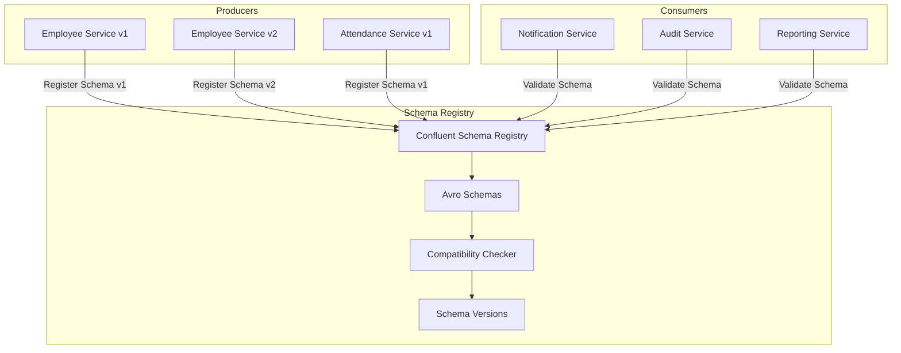

## 🛡️ Security Architecture

### Zero Trust Security Model
```mermaid
graph TB
    subgraph "Identity & Access Management"
        OAuth[OAuth 2.0 / OIDC Provider]
        JWT[JWT Token Service]
        RBAC[Role-Based Access Control]
        MFA[Multi-Factor Authentication]
    end
    
    subgraph "Service-to-Service Security"
        mTLS[Mutual TLS]
        ServiceMesh[Istio Service Mesh]
        Certificates[Certificate Management]
        SPIFFE[SPIFFE/SPIRE]
    end
    
    subgraph "Network Security"
        NetworkPolicies[Kubernetes Network Policies]
        Firewall[Application Firewall]
        VPN[VPN Gateway]
        ZeroTrust[Zero Trust Network]
    end
    
    subgraph "Secrets Management"
        Vault[HashiCorp Vault]
        K8sSecrets[Kubernetes Secrets]
        SecretRotation[Automatic Secret Rotation]
        SecretInjection[Secret Injection]
    end
    
    subgraph "Security Monitoring"
        SIEM[Security Information Event Management]
        ThreatDetection[Threat Detection]
        Compliance[Compliance Monitoring]
        AuditLogs[Security Audit Logs]
    end
    
    OAuth --> JWT
    JWT --> RBAC
    RBAC --> MFA
    
    mTLS --> ServiceMesh
    ServiceMesh --> Certificates
    Certificates --> SPIFFE
    
    NetworkPolicies --> Firewall
    Firewall --> VPN
    VPN --> ZeroTrust
    
    Vault --> K8sSecrets
    K8sSecrets --> SecretRotation
    SecretRotation --> SecretInjection
    
    SIEM --> ThreatDetection
    ThreatDetection --> Compliance
    Compliance --> AuditLogs
```

### Authentication & Authorization Flow
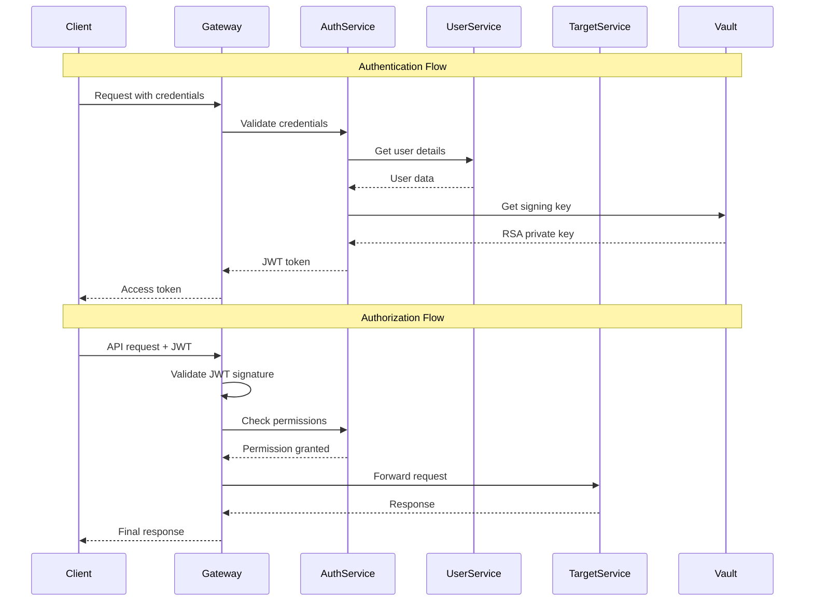

## 📊 Data Management Strategies

### Database per Service Pattern
```mermaid
graph TB
    subgraph "User Domain"
        UserAPI[User API]
        UserDB[(PostgreSQL<br/>User Database)]
        UserCache[(Redis<br/>User Cache)]
    end
    
    subgraph "Employee Domain"
        EmployeeAPI[Employee API]
        EmployeeDB[(PostgreSQL<br/>Employee Database)]
        EmployeeSearchIndex[(Elasticsearch<br/>Employee Search)]
    end
    
    subgraph "Attendance Domain"
        AttendanceAPI[Attendance API]
        AttendanceDB[(TimescaleDB<br/>Time Series Database)]
        AttendanceCache[(Redis<br/>Attendance Cache)]
    end
    
    subgraph "Document Domain"
        DocumentAPI[Document API]
        DocumentDB[(MongoDB<br/>Document Metadata)]
        FileStorage[(MinIO/S3<br/>File Storage)]
    end
    
    subgraph "Analytics Domain"
        ReportingAPI[Reporting API]
        AnalyticsDB[(ClickHouse<br/>Analytics Database)]
        DataLake[(S3<br/>Data Lake)]
    end
    
    UserAPI --> UserDB
    UserAPI --> UserCache
    
    EmployeeAPI --> EmployeeDB
    EmployeeAPI --> EmployeeSearchIndex
    
    AttendanceAPI --> AttendanceDB
    AttendanceAPI --> AttendanceCache
    
    DocumentAPI --> DocumentDB
    DocumentAPI --> FileStorage
    
    ReportingAPI --> AnalyticsDB
    ReportingAPI --> DataLake
    
    classDef api fill:#e3f2fd
    classDef sql fill:#f3e5f5
    classDef nosql fill:#e8f5e8
    classDef cache fill:#fff3e0
    classDef storage fill:#fce4ec
    
    class UserAPI,EmployeeAPI,AttendanceAPI,DocumentAPI,ReportingAPI api
    class UserDB,EmployeeDB,AttendanceDB sql
    class DocumentDB,AnalyticsDB nosql
    class UserCache,AttendanceCache,EmployeeSearchIndex cache
    class FileStorage,DataLake storage
```

### Saga Pattern for Distributed Transactions
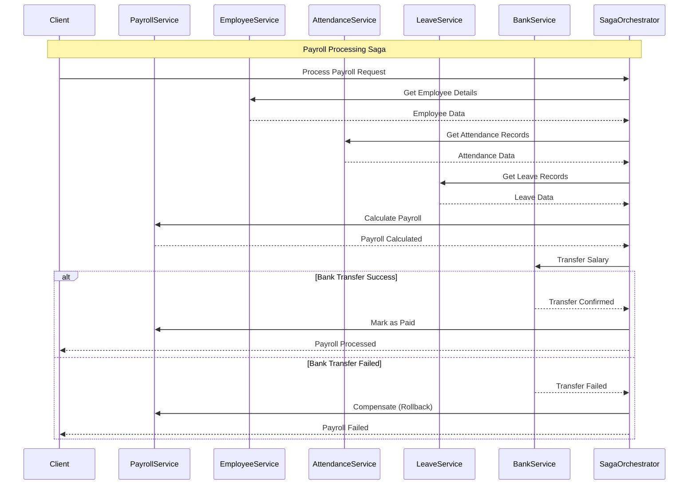

## 🔍 Observability & Monitoring

### Three Pillars of Observability
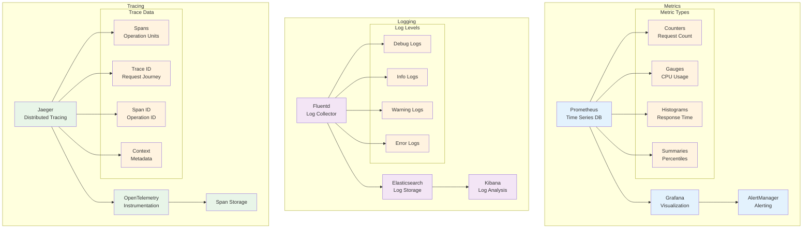

### Health Check Strategy
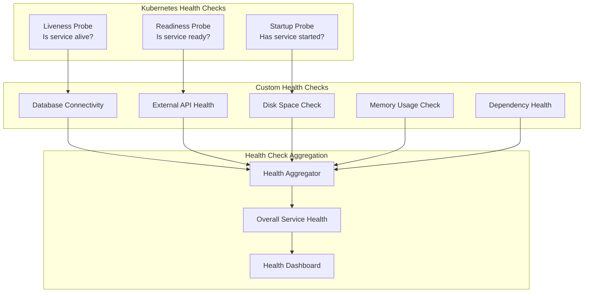

---

**Next**: [Messaging Patterns](./messaging-patterns.md) | [Implementation Guide](./implementation-guide.md) | [Migration Strategy](./migration-strategy.md)