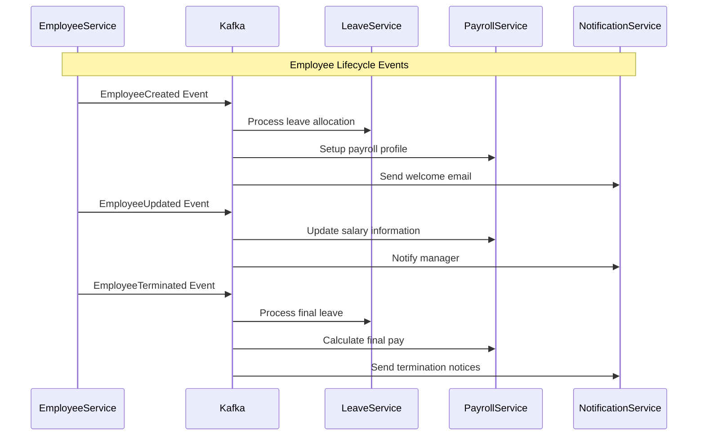

# Microservices Architecture Design

## 🏗️ Service Decomposition Strategy

Based on Domain-Driven Design (DDD) principles, we'll decompose the monolithic HR system into bounded contexts that align with business capabilities.

```mermaid
graph TB
    subgraph "API Gateway Layer"
        Gateway[API Gateway<br/>Kong/Traefik]
        LB[Load Balancer]
        Auth[Authentication Service]
    end
    
    subgraph "Core Business Services"
        UserService[User Management Service<br/>Port 3001]
        EmployeeService[Employee Service<br/>Port 3002]
        DepartmentService[Department Service<br/>Port 3003]
        AttendanceService[Attendance Service<br/>Port 3004]
        LeaveService[Leave Management Service<br/>Port 3005]
        PayrollService[Payroll Service<br/>Port 3006]
        PerformanceService[Performance Service<br/>Port 3007]
        DocumentService[Document Service<br/>Port 3008]
        WorkflowService[Workflow Engine Service<br/>Port 3009]
        NotificationService[Notification Service<br/>Port 3010]
    end
    
    subgraph "Supporting Services"
        ReportingService[Reporting Service<br/>Port 3011]
        SettingsService[Settings Service<br/>Port 3012]
        AuditService[Audit Log Service<br/>Port 3013]
        FileService[File Storage Service<br/>Port 3014]
        SearchService[Search Service<br/>Port 3015]
    end
    
    subgraph "Data Layer"
        UserDB[(User DB)]
        EmployeeDB[(Employee DB)]
        AttendanceDB[(Attendance DB)]
        PayrollDB[(Payroll DB)]
        DocumentDB[(Document DB)]
        AuditDB[(Audit DB)]
        SharedCache[(Redis Cluster)]
    end
    
    subgraph "Message Broker"
        Kafka[Apache Kafka<br/>Event Streaming]
        RabbitMQ[RabbitMQ<br/>Task Queues]
    end
    
    subgraph "External Systems"
        EmailProvider[Email Service]
        SMSProvider[SMS Service]
        PaymentGateway[Payment Gateway]
        BiometricSystem[Biometric System]
    end
    
    Gateway --> Auth
    Gateway --> UserService
    Gateway --> EmployeeService
    Gateway --> DepartmentService
    Gateway --> AttendanceService
    Gateway --> LeaveService
    Gateway --> PayrollService
    Gateway --> PerformanceService
    Gateway --> DocumentService
    Gateway --> WorkflowService
    Gateway --> NotificationService
    Gateway --> ReportingService
    Gateway --> SettingsService
    
    UserService --> UserDB
    EmployeeService --> EmployeeDB
    AttendanceService --> AttendanceDB
    PayrollService --> PayrollDB
    DocumentService --> DocumentDB
    AuditService --> AuditDB
    
    UserService --> Kafka
    EmployeeService --> Kafka
    AttendanceService --> Kafka
    LeaveService --> Kafka
    PayrollService --> Kafka
    
    NotificationService --> RabbitMQ
    WorkflowService --> RabbitMQ
    ReportingService --> RabbitMQ
    
    NotificationService --> EmailProvider
    NotificationService --> SMSProvider
    PayrollService --> PaymentGateway
    AttendanceService --> BiometricSystem
    
    classDef gateway fill:#e3f2fd
    classDef service fill:#f3e5f5
    classDef support fill:#e8f5e8
    classDef data fill:#fff3e0
    classDef message fill:#fce4ec
    classDef external fill:#f1f8e9
    
    class Gateway,LB,Auth gateway
    class UserService,EmployeeService,DepartmentService,AttendanceService,LeaveService,PayrollService,PerformanceService,DocumentService,WorkflowService,NotificationService service
    class ReportingService,SettingsService,AuditService,FileService,SearchService support
    class UserDB,EmployeeDB,AttendanceDB,PayrollDB,DocumentDB,AuditDB,SharedCache data
    class Kafka,RabbitMQ message
    class EmailProvider,SMSProvider,PaymentGateway,BiometricSystem external
```



## 🎯 Service Boundaries by Domain

### 1. **User Management Service**
**Bounded Context**: Identity & Access Management
- User authentication & authorization
- Role and permission management
- Multi-factor authentication
- Session management
- Security policies

**API Endpoints**:
- `POST /auth/login`
- `POST /auth/logout`
- `GET /users/{id}`
- `PUT /users/{id}/roles`
- `POST /auth/mfa/verify`

### 2. **Employee Service**
**Bounded Context**: Employee Lifecycle Management
- Employee profiles and personal information
- Emergency contacts and dependencies
- Skills and certifications
- Employee hierarchy relationships
- Onboarding/offboarding workflows

**API Endpoints**:
- `GET /employees`
- `POST /employees`
- `PUT /employees/{id}`
- `GET /employees/{id}/hierarchy`
- `POST /employees/{id}/skills`

### 3. **Department Service**
**Bounded Context**: Organizational Structure
- Department hierarchy
- Cost centers and budget allocation
- Manager assignments
- Department policies
- Inter-department relationships

**API Endpoints**:
- `GET /departments`
- `POST /departments`
- `GET /departments/{id}/employees`
- `PUT /departments/{id}/manager`
- `GET /departments/{id}/budget`

### 4. **Attendance Service**
**Bounded Context**: Time & Attendance Management
- Clock in/out records
- Break time tracking
- Overtime calculations
- Shift management
- Location-based attendance
- Biometric integration

**API Endpoints**:
- `POST /attendance/checkin`
- `POST /attendance/checkout`
- `GET /attendance/employee/{id}`
- `GET /attendance/summary/{period}`
- `POST /attendance/break/start`

### 5. **Leave Management Service**
**Bounded Context**: Leave & Absence Management
- Leave requests and approvals
- Leave balance calculation
- Leave policies and rules
- Holiday calendars
- Leave reporting

**API Endpoints**:
- `POST /leave/requests`
- `PUT /leave/requests/{id}/approve`
- `GET /leave/balance/{employeeId}`
- `GET /leave/policies`
- `GET /leave/calendar`

### 6. **Payroll Service**
**Bounded Context**: Compensation & Benefits
- Salary calculations
- Tax deductions
- Benefits management
- Payslip generation
- Bank integration
- Compliance reporting

**API Endpoints**:
- `POST /payroll/calculate/{period}`
- `GET /payroll/payslips/{employeeId}`
- `POST /payroll/process`
- `GET /payroll/tax-reports`
- `PUT /payroll/salary/{employeeId}`

### 7. **Performance Service**
**Bounded Context**: Performance Management
- Performance reviews and ratings
- Goal setting and tracking
- 360-degree feedback
- Performance improvement plans
- Calibration processes

**API Endpoints**:
- `POST /performance/reviews`
- `GET /performance/goals/{employeeId}`
- `POST /performance/feedback`
- `GET /performance/ratings/{period}`
- `PUT /performance/goals/{id}`

### 8. **Document Service**
**Bounded Context**: Document Management
- Document storage and retrieval
- Version control
- Access permissions
- Document workflows
- Compliance tracking

**API Endpoints**:
- `POST /documents/upload`
- `GET /documents/{id}`
- `PUT /documents/{id}/permissions`
- `GET /documents/employee/{id}`
- `DELETE /documents/{id}`

### 9. **Workflow Engine Service**
**Bounded Context**: Business Process Management
- Workflow definitions
- Approval chains
- Process automation
- Escalation rules
- SLA monitoring

**API Endpoints**:
- `POST /workflows/start`
- `PUT /workflows/{id}/approve`
- `GET /workflows/pending/{userId}`
- `POST /workflows/definitions`
- `GET /workflows/{id}/status`

### 10. **Notification Service**
**Bounded Context**: Communication Management
- Email notifications
- SMS alerts
- Push notifications
- Notification preferences
- Message templates

**API Endpoints**:
- `POST /notifications/send`
- `GET /notifications/{userId}`
- `PUT /notifications/preferences`
- `POST /notifications/templates`
- `GET /notifications/history`

## 🔄 Event-Driven Communication Patterns

### Events Published by Services



### Event Schema Examples

**Employee Events**:
```json
{
  "eventType": "EmployeeCreated",
  "eventId": "uuid",
  "timestamp": "2025-10-07T10:00:00Z",
  "version": "1.0",
  "data": {
    "employeeId": "uuid",
    "email": "john.doe@company.com",
    "departmentId": "uuid",
    "managerId": "uuid",
    "startDate": "2025-10-07",
    "jobTitle": "Software Engineer",
    "salary": 75000
  }
}
```

**Attendance Events**:
```json
{
  "eventType": "AttendanceRecorded",
  "eventId": "uuid",
  "timestamp": "2025-10-07T09:00:00Z",
  "version": "1.0",
  "data": {
    "employeeId": "uuid",
    "checkInTime": "2025-10-07T09:00:00Z",
    "location": "Office Building A",
    "method": "biometric",
    "deviceId": "scanner-001"
  }
}
```

## 🛡️ Cross-Cutting Concerns

### Security Patterns

```mermaid
graph TB
    subgraph "Security Layer"
        OAuth[OAuth 2.0 / OIDC]
        JWT[JWT Tokens]
        mTLS[Mutual TLS]
        RBAC[Role-Based Access Control]
    end
    
    subgraph "Service Mesh"
        Istio[Istio Service Mesh]
        Envoy[Envoy Proxy]
        Cert[Certificate Management]
    end
    
    subgraph "Secrets Management"
        Vault[HashiCorp Vault]
        K8sSecrets[Kubernetes Secrets]
        ConfigMaps[Configuration Maps]
    end
    
    OAuth --> JWT
    JWT --> mTLS
    mTLS --> RBAC
    
    Istio --> Envoy
    Envoy --> Cert
    
    Vault --> K8sSecrets
    K8sSecrets --> ConfigMaps
```


### Observability Stack

```mermaid
graph TB
    subgraph "Monitoring"
        Prometheus[Prometheus]
        Grafana[Grafana Dashboards]
        AlertManager[Alert Manager]
    end
    
    subgraph "Logging"
        ELK[ELK Stack]
        Fluentd[Fluentd]
        Logstash[Logstash]
    end
    
    subgraph "Tracing"
        Jaeger[Jaeger]
        OpenTelemetry[OpenTelemetry]
        Zipkin[Zipkin]
    end
    
    subgraph "Health Checks"
        K8sProbes[Kubernetes Probes]
        ServiceHealth[Service Health APIs]
        Circuit[Circuit Breakers]
    end
    
    Prometheus --> Grafana
    Grafana --> AlertManager
    
    ELK --> Fluentd
    Fluentd --> Logstash
    
    Jaeger --> OpenTelemetry
    OpenTelemetry --> Zipkin
    
    K8sProbes --> ServiceHealth
    ServiceHealth --> Circuit
```


## 📊 Data Management Patterns

### Database per Service

```mermaid
graph TB
    subgraph "User Service"
        UserAPI[User API]
        UserDB[(PostgreSQL<br/>User Data)]
    end
    
    subgraph "Employee Service"
        EmployeeAPI[Employee API]
        EmployeeDB[(PostgreSQL<br/>Employee Data)]
    end
    
    subgraph "Attendance Service"
        AttendanceAPI[Attendance API]
        AttendanceDB[(TimescaleDB<br/>Time Series Data)]
    end
    
    subgraph "Payroll Service"
        PayrollAPI[Payroll API]
        PayrollDB[(PostgreSQL<br/>Financial Data)]
    end
    
    subgraph "Document Service"
        DocumentAPI[Document API]
        DocumentDB[(MongoDB<br/>Document Metadata)]
        S3[S3 Compatible<br/>File Storage]
    end
    
    subgraph "Reporting Service"
        ReportingAPI[Reporting API]
        DataWarehouse[(ClickHouse<br/>Analytics DB)]
    end
    
    UserAPI --> UserDB
    EmployeeAPI --> EmployeeDB
    AttendanceAPI --> AttendanceDB
    PayrollAPI --> PayrollDB
    DocumentAPI --> DocumentDB
    DocumentAPI --> S3
    ReportingAPI --> DataWarehouse
    
    classDef api fill:#e3f2fd
    classDef db fill:#f3e5f5
    classDef storage fill:#e8f5e8
    
    class UserAPI,EmployeeAPI,AttendanceAPI,PayrollAPI,DocumentAPI,ReportingAPI api
    class UserDB,EmployeeDB,AttendanceDB,PayrollDB,DocumentDB,DataWarehouse db
    class S3 storage
```


### Data Consistency Patterns
- **Saga Pattern** for distributed transactions
- **Event Sourcing** for audit trails
- **CQRS** for read/write separation
- **Eventual Consistency** for cross-service data

---

**Next**: [Messaging Patterns](./messaging-patterns.md) | [Implementation Guide](./implementation-guide.md)