# Complete Microservices Deployment Guide

## 🎯 Overview

This guide provides comprehensive deployment configurations for the HR microservices ecosystem using both Docker Compose (for development/testing) and Kubernetes (for production) environments.

### 🏗️ Deployment Architecture

```mermaid
graph TB
    subgraph "Load Balancer Layer"
        ExternalLB[External Load Balancer<br/>AWS ALB / Azure LB]
        IngressController[Ingress Controller<br/>Nginx / Traefik]
    end
    
    subgraph "API Gateway Layer"
        APIGateway1[Kong Gateway 1]
        APIGateway2[Kong Gateway 2]
        APIGateway3[Kong Gateway 3]
    end
    
    subgraph "Microservices Tier"
        subgraph "User Management"
            UserService1[User Service 1]
            UserService2[User Service 2]
            UserDB[(User Database)]
        end
        
        subgraph "Employee Management"
            EmployeeService1[Employee Service 1]
            EmployeeService2[Employee Service 2]
            EmployeeDB[(Employee Database)]
        end
        
        subgraph "Attendance Tracking"
            AttendanceService1[Attendance Service 1]
            AttendanceService2[Attendance Service 2]
            TimescaleDB[(TimescaleDB)]
        end
    end
    
    subgraph "Infrastructure Services"
        subgraph "Service Discovery"
            Consul1[Consul Server 1]
            Consul2[Consul Server 2]
            Consul3[Consul Server 3]
        end
        
        subgraph "Configuration Management"
            Vault1[Vault Server 1]
            Vault2[Vault Server 2]
            Vault3[Vault Server 3]
        end
        
        subgraph "Message Streaming"
            Kafka1[Kafka Broker 1]
            Kafka2[Kafka Broker 2]
            Kafka3[Kafka Broker 3]
            Zookeeper[Zookeeper Cluster]
        end
        
        subgraph "Caching & Search"
            Redis[Redis Cluster]
            Elasticsearch[Elasticsearch]
        end
    end
    
    subgraph "Observability Stack"
        subgraph "Metrics"
            Prometheus[Prometheus]
            Grafana[Grafana]
        end
        
        subgraph "Logging"
            ELKStack[ELK Stack]
            Fluentd[Fluentd]
        end
        
        subgraph "Tracing"
            Jaeger[Jaeger]
            OpenTelemetry[OpenTelemetry]
        end
    end
    
    ExternalLB --> IngressController
    IngressController --> APIGateway1
    IngressController --> APIGateway2
    IngressController --> APIGateway3
    
    APIGateway1 --> UserService1
    APIGateway1 --> EmployeeService1
    APIGateway1 --> AttendanceService1
    
    UserService1 --> UserDB
    UserService2 --> UserDB
    
    EmployeeService1 --> EmployeeDB
    EmployeeService2 --> EmployeeDB
    
    AttendanceService1 --> TimescaleDB
    AttendanceService2 --> TimescaleDB
    
    UserService1 --> Consul1
    EmployeeService1 --> Consul1
    AttendanceService1 --> Consul1
    
    UserService1 --> Vault1
    EmployeeService1 --> Vault1
    AttendanceService1 --> Vault1
    
    UserService1 --> Kafka1
    EmployeeService1 --> Kafka1
    AttendanceService1 --> Kafka1
    
    Kafka1 --> Zookeeper
    Kafka2 --> Zookeeper
    Kafka3 --> Zookeeper
    
    UserService1 --> Redis
    EmployeeService1 --> Elasticsearch
    
    classDef lb fill:#e3f2fd
    classDef gateway fill:#f3e5f5
    classDef service fill:#e8f5e8
    classDef database fill:#fff3e0
    classDef infrastructure fill:#fce4ec
    classDef observability fill:#f1f8e9
    
    class ExternalLB,IngressController lb
    class APIGateway1,APIGateway2,APIGateway3 gateway
    class UserService1,UserService2,EmployeeService1,EmployeeService2,AttendanceService1,AttendanceService2 service
    class UserDB,EmployeeDB,TimescaleDB database
    class Consul1,Consul2,Consul3,Vault1,Vault2,Vault3,Kafka1,Kafka2,Kafka3,Zookeeper,Redis,Elasticsearch infrastructure
    class Prometheus,Grafana,ELKStack,Fluentd,Jaeger,OpenTelemetry observability
```



## 🐳 Docker Compose Deployment

### Master Docker Compose Configuration
```yaml
# docker-compose.yml - Master orchestration file
version: '3.8'

include:
  # Infrastructure Services
  - ./microservices/infrastructure/service-discovery/docker-compose.service-discovery.yml
  - ./microservices/infrastructure/observability/docker-compose.observability.yml
  - ./microservices/infrastructure/api-gateway/docker-compose.api-gateway.yml
  
  # Message Broker and Streaming
  - ./microservices/deployment/docker-compose.messaging.yml
  
  # Microservices
  - ./microservices/deployment/docker-compose.microservices.yml
  
  # Databases
  - ./microservices/deployment/docker-compose.databases.yml

networks:
  microservices-network:
    driver: bridge
    ipam:
      driver: default
      config:
        - subnet: 172.20.0.0/16

volumes:
  # Database volumes
  postgres_user_data:
  postgres_employee_data:
  timescaledb_data:
  
  # Infrastructure volumes
  consul_data:
  vault_data:
  
  # Message broker volumes
  kafka_1_data:
  kafka_2_data:
  kafka_3_data:
  zookeeper_data:
  
  # Cache and search volumes
  redis_data:
  elasticsearch_data:
  
  # Observability volumes
  prometheus_data:
  grafana_data:
  
  # Logs
  application_logs:
  system_logs:
```

### Messaging Infrastructure
```yaml
# docker-compose.messaging.yml
services:
  # Zookeeper Cluster
  zookeeper-1:
    image: confluentinc/cp-zookeeper:7.4.1
    container_name: hr_zookeeper_1
    hostname: zookeeper-1
    environment:
      ZOOKEEPER_CLIENT_PORT: 2181
      ZOOKEEPER_TICK_TIME: 2000
      ZOOKEEPER_INIT_LIMIT: 5
      ZOOKEEPER_SYNC_LIMIT: 2
      ZOOKEEPER_SERVER_ID: 1
      ZOOKEEPER_SERVERS: zookeeper-1:2888:3888;zookeeper-2:2888:3888;zookeeper-3:2888:3888
    volumes:
      - zookeeper_1_data:/var/lib/zookeeper/data
      - zookeeper_1_logs:/var/lib/zookeeper/log
    ports:
      - "2181:2181"
    restart: unless-stopped
    networks:
      - microservices-network
    deploy:
      resources:
        limits:
          memory: 512M
          cpus: '0.5'
    healthcheck:
      test: ["CMD", "bash", "-c", "echo 'ruok' | nc localhost 2181 | grep imok"]
      interval: 30s
      timeout: 10s
      retries: 3

  zookeeper-2:
    image: confluentinc/cp-zookeeper:7.4.1
    container_name: hr_zookeeper_2
    hostname: zookeeper-2
    environment:
      ZOOKEEPER_CLIENT_PORT: 2181
      ZOOKEEPER_TICK_TIME: 2000
      ZOOKEEPER_INIT_LIMIT: 5
      ZOOKEEPER_SYNC_LIMIT: 2
      ZOOKEEPER_SERVER_ID: 2
      ZOOKEEPER_SERVERS: zookeeper-1:2888:3888;zookeeper-2:2888:3888;zookeeper-3:2888:3888
    volumes:
      - zookeeper_2_data:/var/lib/zookeeper/data
      - zookeeper_2_logs:/var/lib/zookeeper/log
    restart: unless-stopped
    networks:
      - microservices-network
    deploy:
      resources:
        limits:
          memory: 512M
          cpus: '0.5'

  zookeeper-3:
    image: confluentinc/cp-zookeeper:7.4.1
    container_name: hr_zookeeper_3
    hostname: zookeeper-3
    environment:
      ZOOKEEPER_CLIENT_PORT: 2181
      ZOOKEEPER_TICK_TIME: 2000
      ZOOKEEPER_INIT_LIMIT: 5
      ZOOKEEPER_SYNC_LIMIT: 2
      ZOOKEEPER_SERVER_ID: 3
      ZOOKEEPER_SERVERS: zookeeper-1:2888:3888;zookeeper-2:2888:3888;zookeeper-3:2888:3888
    volumes:
      - zookeeper_3_data:/var/lib/zookeeper/data
      - zookeeper_3_logs:/var/lib/zookeeper/log
    restart: unless-stopped
    networks:
      - microservices-network
    deploy:
      resources:
        limits:
          memory: 512M
          cpus: '0.5'

  # Kafka Cluster
  kafka-1:
    image: confluentinc/cp-kafka:7.4.1
    container_name: hr_kafka_1
    hostname: kafka-1
    depends_on:
      - zookeeper-1
      - zookeeper-2
      - zookeeper-3
    environment:
      KAFKA_BROKER_ID: 1
      KAFKA_ZOOKEEPER_CONNECT: zookeeper-1:2181,zookeeper-2:2181,zookeeper-3:2181
      KAFKA_LISTENER_SECURITY_PROTOCOL_MAP: PLAINTEXT:PLAINTEXT,PLAINTEXT_HOST:PLAINTEXT
      KAFKA_ADVERTISED_LISTENERS: PLAINTEXT://kafka-1:29092,PLAINTEXT_HOST://localhost:9092
      KAFKA_LISTENERS: PLAINTEXT://0.0.0.0:29092,PLAINTEXT_HOST://0.0.0.0:9092
      KAFKA_INTER_BROKER_LISTENER_NAME: PLAINTEXT
      KAFKA_OFFSETS_TOPIC_REPLICATION_FACTOR: 3
      KAFKA_TRANSACTION_STATE_LOG_REPLICATION_FACTOR: 3
      KAFKA_TRANSACTION_STATE_LOG_MIN_ISR: 2
      KAFKA_GROUP_INITIAL_REBALANCE_DELAY_MS: 0
      KAFKA_AUTO_CREATE_TOPICS_ENABLE: 'false'
      KAFKA_LOG_RETENTION_HOURS: 168
      KAFKA_LOG_RETENTION_BYTES: 1073741824
      KAFKA_LOG_SEGMENT_BYTES: 1073741824
      KAFKA_NUM_PARTITIONS: 6
      KAFKA_DEFAULT_REPLICATION_FACTOR: 3
      KAFKA_MIN_INSYNC_REPLICAS: 2
      KAFKA_COMPRESSION_TYPE: gzip
      KAFKA_JMX_PORT: 9999
      KAFKA_JMX_HOSTNAME: kafka-1
    volumes:
      - kafka_1_data:/var/lib/kafka/data
    ports:
      - "9092:9092"
      - "9999:9999"
    restart: unless-stopped
    networks:
      - microservices-network
    deploy:
      resources:
        limits:
          memory: 1G
          cpus: '1.0'
        reservations:
          memory: 512M
          cpus: '0.5'
    healthcheck:
      test: ["CMD", "kafka-broker-api-versions", "--bootstrap-server", "localhost:9092"]
      interval: 30s
      timeout: 10s
      retries: 3
      start_period: 60s

  kafka-2:
    image: confluentinc/cp-kafka:7.4.1
    container_name: hr_kafka_2
    hostname: kafka-2
    depends_on:
      - zookeeper-1
      - zookeeper-2
      - zookeeper-3
    environment:
      KAFKA_BROKER_ID: 2
      KAFKA_ZOOKEEPER_CONNECT: zookeeper-1:2181,zookeeper-2:2181,zookeeper-3:2181
      KAFKA_LISTENER_SECURITY_PROTOCOL_MAP: PLAINTEXT:PLAINTEXT,PLAINTEXT_HOST:PLAINTEXT
      KAFKA_ADVERTISED_LISTENERS: PLAINTEXT://kafka-2:29092,PLAINTEXT_HOST://localhost:9093
      KAFKA_LISTENERS: PLAINTEXT://0.0.0.0:29092,PLAINTEXT_HOST://0.0.0.0:9093
      KAFKA_INTER_BROKER_LISTENER_NAME: PLAINTEXT
      KAFKA_OFFSETS_TOPIC_REPLICATION_FACTOR: 3
      KAFKA_TRANSACTION_STATE_LOG_REPLICATION_FACTOR: 3
      KAFKA_TRANSACTION_STATE_LOG_MIN_ISR: 2
      KAFKA_GROUP_INITIAL_REBALANCE_DELAY_MS: 0
      KAFKA_AUTO_CREATE_TOPICS_ENABLE: 'false'
      KAFKA_LOG_RETENTION_HOURS: 168
      KAFKA_LOG_RETENTION_BYTES: 1073741824
      KAFKA_LOG_SEGMENT_BYTES: 1073741824
      KAFKA_NUM_PARTITIONS: 6
      KAFKA_DEFAULT_REPLICATION_FACTOR: 3
      KAFKA_MIN_INSYNC_REPLICAS: 2
      KAFKA_COMPRESSION_TYPE: gzip
      KAFKA_JMX_PORT: 9999
      KAFKA_JMX_HOSTNAME: kafka-2
    volumes:
      - kafka_2_data:/var/lib/kafka/data
    ports:
      - "9093:9093"
      - "9998:9999"
    restart: unless-stopped
    networks:
      - microservices-network
    deploy:
      resources:
        limits:
          memory: 1G
          cpus: '1.0'

  kafka-3:
    image: confluentinc/cp-kafka:7.4.1
    container_name: hr_kafka_3
    hostname: kafka-3
    depends_on:
      - zookeeper-1
      - zookeeper-2
      - zookeeper-3
    environment:
      KAFKA_BROKER_ID: 3
      KAFKA_ZOOKEEPER_CONNECT: zookeeper-1:2181,zookeeper-2:2181,zookeeper-3:2181
      KAFKA_LISTENER_SECURITY_PROTOCOL_MAP: PLAINTEXT:PLAINTEXT,PLAINTEXT_HOST:PLAINTEXT
      KAFKA_ADVERTISED_LISTENERS: PLAINTEXT://kafka-3:29092,PLAINTEXT_HOST://localhost:9094
      KAFKA_LISTENERS: PLAINTEXT://0.0.0.0:29092,PLAINTEXT_HOST://0.0.0.0:9094
      KAFKA_INTER_BROKER_LISTENER_NAME: PLAINTEXT
      KAFKA_OFFSETS_TOPIC_REPLICATION_FACTOR: 3
      KAFKA_TRANSACTION_STATE_LOG_REPLICATION_FACTOR: 3
      KAFKA_TRANSACTION_STATE_LOG_MIN_ISR: 2
      KAFKA_GROUP_INITIAL_REBALANCE_DELAY_MS: 0
      KAFKA_AUTO_CREATE_TOPICS_ENABLE: 'false'
      KAFKA_LOG_RETENTION_HOURS: 168
      KAFKA_LOG_RETENTION_BYTES: 1073741824
      KAFKA_LOG_SEGMENT_BYTES: 1073741824
      KAFKA_NUM_PARTITIONS: 6
      KAFKA_DEFAULT_REPLICATION_FACTOR: 3
      KAFKA_MIN_INSYNC_REPLICAS: 2
      KAFKA_COMPRESSION_TYPE: gzip
      KAFKA_JMX_PORT: 9999
      KAFKA_JMX_HOSTNAME: kafka-3
    volumes:
      - kafka_3_data:/var/lib/kafka/data
    ports:
      - "9094:9094"
      - "9997:9999"
    restart: unless-stopped
    networks:
      - microservices-network
    deploy:
      resources:
        limits:
          memory: 1G
          cpus: '1.0'

  # Kafka Management UI
  kafka-ui:
    image: provectuslabs/kafka-ui:latest
    container_name: hr_kafka_ui
    depends_on:
      - kafka-1
      - kafka-2
      - kafka-3
    environment:
      KAFKA_CLUSTERS_0_NAME: hr-microservices
      KAFKA_CLUSTERS_0_BOOTSTRAPSERVERS: kafka-1:29092,kafka-2:29092,kafka-3:29092
      KAFKA_CLUSTERS_0_ZOOKEEPER: zookeeper-1:2181,zookeeper-2:2181,zookeeper-3:2181
      KAFKA_CLUSTERS_0_READONLY: false
    ports:
      - "8080:8080"
    restart: unless-stopped
    networks:
      - microservices-network
    deploy:
      resources:
        limits:
          memory: 512M
          cpus: '0.5'

  # Redis Cluster
  redis-cluster:
    image: redis:7.2-alpine
    container_name: hr_redis_cluster
    command: [
      "redis-server",
      "--appendonly", "yes",
      "--cluster-enabled", "yes",
      "--cluster-config-file", "nodes.conf",
      "--cluster-node-timeout", "5000",
      "--maxmemory", "1gb",
      "--maxmemory-policy", "allkeys-lru",
      "--save", "900", "1",
      "--save", "300", "10",
      "--save", "60", "10000"
    ]
    volumes:
      - redis_data:/data
    ports:
      - "6379:6379"
    restart: unless-stopped
    networks:
      - microservices-network
    deploy:
      resources:
        limits:
          memory: 1G
          cpus: '0.5'
    healthcheck:
      test: ["CMD", "redis-cli", "ping"]
      interval: 30s
      timeout: 10s
      retries: 3

volumes:
  zookeeper_1_data:
  zookeeper_1_logs:
  zookeeper_2_data:
  zookeeper_2_logs:
  zookeeper_3_data:
  zookeeper_3_logs:
  kafka_1_data:
  kafka_2_data:
  kafka_3_data:
  redis_data:

networks:
  microservices-network:
    external: true
```

### Microservices Configuration
```yaml
# docker-compose.microservices.yml
services:
  # User Service
  user-service:
    build:
      context: ./microservices/services/user-service
      dockerfile: Dockerfile
      target: production
    container_name: hr_user_service
    hostname: user-service
    environment:
      # Application
      - NODE_ENV=production
      - PORT=3001
      - SERVICE_NAME=user-service
      
      # Database
      - DB_HOST=postgres-user
      - DB_PORT=5432
      - DB_NAME=user_service
      - DB_USER=user_service
      - DB_PASSWORD=user_service_password
      
      # Redis
      - REDIS_HOST=redis-cluster
      - REDIS_PORT=6379
      
      # Kafka
      - KAFKA_BROKERS=kafka-1:29092,kafka-2:29092,kafka-3:29092
      
      # Service Discovery
      - CONSUL_HOST=consul-server-1
      - CONSUL_PORT=8500
      - CONSUL_TOKEN=your-consul-token
      
      # Vault
      - VAULT_ADDR=https://vault-server-1:8200
      - VAULT_ROLE_ID=user-service-role-id
      - VAULT_SECRET_ID=user-service-secret-id
      
      # Observability
      - JAEGER_AGENT_HOST=jaeger-agent
      - JAEGER_AGENT_PORT=6831
      - PROMETHEUS_PORT=9090
      
      # Security
      - JWT_SECRET=your-jwt-secret
      - ENCRYPTION_KEY=your-encryption-key
    ports:
      - "3001:3001"
    depends_on:
      - postgres-user
      - redis-cluster
      - kafka-1
      - consul-server-1
      - vault-server-1
    volumes:
      - ./logs/user-service:/app/logs
      - ./microservices/services/user-service/storage:/app/storage
    restart: unless-stopped
    networks:
      - microservices-network
    deploy:
      resources:
        limits:
          memory: 1G
          cpus: '1.0'
        reservations:
          memory: 512M
          cpus: '0.5'
    healthcheck:
      test: ["CMD", "curl", "-f", "http://localhost:3001/health"]
      interval: 30s
      timeout: 10s
      retries: 3
      start_period: 60s

  # Employee Service
  employee-service:
    build:
      context: ./microservices/services/employee-service
      dockerfile: Dockerfile
      target: production
    container_name: hr_employee_service
    hostname: employee-service
    environment:
      # Laravel Application
      - APP_ENV=production
      - APP_KEY=base64:your-laravel-app-key
      - APP_DEBUG=false
      - APP_URL=http://employee-service:3002
      
      # Database
      - DB_CONNECTION=pgsql
      - DB_HOST=postgres-employee
      - DB_PORT=5432
      - DB_DATABASE=employee_service
      - DB_USERNAME=employee_service
      - DB_PASSWORD=employee_service_password
      
      # Redis
      - REDIS_HOST=redis-cluster
      - REDIS_PORT=6379
      - REDIS_PASSWORD=
      
      # Elasticsearch
      - ELASTICSEARCH_HOST=elasticsearch
      - ELASTICSEARCH_PORT=9200
      
      # Kafka
      - KAFKA_BROKERS=kafka-1:29092,kafka-2:29092,kafka-3:29092
      
      # Service Discovery
      - CONSUL_HTTP_ADDR=http://consul-server-1:8500
      - CONSUL_HTTP_TOKEN=your-consul-token
      
      # Vault
      - VAULT_ADDR=https://vault-server-1:8200
      - VAULT_ROLE_ID=employee-service-role-id
      - VAULT_SECRET_ID=employee-service-secret-id
      
      # External Services
      - USER_SERVICE_URL=http://user-service:3001
      
      # Observability
      - JAEGER_AGENT_HOST=jaeger-agent
      - JAEGER_AGENT_PORT=6831
    ports:
      - "3002:80"
    depends_on:
      - postgres-employee
      - redis-cluster
      - elasticsearch
      - kafka-1
      - consul-server-1
      - vault-server-1
      - user-service
    volumes:
      - ./logs/employee-service:/var/www/storage/logs
      - ./microservices/services/employee-service/storage:/var/www/storage/app
    restart: unless-stopped
    networks:
      - microservices-network
    deploy:
      resources:
        limits:
          memory: 1G
          cpus: '1.0'
        reservations:
          memory: 512M
          cpus: '0.5'
    healthcheck:
      test: ["CMD", "curl", "-f", "http://localhost/health"]
      interval: 30s
      timeout: 10s
      retries: 3
      start_period: 60s

  # Attendance Service
  attendance-service:
    build:
      context: ./microservices/services/attendance-service
      dockerfile: Dockerfile
      target: production
    container_name: hr_attendance_service
    hostname: attendance-service
    environment:
      # Laravel Application
      - APP_ENV=production
      - APP_KEY=base64:your-laravel-app-key
      - APP_DEBUG=false
      - APP_URL=http://attendance-service:3003
      
      # TimescaleDB
      - DB_CONNECTION=pgsql
      - DB_HOST=timescaledb
      - DB_PORT=5432
      - DB_DATABASE=attendance_service
      - DB_USERNAME=attendance_service
      - DB_PASSWORD=attendance_service_password
      
      # Redis
      - REDIS_HOST=redis-cluster
      - REDIS_PORT=6379
      
      # Kafka
      - KAFKA_BROKERS=kafka-1:29092,kafka-2:29092,kafka-3:29092
      
      # Service Discovery
      - CONSUL_HTTP_ADDR=http://consul-server-1:8500
      - CONSUL_HTTP_TOKEN=your-consul-token
      
      # Vault
      - VAULT_ADDR=https://vault-server-1:8200
      - VAULT_ROLE_ID=attendance-service-role-id
      - VAULT_SECRET_ID=attendance-service-secret-id
      
      # External Services
      - EMPLOYEE_SERVICE_URL=http://employee-service
      - USER_SERVICE_URL=http://user-service:3001
      
      # WebSocket
      - WEBSOCKET_PORT=6001
      
      # Timezone and Localization
      - TIMEZONE=UTC
      - LOCALE=en_US
      
      # Maps API (for geolocation)
      - MAPS_API_KEY=your-maps-api-key
    ports:
      - "3003:80"
      - "6001:6001"  # WebSocket
    depends_on:
      - timescaledb
      - redis-cluster
      - kafka-1
      - consul-server-1
      - vault-server-1
      - employee-service
    volumes:
      - ./logs/attendance-service:/var/www/storage/logs
      - ./microservices/services/attendance-service/storage:/var/www/storage/app
    restart: unless-stopped
    networks:
      - microservices-network
    deploy:
      resources:
        limits:
          memory: 1.5G
          cpus: '1.5'
        reservations:
          memory: 768M
          cpus: '0.75'
    healthcheck:
      test: ["CMD", "curl", "-f", "http://localhost/health"]
      interval: 30s
      timeout: 10s
      retries: 3
      start_period: 60s

networks:
  microservices-network:
    external: true
```

### Database Services
```yaml
# docker-compose.databases.yml
services:
  # User Service Database
  postgres-user:
    image: postgres:15-alpine
    container_name: hr_postgres_user
    hostname: postgres-user
    environment:
      POSTGRES_DB: user_service
      POSTGRES_USER: user_service
      POSTGRES_PASSWORD: user_service_password
      POSTGRES_INITDB_ARGS: "--auth-host=md5"
    volumes:
      - postgres_user_data:/var/lib/postgresql/data
      - ./microservices/services/user-service/database/schema.sql:/docker-entrypoint-initdb.d/01-schema.sql
      - ./microservices/services/user-service/database/indexes.sql:/docker-entrypoint-initdb.d/02-indexes.sql
      - ./microservices/services/user-service/database/seed.sql:/docker-entrypoint-initdb.d/03-seed.sql
    ports:
      - "5432:5432"
    restart: unless-stopped
    networks:
      - microservices-network
    deploy:
      resources:
        limits:
          memory: 512M
          cpus: '0.5'
        reservations:
          memory: 256M
          cpus: '0.25'
    healthcheck:
      test: ["CMD-SHELL", "pg_isready -U user_service -d user_service"]
      interval: 30s
      timeout: 10s
      retries: 3

  # Employee Service Database
  postgres-employee:
    image: postgres:15-alpine
    container_name: hr_postgres_employee
    hostname: postgres-employee
    environment:
      POSTGRES_DB: employee_service
      POSTGRES_USER: employee_service
      POSTGRES_PASSWORD: employee_service_password
      POSTGRES_INITDB_ARGS: "--auth-host=md5"
    volumes:
      - postgres_employee_data:/var/lib/postgresql/data
      - ./microservices/services/employee-service/database/schema.sql:/docker-entrypoint-initdb.d/01-schema.sql
      - ./microservices/services/employee-service/database/indexes.sql:/docker-entrypoint-initdb.d/02-indexes.sql
      - ./microservices/services/employee-service/database/seed.sql:/docker-entrypoint-initdb.d/03-seed.sql
    ports:
      - "5433:5432"
    restart: unless-stopped
    networks:
      - microservices-network
    deploy:
      resources:
        limits:
          memory: 512M
          cpus: '0.5'
    healthcheck:
      test: ["CMD-SHELL", "pg_isready -U employee_service -d employee_service"]
      interval: 30s
      timeout: 10s
      retries: 3

  # Attendance Service Database (TimescaleDB)
  timescaledb:
    image: timescale/timescaledb:latest-pg15
    container_name: hr_timescaledb
    hostname: timescaledb
    environment:
      POSTGRES_DB: attendance_service
      POSTGRES_USER: attendance_service
      POSTGRES_PASSWORD: attendance_service_password
      POSTGRES_INITDB_ARGS: "-A md5"
    volumes:
      - timescaledb_data:/var/lib/postgresql/data
      - ./microservices/services/attendance-service/database/schema.sql:/docker-entrypoint-initdb.d/01-schema.sql
      - ./microservices/services/attendance-service/database/timescale.sql:/docker-entrypoint-initdb.d/02-timescale.sql
      - ./microservices/services/attendance-service/database/indexes.sql:/docker-entrypoint-initdb.d/03-indexes.sql
      - ./microservices/services/attendance-service/database/seed.sql:/docker-entrypoint-initdb.d/04-seed.sql
    ports:
      - "5434:5432"
    restart: unless-stopped
    networks:
      - microservices-network
    deploy:
      resources:
        limits:
          memory: 1G
          cpus: '1.0'
        reservations:
          memory: 512M
          cpus: '0.5'
    command: ["postgres", "-c", "shared_preload_libraries=timescaledb"]
    healthcheck:
      test: ["CMD-SHELL", "pg_isready -U attendance_service -d attendance_service"]
      interval: 30s
      timeout: 10s
      retries: 3

  # Elasticsearch for Employee Search
  elasticsearch:
    image: elasticsearch:8.11.0
    container_name: hr_elasticsearch
    hostname: elasticsearch
    environment:
      - discovery.type=single-node
      - xpack.security.enabled=false
      - "ES_JAVA_OPTS=-Xms1g -Xmx1g"
      - cluster.name=hr-microservices
      - node.name=elasticsearch-node-1
    volumes:
      - elasticsearch_data:/usr/share/elasticsearch/data
    ports:
      - "9200:9200"
      - "9300:9300"
    restart: unless-stopped
    networks:
      - microservices-network
    deploy:
      resources:
        limits:
          memory: 2G
          cpus: '1.0'
        reservations:
          memory: 1G
          cpus: '0.5'
    healthcheck:
      test: ["CMD-SHELL", "curl -f http://localhost:9200/_cluster/health || exit 1"]
      interval: 30s
      timeout: 10s
      retries: 3
      start_period: 60s

volumes:
  postgres_user_data:
  postgres_employee_data:
  timescaledb_data:
  elasticsearch_data:

networks:
  microservices-network:
    external: true
```

## 🚀 Deployment Scripts

### Start Script
```bash
#!/bin/bash
# scripts/start-microservices.sh

set -e

echo "🚀 Starting HR Microservices Platform..."

# Create network if it doesn't exist
docker network create microservices-network 2>/dev/null || true

# Start infrastructure services first
echo "📡 Starting infrastructure services..."
docker-compose -f docker-compose.yml up -d \
  zookeeper-1 zookeeper-2 zookeeper-3 \
  consul-server-1 consul-server-2 consul-server-3 \
  vault-server-1 vault-server-2 vault-server-3

echo "⏳ Waiting for infrastructure to be ready..."
sleep 30

# Start databases
echo "🗄️ Starting databases..."
docker-compose -f docker-compose.yml up -d \
  postgres-user postgres-employee timescaledb \
  elasticsearch redis-cluster

echo "⏳ Waiting for databases to be ready..."
sleep 45

# Start message brokers
echo "📨 Starting message brokers..."
docker-compose -f docker-compose.yml up -d \
  kafka-1 kafka-2 kafka-3 kafka-ui

echo "⏳ Waiting for Kafka cluster to be ready..."
sleep 60

# Initialize Vault (if not already done)
echo "🔐 Initializing Vault..."
docker-compose -f docker-compose.yml up --no-deps vault-init

# Start API Gateway
echo "🌐 Starting API Gateway..."
docker-compose -f docker-compose.yml up -d \
  kong-database kong-migration kong-cp kong-dp-1 kong-dp-2 api-gateway-lb

echo "⏳ Waiting for API Gateway to be ready..."
sleep 30

# Start microservices
echo "🔧 Starting microservices..."
docker-compose -f docker-compose.yml up -d \
  user-service employee-service attendance-service

echo "⏳ Waiting for microservices to be ready..."
sleep 45

# Start observability stack
echo "📊 Starting observability stack..."
docker-compose -f docker-compose.yml up -d \
  prometheus grafana \
  elasticsearch logstash kibana \
  jaeger-collector jaeger-query jaeger-agent

echo "✅ HR Microservices Platform started successfully!"
echo ""
echo "🌐 Access Points:"
echo "  • API Gateway: http://localhost"
echo "  • Kong Manager: http://localhost:8002"
echo "  • Consul UI: http://localhost:8500"
echo "  • Vault UI: https://localhost:8200"
echo "  • Kafka UI: http://localhost:8080"
echo "  • Grafana: http://localhost:3000"
echo "  • Kibana: http://localhost:5601"
echo "  • Jaeger UI: http://localhost:16686"
echo ""
echo "🔍 Health Checks:"
echo "  • User Service: http://localhost:3001/health"
echo "  • Employee Service: http://localhost:3002/health"
echo "  • Attendance Service: http://localhost:3003/health"
echo ""
echo "📚 Documentation: ./docs/"
```

### Stop Script
```bash
#!/bin/bash
# scripts/stop-microservices.sh

set -e

echo "🛑 Stopping HR Microservices Platform..."

# Stop all services
docker-compose -f docker-compose.yml down

# Clean up dangling images and volumes (optional)
read -p "Do you want to clean up dangling Docker resources? (y/N): " -n 1 -r
echo
if [[ $REPLY =~ ^[Yy]$ ]]; then
    echo "🧹 Cleaning up Docker resources..."
    docker system prune -f
    docker volume prune -f
fi

echo "✅ HR Microservices Platform stopped successfully!"
```

### Health Check Script
```bash
#!/bin/bash
# scripts/health-check.sh

set -e

echo "🔍 Checking HR Microservices Platform Health..."

# Define services and their health endpoints
declare -A services=(
    ["User Service"]="http://localhost:3001/health"
    ["Employee Service"]="http://localhost:3002/health"
    ["Attendance Service"]="http://localhost:3003/health"
    ["API Gateway LB"]="http://localhost:8404/stats"
    ["Kong Admin"]="http://localhost:8001/status"
    ["Consul"]="http://localhost:8500/v1/status/leader"
    ["Vault"]="https://localhost:8200/v1/sys/health"
    ["Kafka UI"]="http://localhost:8080/actuator/health"
    ["Grafana"]="http://localhost:3000/api/health"
    ["Elasticsearch"]="http://localhost:9200/_cluster/health"
    ["Kibana"]="http://localhost:5601/api/status"
    ["Jaeger"]="http://localhost:16686/"
)

# Colors for output
RED='\033[0;31m'
GREEN='\033[0;32m'
YELLOW='\033[1;33m'
NC='\033[0m' # No Color

echo "Service Health Status:"
echo "====================="

for service in "${!services[@]}"; do
    url="${services[$service]}"
    
    if curl -f -s -o /dev/null --max-time 10 "$url"; then
        echo -e "${GREEN}✅ $service${NC} - Healthy"
    else
        echo -e "${RED}❌ $service${NC} - Unhealthy"
    fi
done

echo ""
echo "🐳 Docker Container Status:"
echo "==========================="
docker-compose -f docker-compose.yml ps

echo ""
echo "📊 Resource Usage:"
echo "=================="
docker stats --no-stream --format "table {{.Container}}\t{{.CPUPerc}}\t{{.MemUsage}}\t{{.MemPerc}}\t{{.NetIO}}\t{{.BlockIO}}"
```

---

**Next**: [Migration Documentation](../migration/README.md) | [Complete System Overview](../README.md)