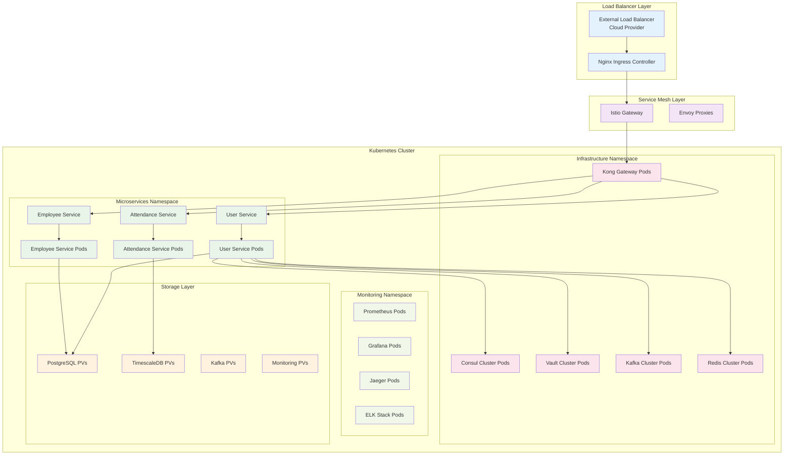

# Kubernetes Deployment Configuration

## 🎯 Overview

This section provides production-ready Kubernetes deployment configurations for the HR microservices ecosystem with Helm charts, service mesh integration, and enterprise-grade orchestration.

## 📁 Directory Structure

```
kubernetes/
├── namespaces/
│   ├── microservices.yaml
│   ├── infrastructure.yaml
│   └── monitoring.yaml
├── helm-charts/
│   ├── user-service/
│   ├── employee-service/
│   ├── attendance-service/
│   ├── api-gateway/
│   ├── kafka-cluster/
│   └── monitoring-stack/
├── istio/
│   ├── gateway.yaml
│   ├── virtual-services.yaml
│   ├── destination-rules.yaml
│   └── security-policies.yaml
├── ingress/
│   ├── nginx-controller.yaml
│   └── ingress-rules.yaml
├── storage/
│   ├── persistent-volumes.yaml
│   └── storage-classes.yaml
└── security/
    ├── rbac.yaml
    ├── network-policies.yaml
    └── pod-security-policies.yaml
```

## 🏗️ Kubernetes Architecture



## 🔧 Base Configurations

### Namespaces
```yaml
# namespaces/microservices.yaml
apiVersion: v1
kind: Namespace
metadata:
  name: microservices
  labels:
    app: hr-microservices
    tier: application
    istio-injection: enabled
---
apiVersion: v1
kind: Namespace
metadata:
  name: infrastructure
  labels:
    app: hr-microservices
    tier: infrastructure
    istio-injection: enabled
---
apiVersion: v1
kind: Namespace
metadata:
  name: monitoring
  labels:
    app: hr-microservices
    tier: monitoring
    istio-injection: enabled
```

### Storage Classes
```yaml
# storage/storage-classes.yaml
apiVersion: storage.k8s.io/v1
kind: StorageClass
metadata:
  name: fast-ssd
  annotations:
    storageclass.kubernetes.io/is-default-class: "false"
provisioner: kubernetes.io/aws-ebs # Change based on cloud provider
parameters:
  type: gp3
  iops: "3000"
  throughput: "125"
  fsType: ext4
  encrypted: "true"
allowVolumeExpansion: true
volumeBindingMode: WaitForFirstConsumer
reclaimPolicy: Retain
---
apiVersion: storage.k8s.io/v1
kind: StorageClass
metadata:
  name: database-storage
provisioner: kubernetes.io/aws-ebs
parameters:
  type: io2
  iops: "5000"
  fsType: ext4
  encrypted: "true"
allowVolumeExpansion: true
volumeBindingMode: WaitForFirstConsumer
reclaimPolicy: Retain
---
apiVersion: storage.k8s.io/v1
kind: StorageClass
metadata:
  name: kafka-storage
provisioner: kubernetes.io/aws-ebs
parameters:
  type: gp3
  iops: "4000"
  throughput: "250"
  fsType: ext4
  encrypted: "true"
allowVolumeExpansion: true
volumeBindingMode: WaitForFirstConsumer
reclaimPolicy: Retain
```

## 📊 Helm Chart: User Service

### Chart.yaml
```yaml
# helm-charts/user-service/Chart.yaml
apiVersion: v2
name: user-service
description: HR User Management Microservice
type: application
version: 1.0.0
appVersion: "1.0.0"
home: https://github.com/your-org/hr-microservices
sources:
  - https://github.com/your-org/hr-microservices
maintainers:
  - name: Platform Team
    email: platform@yourcompany.com
keywords:
  - microservices
  - hr
  - users
  - authentication
dependencies:
  - name: postgresql
    version: 12.1.6
    repository: https://charts.bitnami.com/bitnami
    condition: postgresql.enabled
  - name: redis
    version: 17.4.3
    repository: https://charts.bitnami.com/bitnami
    condition: redis.enabled
```

### Values.yaml
```yaml
# helm-charts/user-service/values.yaml
replicaCount: 3

image:
  repository: your-registry/hr-user-service
  pullPolicy: IfNotPresent
  tag: "1.0.0"

nameOverride: ""
fullnameOverride: ""

serviceAccount:
  create: true
  annotations: {}
  name: ""

podAnnotations:
  prometheus.io/scrape: "true"
  prometheus.io/port: "9090"
  prometheus.io/path: "/metrics"

podSecurityContext:
  fsGroup: 2000
  runAsNonRoot: true
  runAsUser: 1000

securityContext:
  allowPrivilegeEscalation: false
  capabilities:
    drop:
    - ALL
  readOnlyRootFilesystem: true
  runAsNonRoot: true
  runAsUser: 1000

service:
  type: ClusterIP
  port: 3001
  targetPort: 3001

ingress:
  enabled: false
  className: "nginx"
  annotations:
    nginx.ingress.kubernetes.io/rewrite-target: /
    nginx.ingress.kubernetes.io/rate-limit: "100"
    nginx.ingress.kubernetes.io/rate-limit-window: "1m"
  hosts:
    - host: user-service.local
      paths:
        - path: /
          pathType: Prefix
  tls: []

resources:
  limits:
    cpu: 1000m
    memory: 1Gi
  requests:
    cpu: 500m
    memory: 512Mi

autoscaling:
  enabled: true
  minReplicas: 3
  maxReplicas: 10
  targetCPUUtilizationPercentage: 70
  targetMemoryUtilizationPercentage: 80

nodeSelector: {}

tolerations: []

affinity:
  podAntiAffinity:
    preferredDuringSchedulingIgnoredDuringExecution:
    - weight: 100
      podAffinityTerm:
        labelSelector:
          matchExpressions:
          - key: app.kubernetes.io/name
            operator: In
            values:
            - user-service
        topologyKey: kubernetes.io/hostname

# Application Configuration
config:
  nodeEnv: production
  port: 3001
  serviceName: user-service

# Database Configuration
database:
  host: postgresql
  port: 5432
  name: user_service
  username: user_service
  # Password should be stored in a secret

# Redis Configuration
redis:
  enabled: true
  host: redis-master
  port: 6379

# External Services
externalServices:
  consul:
    host: consul-server
    port: 8500
  vault:
    addr: https://vault-server:8200
  kafka:
    brokers: "kafka-0:9092,kafka-1:9092,kafka-2:9092"

# Observability
observability:
  jaeger:
    agentHost: jaeger-agent
    agentPort: 6831
  prometheus:
    port: 9090

# Security
security:
  jwtSecret: your-jwt-secret
  encryptionKey: your-encryption-key

# Health checks
healthcheck:
  enabled: true
  livenessProbe:
    httpGet:
      path: /health
      port: 3001
    initialDelaySeconds: 30
    periodSeconds: 30
    timeoutSeconds: 10
    failureThreshold: 3
  readinessProbe:
    httpGet:
      path: /ready
      port: 3001
    initialDelaySeconds: 10
    periodSeconds: 10
    timeoutSeconds: 5
    failureThreshold: 3

# Persistent Volume
persistence:
  enabled: true
  storageClass: "fast-ssd"
  accessMode: ReadWriteOnce
  size: 10Gi

# PostgreSQL dependency
postgresql:
  enabled: true
  auth:
    postgresPassword: postgres-password
    username: user_service
    password: user-service-password
    database: user_service
  primary:
    persistence:
      enabled: true
      storageClass: "database-storage"
      size: 20Gi
  metrics:
    enabled: true
```

### Deployment Template
```yaml
# helm-charts/user-service/templates/deployment.yaml
apiVersion: apps/v1
kind: Deployment
metadata:
  name: {{ include "user-service.fullname" . }}
  labels:
    {{- include "user-service.labels" . | nindent 4 }}
spec:
  {{- if not .Values.autoscaling.enabled }}
  replicas: {{ .Values.replicaCount }}
  {{- end }}
  selector:
    matchLabels:
      {{- include "user-service.selectorLabels" . | nindent 6 }}
  strategy:
    type: RollingUpdate
    rollingUpdate:
      maxUnavailable: 1
      maxSurge: 1
  template:
    metadata:
      {{- with .Values.podAnnotations }}
      annotations:
        {{- toYaml . | nindent 8 }}
      {{- end }}
      labels:
        {{- include "user-service.selectorLabels" . | nindent 8 }}
        version: v1
    spec:
      {{- with .Values.imagePullSecrets }}
      imagePullSecrets:
        {{- toYaml . | nindent 8 }}
      {{- end }}
      serviceAccountName: {{ include "user-service.serviceAccountName" . }}
      securityContext:
        {{- toYaml .Values.podSecurityContext | nindent 8 }}
      containers:
        - name: {{ .Chart.Name }}
          securityContext:
            {{- toYaml .Values.securityContext | nindent 12 }}
          image: "{{ .Values.image.repository }}:{{ .Values.image.tag | default .Chart.AppVersion }}"
          imagePullPolicy: {{ .Values.image.pullPolicy }}
          ports:
            - name: http
              containerPort: {{ .Values.config.port }}
              protocol: TCP
            - name: metrics
              containerPort: {{ .Values.observability.prometheus.port }}
              protocol: TCP
          env:
            - name: NODE_ENV
              value: {{ .Values.config.nodeEnv }}
            - name: PORT
              value: "{{ .Values.config.port }}"
            - name: SERVICE_NAME
              value: {{ .Values.config.serviceName }}
            - name: DB_HOST
              value: {{ .Values.database.host }}
            - name: DB_PORT
              value: "{{ .Values.database.port }}"
            - name: DB_NAME
              value: {{ .Values.database.name }}
            - name: DB_USER
              value: {{ .Values.database.username }}
            - name: DB_PASSWORD
              valueFrom:
                secretKeyRef:
                  name: {{ include "user-service.fullname" . }}-db
                  key: password
            - name: REDIS_HOST
              value: {{ .Values.redis.host }}
            - name: REDIS_PORT
              value: "{{ .Values.redis.port }}"
            - name: CONSUL_HOST
              value: {{ .Values.externalServices.consul.host }}
            - name: CONSUL_PORT
              value: "{{ .Values.externalServices.consul.port }}"
            - name: VAULT_ADDR
              value: {{ .Values.externalServices.vault.addr }}
            - name: KAFKA_BROKERS
              value: {{ .Values.externalServices.kafka.brokers }}
            - name: JAEGER_AGENT_HOST
              value: {{ .Values.observability.jaeger.agentHost }}
            - name: JAEGER_AGENT_PORT
              value: "{{ .Values.observability.jaeger.agentPort }}"
            - name: JWT_SECRET
              valueFrom:
                secretKeyRef:
                  name: {{ include "user-service.fullname" . }}-auth
                  key: jwt-secret
            - name: ENCRYPTION_KEY
              valueFrom:
                secretKeyRef:
                  name: {{ include "user-service.fullname" . }}-auth
                  key: encryption-key
          {{- if .Values.healthcheck.enabled }}
          livenessProbe:
            {{- toYaml .Values.healthcheck.livenessProbe | nindent 12 }}
          readinessProbe:
            {{- toYaml .Values.healthcheck.readinessProbe | nindent 12 }}
          {{- end }}
          resources:
            {{- toYaml .Values.resources | nindent 12 }}
          volumeMounts:
            - name: storage
              mountPath: /app/storage
            - name: logs
              mountPath: /app/logs
            - name: tmp
              mountPath: /tmp
      volumes:
        - name: storage
          {{- if .Values.persistence.enabled }}
          persistentVolumeClaim:
            claimName: {{ include "user-service.fullname" . }}-storage
          {{- else }}
          emptyDir: {}
          {{- end }}
        - name: logs
          emptyDir: {}
        - name: tmp
          emptyDir: {}
      {{- with .Values.nodeSelector }}
      nodeSelector:
        {{- toYaml . | nindent 8 }}
      {{- end }}
      {{- with .Values.affinity }}
      affinity:
        {{- toYaml . | nindent 8 }}
      {{- end }}
      {{- with .Values.tolerations }}
      tolerations:
        {{- toYaml . | nindent 8 }}
      {{- end }}
```

## 🌐 Istio Service Mesh Configuration

### Gateway
```yaml
# istio/gateway.yaml
apiVersion: networking.istio.io/v1beta1
kind: Gateway
metadata:
  name: hr-microservices-gateway
  namespace: microservices
spec:
  selector:
    istio: ingressgateway
  servers:
  - port:
      number: 80
      name: http
      protocol: HTTP
    hosts:
    - "hr-api.yourdomain.com"
    - "user-service.yourdomain.com"
    - "employee-service.yourdomain.com"
    - "attendance-service.yourdomain.com"
  - port:
      number: 443
      name: https
      protocol: HTTPS
    tls:
      mode: SIMPLE
      credentialName: hr-microservices-tls-secret
    hosts:
    - "hr-api.yourdomain.com"
    - "user-service.yourdomain.com"
    - "employee-service.yourdomain.com"
    - "attendance-service.yourdomain.com"
```

### Virtual Services
```yaml
# istio/virtual-services.yaml
apiVersion: networking.istio.io/v1beta1
kind: VirtualService
metadata:
  name: user-service-vs
  namespace: microservices
spec:
  hosts:
  - "user-service.yourdomain.com"
  - "hr-api.yourdomain.com"
  gateways:
  - hr-microservices-gateway
  http:
  - match:
    - uri:
        prefix: "/api/v1/users"
    - uri:
        prefix: "/api/v1/auth"
    - headers:
        host:
          exact: "user-service.yourdomain.com"
    route:
    - destination:
        host: user-service
        port:
          number: 3001
    timeout: 30s
    retries:
      attempts: 3
      perTryTimeout: 10s
    fault:
      delay:
        percentage:
          value: 0.1
        fixedDelay: 5s
---
apiVersion: networking.istio.io/v1beta1
kind: VirtualService
metadata:
  name: employee-service-vs
  namespace: microservices
spec:
  hosts:
  - "employee-service.yourdomain.com"
  - "hr-api.yourdomain.com"
  gateways:
  - hr-microservices-gateway
  http:
  - match:
    - uri:
        prefix: "/api/v1/employees"
    - uri:
        prefix: "/api/v1/departments"
    - headers:
        host:
          exact: "employee-service.yourdomain.com"
    route:
    - destination:
        host: employee-service
        port:
          number: 3002
    timeout: 30s
    retries:
      attempts: 3
      perTryTimeout: 10s
---
apiVersion: networking.istio.io/v1beta1
kind: VirtualService
metadata:
  name: attendance-service-vs
  namespace: microservices
spec:
  hosts:
  - "attendance-service.yourdomain.com"
  - "hr-api.yourdomain.com"
  gateways:
  - hr-microservices-gateway
  http:
  - match:
    - uri:
        prefix: "/api/v1/attendance"
    - uri:
        prefix: "/api/v1/timesheets"
    - headers:
        host:
          exact: "attendance-service.yourdomain.com"
    route:
    - destination:
        host: attendance-service
        port:
          number: 3003
    timeout: 30s
    retries:
      attempts: 3
      perTryTimeout: 10s
```

### Destination Rules
```yaml
# istio/destination-rules.yaml
apiVersion: networking.istio.io/v1beta1
kind: DestinationRule
metadata:
  name: user-service-dr
  namespace: microservices
spec:
  host: user-service
  trafficPolicy:
    connectionPool:
      tcp:
        maxConnections: 100
      http:
        http1MaxPendingRequests: 50
        http2MaxRequests: 100
        maxRequestsPerConnection: 10
        maxRetries: 3
        consecutiveGatewayErrors: 5
        interval: 30s
        baseEjectionTime: 30s
        maxEjectionPercent: 50
    loadBalancer:
      simple: LEAST_CONN
    circuitBreaker:
      consecutiveGatewayErrors: 5
      consecutive5xxErrors: 5
      interval: 30s
      baseEjectionTime: 30s
      maxEjectionPercent: 50
      minHealthPercent: 50
  subsets:
  - name: v1
    labels:
      version: v1
    trafficPolicy:
      portLevelSettings:
      - port:
          number: 3001
        connectionPool:
          tcp:
            maxConnections: 50
---
apiVersion: networking.istio.io/v1beta1
kind: DestinationRule
metadata:
  name: employee-service-dr
  namespace: microservices
spec:
  host: employee-service
  trafficPolicy:
    connectionPool:
      tcp:
        maxConnections: 100
      http:
        http1MaxPendingRequests: 50
        http2MaxRequests: 100
        maxRequestsPerConnection: 10
        maxRetries: 3
    loadBalancer:
      simple: ROUND_ROBIN
    circuitBreaker:
      consecutiveGatewayErrors: 5
      consecutive5xxErrors: 5
      interval: 30s
      baseEjectionTime: 30s
      maxEjectionPercent: 50
  subsets:
  - name: v1
    labels:
      version: v1
---
apiVersion: networking.istio.io/v1beta1
kind: DestinationRule
metadata:
  name: attendance-service-dr
  namespace: microservices
spec:
  host: attendance-service
  trafficPolicy:
    connectionPool:
      tcp:
        maxConnections: 100
      http:
        http1MaxPendingRequests: 50
        http2MaxRequests: 100
        maxRequestsPerConnection: 10
        maxRetries: 3
    loadBalancer:
      simple: RANDOM
    circuitBreaker:
      consecutiveGatewayErrors: 5
      consecutive5xxErrors: 5
      interval: 30s
      baseEjectionTime: 30s
      maxEjectionPercent: 50
  subsets:
  - name: v1
    labels:
      version: v1
```

## 🔐 Security Policies

### Network Policies
```yaml
# security/network-policies.yaml
apiVersion: networking.k8s.io/v1
kind: NetworkPolicy
metadata:
  name: microservices-network-policy
  namespace: microservices
spec:
  podSelector: {}
  policyTypes:
  - Ingress
  - Egress
  ingress:
  - from:
    - namespaceSelector:
        matchLabels:
          name: istio-system
    - namespaceSelector:
        matchLabels:
          name: infrastructure
    - podSelector: {}
    ports:
    - protocol: TCP
      port: 3001
    - protocol: TCP
      port: 3002
    - protocol: TCP
      port: 3003
    - protocol: TCP
      port: 9090  # Prometheus metrics
  egress:
  - to:
    - namespaceSelector:
        matchLabels:
          name: infrastructure
    ports:
    - protocol: TCP
      port: 5432   # PostgreSQL
    - protocol: TCP
      port: 6379   # Redis
    - protocol: TCP
      port: 9092   # Kafka
    - protocol: TCP
      port: 8500   # Consul
    - protocol: TCP
      port: 8200   # Vault
  - to:
    - namespaceSelector:
        matchLabels:
          name: monitoring
    ports:
    - protocol: TCP
      port: 9090   # Prometheus
    - protocol: UDP
      port: 6831   # Jaeger
  - to: []  # Allow all egress for external APIs
    ports:
    - protocol: TCP
      port: 80
    - protocol: TCP
      port: 443
    - protocol: TCP
      port: 53
    - protocol: UDP
      port: 53
---
apiVersion: networking.k8s.io/v1
kind: NetworkPolicy
metadata:
  name: infrastructure-network-policy
  namespace: infrastructure
spec:
  podSelector: {}
  policyTypes:
  - Ingress
  - Egress
  ingress:
  - from:
    - namespaceSelector:
        matchLabels:
          name: microservices
    - podSelector: {}
    ports:
    - protocol: TCP
      port: 5432   # PostgreSQL
    - protocol: TCP
      port: 6379   # Redis
    - protocol: TCP
      port: 9092   # Kafka
    - protocol: TCP
      port: 8500   # Consul
    - protocol: TCP
      port: 8200   # Vault
    - protocol: TCP
      port: 8001   # Kong Admin
    - protocol: TCP
      port: 8000   # Kong Proxy
  egress:
  - to: []  # Allow all egress for infrastructure
```

## 📊 Monitoring Configuration

### Prometheus ServiceMonitor
```yaml
# monitoring/service-monitors.yaml
apiVersion: monitoring.coreos.com/v1
kind: ServiceMonitor
metadata:
  name: user-service-metrics
  namespace: monitoring
  labels:
    app: user-service
    release: prometheus
spec:
  selector:
    matchLabels:
      app.kubernetes.io/name: user-service
  namespaceSelector:
    matchNames:
    - microservices
  endpoints:
  - port: metrics
    interval: 30s
    path: /metrics
    scheme: http
    scrapeTimeout: 10s
---
apiVersion: monitoring.coreos.com/v1
kind: ServiceMonitor
metadata:
  name: employee-service-metrics
  namespace: monitoring
  labels:
    app: employee-service
    release: prometheus
spec:
  selector:
    matchLabels:
      app.kubernetes.io/name: employee-service
  namespaceSelector:
    matchNames:
    - microservices
  endpoints:
  - port: metrics
    interval: 30s
    path: /metrics
    scheme: http
---
apiVersion: monitoring.coreos.com/v1
kind: ServiceMonitor
metadata:
  name: attendance-service-metrics
  namespace: monitoring
  labels:
    app: attendance-service
    release: prometheus
spec:
  selector:
    matchLabels:
      app.kubernetes.io/name: attendance-service
  namespaceSelector:
    matchNames:
    - microservices
  endpoints:
  - port: metrics
    interval: 30s
    path: /metrics
    scheme: http
```

## 🚀 Deployment Scripts

### Kubernetes Deployment Script
```bash
#!/bin/bash
# scripts/deploy-kubernetes.sh

set -e

NAMESPACE_MICROSERVICES="microservices"
NAMESPACE_INFRASTRUCTURE="infrastructure"
NAMESPACE_MONITORING="monitoring"

echo "🚀 Deploying HR Microservices to Kubernetes..."

# Create namespaces
echo "📁 Creating namespaces..."
kubectl apply -f kubernetes/namespaces/

# Install Istio (if not already installed)
if ! kubectl get namespace istio-system > /dev/null 2>&1; then
    echo "🌐 Installing Istio..."
    curl -L https://istio.io/downloadIstio | sh -
    export PATH=$PWD/istio-*/bin:$PATH
    istioctl install --set values.defaultRevision=default -y
    kubectl label namespace default istio-injection=enabled
fi

# Create storage classes
echo "💾 Creating storage classes..."
kubectl apply -f kubernetes/storage/

# Deploy infrastructure services
echo "🏗️ Deploying infrastructure services..."
helm repo add bitnami https://charts.bitnami.com/bitnami
helm repo add kong https://charts.konghq.com
helm repo add hashicorp https://helm.releases.hashicorp.com
helm repo add prometheus-community https://prometheus-community.github.io/helm-charts
helm repo update

# Deploy PostgreSQL for microservices
kubectl create namespace $NAMESPACE_INFRASTRUCTURE --dry-run=client -o yaml | kubectl apply -f -
helm upgrade --install postgresql-user bitnami/postgresql \
    --namespace $NAMESPACE_INFRASTRUCTURE \
    --set auth.postgresPassword=postgres-password \
    --set auth.username=user_service \
    --set auth.password=user-service-password \
    --set auth.database=user_service \
    --set primary.persistence.storageClass=database-storage \
    --set primary.persistence.size=20Gi

helm upgrade --install postgresql-employee bitnami/postgresql \
    --namespace $NAMESPACE_INFRASTRUCTURE \
    --set auth.postgresPassword=postgres-password \
    --set auth.username=employee_service \
    --set auth.password=employee-service-password \
    --set auth.database=employee_service \
    --set primary.persistence.storageClass=database-storage \
    --set primary.persistence.size=20Gi

# Deploy TimescaleDB
helm upgrade --install timescaledb bitnami/postgresql \
    --namespace $NAMESPACE_INFRASTRUCTURE \
    --set image.repository=timescale/timescaledb-ha \
    --set image.tag=pg15-latest \
    --set auth.postgresPassword=postgres-password \
    --set auth.username=attendance_service \
    --set auth.password=attendance-service-password \
    --set auth.database=attendance_service \
    --set primary.persistence.storageClass=database-storage \
    --set primary.persistence.size=50Gi

# Deploy Redis
helm upgrade --install redis bitnami/redis \
    --namespace $NAMESPACE_INFRASTRUCTURE \
    --set auth.enabled=false \
    --set master.persistence.storageClass=fast-ssd \
    --set master.persistence.size=10Gi

# Deploy Kafka
helm upgrade --install kafka bitnami/kafka \
    --namespace $NAMESPACE_INFRASTRUCTURE \
    --set replicaCount=3 \
    --set persistence.storageClass=kafka-storage \
    --set persistence.size=20Gi \
    --set zookeeper.persistence.storageClass=fast-ssd \
    --set zookeeper.persistence.size=10Gi

# Deploy Consul
helm upgrade --install consul hashicorp/consul \
    --namespace $NAMESPACE_INFRASTRUCTURE \
    --set global.name=consul \
    --set server.replicas=3 \
    --set server.bootstrapExpect=3 \
    --set server.storage=10Gi \
    --set server.storageClass=fast-ssd \
    --set ui.enabled=true

# Deploy Vault
helm upgrade --install vault hashicorp/vault \
    --namespace $NAMESPACE_INFRASTRUCTURE \
    --set server.ha.enabled=true \
    --set server.ha.replicas=3 \
    --set server.dataStorage.storageClass=fast-ssd \
    --set server.dataStorage.size=10Gi

# Wait for infrastructure to be ready
echo "⏳ Waiting for infrastructure services to be ready..."
kubectl wait --for=condition=ready pod -l app.kubernetes.io/name=postgresql -n $NAMESPACE_INFRASTRUCTURE --timeout=300s
kubectl wait --for=condition=ready pod -l app.kubernetes.io/name=redis -n $NAMESPACE_INFRASTRUCTURE --timeout=300s
kubectl wait --for=condition=ready pod -l app.kubernetes.io/name=kafka -n $NAMESPACE_INFRASTRUCTURE --timeout=300s

# Deploy microservices
echo "🔧 Deploying microservices..."
kubectl create namespace $NAMESPACE_MICROSERVICES --dry-run=client -o yaml | kubectl apply -f -

helm upgrade --install user-service ./kubernetes/helm-charts/user-service \
    --namespace $NAMESPACE_MICROSERVICES \
    --set image.tag=latest \
    --wait

helm upgrade --install employee-service ./kubernetes/helm-charts/employee-service \
    --namespace $NAMESPACE_MICROSERVICES \
    --set image.tag=latest \
    --wait

helm upgrade --install attendance-service ./kubernetes/helm-charts/attendance-service \
    --namespace $NAMESPACE_MICROSERVICES \
    --set image.tag=latest \
    --wait

# Apply Istio configuration
echo "🌐 Applying Istio configuration..."
kubectl apply -f kubernetes/istio/

# Deploy monitoring stack
echo "📊 Deploying monitoring stack..."
kubectl create namespace $NAMESPACE_MONITORING --dry-run=client -o yaml | kubectl apply -f -

helm upgrade --install prometheus-stack prometheus-community/kube-prometheus-stack \
    --namespace $NAMESPACE_MONITORING \
    --set prometheus.prometheusSpec.storageSpec.volumeClaimTemplate.spec.storageClassName=fast-ssd \
    --set prometheus.prometheusSpec.storageSpec.volumeClaimTemplate.spec.resources.requests.storage=50Gi \
    --set grafana.persistence.enabled=true \
    --set grafana.persistence.storageClassName=fast-ssd \
    --set grafana.persistence.size=10Gi

# Apply security policies
echo "🔐 Applying security policies..."
kubectl apply -f kubernetes/security/

echo "✅ HR Microservices deployed successfully to Kubernetes!"
echo ""
echo "🌐 Access Points:"
echo "  • Istio Gateway: https://hr-api.yourdomain.com"
echo "  • Grafana: kubectl port-forward -n monitoring svc/prometheus-stack-grafana 3000:80"
echo "  • Prometheus: kubectl port-forward -n monitoring svc/prometheus-stack-prometheus 9090:9090"
echo "  • Consul UI: kubectl port-forward -n infrastructure svc/consul-ui 8500:80"
echo ""
echo "🔍 Health Checks:"
for service in user-service employee-service attendance-service; do
    echo "  • $service: kubectl get pods -n $NAMESPACE_MICROSERVICES -l app.kubernetes.io/name=$service"
done
```

---

**Next**: [Migration Documentation](../migration/README.md) | [Complete System Overview](../README.md)