# API Gateway Implementation

## 🎯 Overview

The API Gateway serves as the single entry point for all client applications accessing the HR microservices ecosystem. It provides authentication, authorization, rate limiting, request routing, load balancing, and observability features.

### 🏗️ Architecture

```mermaid
graph TB
    subgraph "Client Applications"
        WebApp[Web Application]
        MobileApp[Mobile App]
        AdminPanel[Admin Panel]
        ThirdParty[Third-party Integrations]
    end
    
    subgraph "API Gateway Layer"
        subgraph "Load Balancer"
            LB[HAProxy/Nginx<br/>Load Balancer]
        end
        
        subgraph "API Gateway Cluster"
            Gateway1[Kong Gateway 1]
            Gateway2[Kong Gateway 2]
            Gateway3[Kong Gateway 3]
        end
        
        subgraph "Gateway Features"
            Auth[Authentication<br/>& Authorization]
            RateLimit[Rate Limiting<br/>& Throttling]
            Router[Request Routing<br/>& Load Balancing]
            Transform[Request/Response<br/>Transformation]
            Cache[Response Caching]
            Monitor[Monitoring<br/>& Logging]
            CircuitBreaker[Circuit Breaker<br/>& Retry]
        end
    end
    
    subgraph "Service Discovery"
        Consul[Consul<br/>Service Registry]
        HealthCheck[Health Checks]
    end
    
    subgraph "Security & Auth"
        Keycloak[Keycloak<br/>Identity Provider]
        Vault[HashiCorp Vault<br/>Secrets Management]
        JWT[JWT Token<br/>Validation]
    end
    
    subgraph "Microservices"
        UserService[User Service<br/>:3001]
        EmployeeService[Employee Service<br/>:3002]
        AttendanceService[Attendance Service<br/>:3003]
        LeaveService[Leave Service<br/>:3004]
        PayrollService[Payroll Service<br/>:3005]
        NotificationService[Notification Service<br/>:3006]
    end
    
    subgraph "Observability"
        Prometheus[Prometheus<br/>Metrics]
        Jaeger[Jaeger<br/>Distributed Tracing]
        ELKStack[ELK Stack<br/>Centralized Logging]
        Grafana[Grafana<br/>Dashboards]
    end
    
    WebApp --> LB
    MobileApp --> LB
    AdminPanel --> LB
    ThirdParty --> LB
    
    LB --> Gateway1
    LB --> Gateway2
    LB --> Gateway3
    
    Gateway1 --> Auth
    Gateway1 --> RateLimit
    Gateway1 --> Router
    Gateway1 --> Transform
    Gateway1 --> Cache
    Gateway1 --> Monitor
    Gateway1 --> CircuitBreaker
    
    Gateway1 --> Consul
    Gateway2 --> Consul
    Gateway3 --> Consul
    
    Auth --> Keycloak
    Auth --> Vault
    Auth --> JWT
    
    Router --> UserService
    Router --> EmployeeService
    Router --> AttendanceService
    Router --> LeaveService
    Router --> PayrollService
    Router --> NotificationService
    
    Monitor --> Prometheus
    Monitor --> Jaeger
    Monitor --> ELKStack
    
    Prometheus --> Grafana
    
    classDef client fill:#e3f2fd
    classDef gateway fill:#f3e5f5
    classDef feature fill:#e8f5e8
    classDef service fill:#fff3e0
    classDef security fill:#fce4ec
    classDef observability fill:#f1f8e9
    
    class WebApp,MobileApp,AdminPanel,ThirdParty client
    class LB,Gateway1,Gateway2,Gateway3 gateway
    class Auth,RateLimit,Router,Transform,Cache,Monitor,CircuitBreaker feature
    class UserService,EmployeeService,AttendanceService,LeaveService,PayrollService,NotificationService service
    class Keycloak,Vault,JWT,Consul,HealthCheck security
    class Prometheus,Jaeger,ELKStack,Grafana observability
```



## ⚙️ Kong Gateway Configuration

### Core Configuration
```yaml
# kong.yml - Declarative Configuration
_format_version: "3.0"
_transform: true

services:
  # User Service
  - name: user-service
    url: http://user-service:3001
    retries: 3
    connect_timeout: 60000
    write_timeout: 60000
    read_timeout: 60000
    tags:
      - hr-microservices
      - user-management
    
  # Employee Service  
  - name: employee-service
    url: http://employee-service:3002
    retries: 3
    connect_timeout: 60000
    write_timeout: 60000
    read_timeout: 60000
    tags:
      - hr-microservices
      - employee-management
      
  # Attendance Service
  - name: attendance-service
    url: http://attendance-service:3003
    retries: 3
    connect_timeout: 60000
    write_timeout: 60000
    read_timeout: 60000
    tags:
      - hr-microservices
      - attendance-tracking

routes:
  # User Service Routes
  - name: user-auth-routes
    service: user-service
    paths:
      - /api/v1/auth
      - /api/v1/users
    methods:
      - GET
      - POST
      - PUT
      - PATCH
      - DELETE
    strip_path: false
    preserve_host: false
    tags:
      - authentication
      - user-management
      
  # Employee Service Routes  
  - name: employee-routes
    service: employee-service
    paths:
      - /api/v1/employees
    methods:
      - GET
      - POST
      - PUT
      - PATCH
      - DELETE
    strip_path: false
    preserve_host: false
    tags:
      - employee-management
      
  # Attendance Service Routes
  - name: attendance-routes
    service: attendance-service
    paths:
      - /api/v1/attendance
      - /api/v1/schedules
      - /api/v1/timesheets
    methods:
      - GET
      - POST
      - PUT
      - PATCH
      - DELETE
    strip_path: false
    preserve_host: false
    tags:
      - attendance-tracking

plugins:
  # Global Rate Limiting
  - name: rate-limiting-advanced
    config:
      limit:
        - 1000
      window_size:
        - 60
      identifier: consumer
      sync_rate: 10
      strategy: redis
      redis:
        host: redis-cluster
        port: 6379
        database: 1
      hide_client_headers: false
    tags:
      - rate-limiting
      - global
      
  # Global Request/Response Logging
  - name: file-log
    config:
      path: /var/log/kong/access.log
      reopen: true
    tags:
      - logging
      - global
      
  # Global Prometheus Metrics
  - name: prometheus
    config:
      per_consumer: true
      status_code_metrics: true
      latency_metrics: true
      bandwidth_metrics: true
    tags:
      - monitoring
      - global
      
  # Global CORS
  - name: cors
    config:
      origins:
        - "https://hr-dashboard.company.com"
        - "https://mobile-app.company.com"
        - "http://localhost:3000"
        - "http://localhost:8080"
      methods:
        - GET
        - POST
        - PUT
        - PATCH
        - DELETE
        - OPTIONS
      headers:
        - Accept
        - Accept-Version
        - Content-Length
        - Content-MD5
        - Content-Type
        - Date
        - Authorization
        - X-Auth-Token
      exposed_headers:
        - X-Auth-Token
        - X-RateLimit-Limit
        - X-RateLimit-Remaining
      credentials: true
      max_age: 3600
    tags:
      - cors
      - global

  # JWT Authentication for protected routes
  - name: jwt
    route: employee-routes
    config:
      uri_param_names:
        - token
      cookie_names:
        - auth_token
      header_names:
        - Authorization
      claims_to_verify:
        - exp
        - iat
      key_claim_name: iss
      secret_is_base64: false
      run_on_preflight: true
    tags:
      - authentication
      - jwt
      
  - name: jwt
    route: attendance-routes
    config:
      uri_param_names:
        - token
      cookie_names:
        - auth_token
      header_names:
        - Authorization
      claims_to_verify:
        - exp
        - iat
      key_claim_name: iss
      secret_is_base64: false
      run_on_preflight: true
    tags:
      - authentication
      - jwt
      
  # Request Size Limiting
  - name: request-size-limiting
    config:
      allowed_payload_size: 10
      size_unit: megabytes
      require_content_length: false
    tags:
      - security
      - global
      
  # IP Restriction for Admin Routes
  - name: ip-restriction
    route: user-auth-routes
    config:
      allow:
        - "10.0.0.0/8"
        - "172.16.0.0/12"
        - "192.168.0.0/16"
        - "127.0.0.1"
      deny: []
      message: "Access denied from this IP address"
    tags:
      - security
      - ip-filtering

consumers:
  # Service-to-Service Communication
  - username: user-service
    custom_id: svc_user
    tags:
      - service-account
      - internal
      
  - username: employee-service
    custom_id: svc_employee
    tags:
      - service-account
      - internal
      
  - username: attendance-service
    custom_id: svc_attendance
    tags:
      - service-account
      - internal

  # API Client Applications
  - username: web-application
    custom_id: app_web
    tags:
      - application
      - web
      
  - username: mobile-application
    custom_id: app_mobile
    tags:
      - application
      - mobile

jwt_secrets:
  # JWT Configuration for Services
  - consumer: user-service
    key: user-service-jwt-key
    secret: your-jwt-secret-for-user-service
    algorithm: HS256
    
  - consumer: employee-service
    key: employee-service-jwt-key
    secret: your-jwt-secret-for-employee-service
    algorithm: HS256
    
  - consumer: attendance-service
    key: attendance-service-jwt-key
    secret: your-jwt-secret-for-attendance-service
    algorithm: HS256
    
  # JWT Configuration for Applications
  - consumer: web-application
    key: web-app-jwt-key
    secret: your-jwt-secret-for-web-app
    algorithm: HS256
    
  - consumer: mobile-application
    key: mobile-app-jwt-key
    secret: your-jwt-secret-for-mobile-app
    algorithm: HS256

acls:
  # Access Control Lists
  - consumer: user-service
    group: internal-services
    
  - consumer: employee-service
    group: internal-services
    
  - consumer: attendance-service
    group: internal-services
    
  - consumer: web-application
    group: web-clients
    
  - consumer: mobile-application
    group: mobile-clients

rate_limiting_advanced:
  # Service-specific rate limits
  - consumer: web-application
    config:
      limit:
        - 500
      window_size:
        - 60
      identifier: consumer
      
  - consumer: mobile-application
    config:
      limit:
        - 300
      window_size:
        - 60
      identifier: consumer
```

## 🔒 Security Configuration

### OAuth 2.0 / OIDC Integration
```yaml
# OAuth 2.0 Plugin Configuration
plugins:
  - name: oauth2
    config:
      scopes:
        - read:users
        - write:users
        - read:employees
        - write:employees
        - read:attendance
        - write:attendance
        - admin:system
      mandatory_scope: true
      enable_authorization_code: true
      enable_client_credentials: true
      enable_implicit_grant: false
      enable_password_grant: true
      token_expiration: 3600
      auth_header_name: Authorization
      global_credentials: false
      anonymous: ""
      hide_credentials: true
      
  # OIDC Plugin for Keycloak Integration
  - name: oidc
    config:
      client_id: hr-microservices-gateway
      client_secret: your-keycloak-client-secret
      discovery: https://keycloak.company.com/auth/realms/hr-system/.well-known/openid_configuration
      scope: openid profile email roles
      ssl_verify: true
      session_secret: your-session-secret
      introspection_endpoint: https://keycloak.company.com/auth/realms/hr-system/protocol/openid-connect/token/introspect
      bearer_only: true
      realm: hr-system
      redirect_after_logout_uri: https://hr-dashboard.company.com/logout
      logout_path: /logout
      userinfo_header_name: X-Userinfo
      id_token_header_name: X-ID-Token
      access_token_header_name: X-Access-Token
```

### Request/Response Transformation
```yaml
# Request Transformation Plugin
plugins:
  - name: request-transformer-advanced
    route: employee-routes
    config:
      http_method: null
      remove:
        headers:
          - x-internal-secret
        querystring: []
        body: []
      replace:
        headers: []
        querystring: []
        body: []
        uri: null
      add:
        headers:
          - "X-Service-Name:employee-service"
          - "X-Request-ID:$(uuid)"
          - "X-Forwarded-Proto:$(scheme)"
        querystring: []
        body: []
      append:
        headers: []
        querystring: []
        body: []
        
  # Response Transformation Plugin  
  - name: response-transformer-advanced
    route: employee-routes
    config:
      remove:
        headers:
          - x-internal-token
          - x-database-host
        json:
          - internal_metadata
      replace:
        headers: []
        json: []
      add:
        headers:
          - "X-Response-Source:employee-service"
          - "X-Response-Time:$(latency)"
        json: []
      append:
        headers: []
        json: []
```

## 📊 Monitoring & Observability

### Prometheus Metrics Configuration
```yaml
# Custom Prometheus Metrics
plugins:
  - name: prometheus
    config:
      per_consumer: true
      status_code_metrics: true
      latency_metrics: true
      bandwidth_metrics: true
      upstream_health_metrics: true
      custom_labels:
        service_name: "api-gateway"
        environment: "production"
        region: "us-east-1"
```

### Jaeger Tracing Configuration
```yaml
# OpenTracing Plugin for Jaeger
plugins:
  - name: opentracing
    config:
      http_endpoint: http://jaeger-collector:14268/api/traces
      sample_ratio: 0.1
      include_credential: false
      header_type: jaeger
      default_header_type: jaeger
      tags:
        service_name: api-gateway
        service_version: "1.0.0"
```

### Access Logging Configuration
```yaml
# Enhanced Logging Plugin
plugins:
  - name: file-log
    config:
      path: /var/log/kong/access.log
      reopen: true
      custom_fields_by_lua:
        request_id: "return kong.ctx.plugin.request_id"
        user_id: "return kong.ctx.plugin.user_id"
        service_name: "return kong.router.get_service().name"
        route_name: "return kong.router.get_route().name"
        
  # Structured JSON Logging
  - name: http-log
    config:
      http_endpoint: http://logstash:5000/gateway-logs
      method: POST
      content_type: application/json
      timeout: 10000
      keepalive: 60000
      retry_count: 10
      queue_size: 1000
      flush_timeout: 2
      custom_fields_by_lua:
        timestamp: "return os.time()"
        environment: "return 'production'"
        gateway_version: "return '3.0.0'"
```

## 🐳 Docker Configuration

### Dockerfile
```dockerfile
FROM kong:3.0.0-alpine

# Install additional plugins
USER root

# Install custom plugins and dependencies
RUN apk add --no-cache \
    git \
    curl \
    openssl \
    ca-certificates

# Copy custom plugins
COPY plugins/ /usr/local/share/lua/5.1/kong/plugins/

# Copy configuration
COPY kong.yml /etc/kong/kong.yml
COPY kong.conf /etc/kong/kong.conf

# Create log directory
RUN mkdir -p /var/log/kong && \
    chown -R kong:kong /var/log/kong

# Health check
HEALTHCHECK --interval=30s --timeout=10s --start-period=60s --retries=3 \
  CMD kong health || exit 1

USER kong

EXPOSE 8000 8001 8443 8444

ENTRYPOINT ["/docker-entrypoint.sh"]
CMD ["kong", "docker-start"]
```

### Kong Configuration File
```conf
# kong.conf
# Basic Configuration
prefix = /usr/local/kong
log_level = info
proxy_access_log = /var/log/kong/access.log
proxy_error_log = /var/log/kong/error.log
admin_access_log = /var/log/kong/admin_access.log
admin_error_log = /var/log/kong/admin_error.log

# Proxy Configuration
proxy_listen = 0.0.0.0:8000, 0.0.0.0:8443 ssl
admin_listen = 0.0.0.0:8001, 0.0.0.0:8444 ssl

# SSL Configuration
ssl_cert = /etc/ssl/certs/kong.crt
ssl_cert_key = /etc/ssl/private/kong.key
admin_ssl_cert = /etc/ssl/certs/kong-admin.crt
admin_ssl_cert_key = /etc/ssl/private/kong-admin.key

# Database Configuration (PostgreSQL)
database = postgres
pg_host = kong-database
pg_port = 5432
pg_database = kong
pg_user = kong
pg_password = kong_password
pg_ssl = off

# Clustering Configuration
cluster_listen = 0.0.0.0:8005
cluster_control_plane = kong-cp:8005
cluster_cert = /etc/ssl/certs/cluster.crt
cluster_cert_key = /etc/ssl/private/cluster.key

# Performance Tuning
worker_processes = auto
worker_connections = 1024
upstream_keepalive_pool_size = 256
upstream_keepalive_max_requests = 1000
upstream_keepalive_idle_timeout = 60

# Memory Configuration
mem_cache_size = 128m
lua_shared_dict_cache = 64m
lua_shared_dict_cache_locks = 4m

# Rate Limiting Configuration
rate_limiting_policy = redis
redis_host = redis-cluster
redis_port = 6379
redis_database = 1
redis_password = redis_password

# Plugin Configuration
plugins = bundled,prometheus,oauth2,oidc,request-transformer-advanced,response-transformer-advanced,rate-limiting-advanced

# Security Configuration
real_ip_header = X-Forwarded-For
real_ip_recursive = on
trusted_ips = 0.0.0.0/0,::/0

# Administrative Configuration
admin_api_uri = https://kong-admin.company.com:8444
status_listen = 0.0.0.0:8100
```

### Docker Compose Configuration
```yaml
# API Gateway Services in docker-compose.microservices.yml
services:
  # Kong Database
  kong-database:
    image: postgres:15-alpine
    container_name: hr_kong_database
    environment:
      POSTGRES_USER: kong
      POSTGRES_DB: kong
      POSTGRES_PASSWORD: kong_password
    volumes:
      - kong_data:/var/lib/postgresql/data
    restart: unless-stopped
    networks:
      - microservices-network
    deploy:
      resources:
        limits:
          memory: 512M
          cpus: '0.5'
        reservations:
          memory: 256M
          cpus: '0.25'

  # Kong Migration (One-time setup)
  kong-migration:
    image: kong:3.0.0-alpine
    container_name: hr_kong_migration
    environment:
      KONG_DATABASE: postgres
      KONG_PG_HOST: kong-database
      KONG_PG_PORT: 5432
      KONG_PG_DATABASE: kong
      KONG_PG_USER: kong
      KONG_PG_PASSWORD: kong_password
    command: kong migrations bootstrap
    depends_on:
      - kong-database
    restart: "no"
    networks:
      - microservices-network

  # Kong Control Plane
  kong-cp:
    build:
      context: ./microservices/infrastructure/api-gateway
      dockerfile: Dockerfile
    container_name: hr_kong_cp
    environment:
      KONG_ROLE: control_plane
      KONG_DATABASE: postgres
      KONG_PG_HOST: kong-database
      KONG_PG_PORT: 5432
      KONG_PG_DATABASE: kong
      KONG_PG_USER: kong
      KONG_PG_PASSWORD: kong_password
      KONG_CLUSTER_CERT: /etc/ssl/certs/cluster.crt
      KONG_CLUSTER_CERT_KEY: /etc/ssl/private/cluster.key
      KONG_ADMIN_LISTEN: 0.0.0.0:8001
      KONG_ADMIN_GUI_LISTEN: 0.0.0.0:8002
      KONG_DECLARATIVE_CONFIG: /etc/kong/kong.yml
    ports:
      - "8001:8001"  # Admin API
      - "8002:8002"  # Kong Manager GUI
      - "8005:8005"  # Cluster communication
    volumes:
      - ./microservices/infrastructure/api-gateway/kong.yml:/etc/kong/kong.yml:ro
      - ./microservices/infrastructure/api-gateway/ssl:/etc/ssl:ro
      - kong_logs:/var/log/kong
    depends_on:
      - kong-migration
      - redis-cluster
    restart: unless-stopped
    networks:
      - microservices-network
    deploy:
      resources:
        limits:
          memory: 1G
          cpus: '1.0'
        reservations:
          memory: 512M
          cpus: '0.5'
    healthcheck:
      test: ["CMD", "kong", "health"]
      interval: 30s
      timeout: 10s
      retries: 3
      start_period: 60s

  # Kong Data Plane (Gateway Instances)
  kong-dp-1:
    build:
      context: ./microservices/infrastructure/api-gateway
      dockerfile: Dockerfile
    container_name: hr_kong_dp_1
    environment:
      KONG_ROLE: data_plane
      KONG_DATABASE: "off"
      KONG_CLUSTER_CONTROL_PLANE: kong-cp:8005
      KONG_CLUSTER_CERT: /etc/ssl/certs/cluster.crt
      KONG_CLUSTER_CERT_KEY: /etc/ssl/private/cluster.key
      KONG_PROXY_LISTEN: 0.0.0.0:8000
      KONG_PROXY_LISTEN_SSL: 0.0.0.0:8443
      KONG_STATUS_LISTEN: 0.0.0.0:8100
    ports:
      - "8000:8000"  # Proxy HTTP
      - "8443:8443"  # Proxy HTTPS
      - "8100:8100"  # Status/Health
    volumes:
      - ./microservices/infrastructure/api-gateway/ssl:/etc/ssl:ro
      - kong_logs:/var/log/kong
    depends_on:
      - kong-cp
    restart: unless-stopped
    networks:
      - microservices-network
    deploy:
      resources:
        limits:
          memory: 1G
          cpus: '1.0'
        reservations:
          memory: 512M
          cpus: '0.5'
    healthcheck:
      test: ["CMD", "curl", "-f", "http://localhost:8100/status"]
      interval: 30s
      timeout: 10s
      retries: 3
      start_period: 60s

  kong-dp-2:
    build:
      context: ./microservices/infrastructure/api-gateway
      dockerfile: Dockerfile
    container_name: hr_kong_dp_2
    environment:
      KONG_ROLE: data_plane
      KONG_DATABASE: "off"
      KONG_CLUSTER_CONTROL_PLANE: kong-cp:8005
      KONG_CLUSTER_CERT: /etc/ssl/certs/cluster.crt
      KONG_CLUSTER_CERT_KEY: /etc/ssl/private/cluster.key
      KONG_PROXY_LISTEN: 0.0.0.0:8000
      KONG_PROXY_LISTEN_SSL: 0.0.0.0:8443
      KONG_STATUS_LISTEN: 0.0.0.0:8100
    ports:
      - "8010:8000"  # Proxy HTTP (different port for second instance)
      - "8453:8443"  # Proxy HTTPS
      - "8110:8100"  # Status/Health
    volumes:
      - ./microservices/infrastructure/api-gateway/ssl:/etc/ssl:ro
      - kong_logs:/var/log/kong
    depends_on:
      - kong-cp
    restart: unless-stopped
    networks:
      - microservices-network
    deploy:
      resources:
        limits:
          memory: 1G
          cpus: '1.0'
        reservations:
          memory: 512M
          cpus: '0.5'
    healthcheck:
      test: ["CMD", "curl", "-f", "http://localhost:8100/status"]
      interval: 30s
      timeout: 10s
      retries: 3
      start_period: 60s

  # Load Balancer (HAProxy)
  api-gateway-lb:
    image: haproxy:2.8-alpine
    container_name: hr_api_gateway_lb
    ports:
      - "80:80"
      - "443:443"
      - "8404:8404"  # HAProxy Stats
    volumes:
      - ./microservices/infrastructure/api-gateway/haproxy.cfg:/usr/local/etc/haproxy/haproxy.cfg:ro
      - ./microservices/infrastructure/api-gateway/ssl:/etc/ssl:ro
    depends_on:
      - kong-dp-1
      - kong-dp-2
    restart: unless-stopped
    networks:
      - microservices-network
    deploy:
      resources:
        limits:
          memory: 256M
          cpus: '0.5'
        reservations:
          memory: 128M
          cpus: '0.25'
    healthcheck:
      test: ["CMD", "haproxy", "-c", "-f", "/usr/local/etc/haproxy/haproxy.cfg"]
      interval: 30s
      timeout: 10s
      retries: 3

volumes:
  kong_data:
  kong_logs:

networks:
  microservices-network:
    driver: bridge
```

### HAProxy Load Balancer Configuration
```cfg
# haproxy.cfg
global
    daemon
    log stdout local0
    chroot /var/lib/haproxy
    stats socket /run/haproxy/admin.sock mode 660 level admin
    stats timeout 30s
    user haproxy
    group haproxy
    
    # Security
    ssl-default-bind-ciphers ECDHE+AESGCM:ECDHE+CHACHA20:DHE+AESGCM:DHE+CHACHA20:!aNULL:!SHA1:!AESCCM
    ssl-default-bind-ciphersuites TLS_AES_128_GCM_SHA256:TLS_AES_256_GCM_SHA384:TLS_CHACHA20_POLY1305_SHA256
    ssl-default-bind-options prefer-client-ciphers no-sslv3 no-tlsv10 no-tlsv11 no-tls-tickets
    
    ssl-default-server-ciphers ECDHE+AESGCM:ECDHE+CHACHA20:DHE+AESGCM:DHE+CHACHA20:!aNULL:!SHA1:!AESCCM
    ssl-default-server-ciphersuites TLS_AES_128_GCM_SHA256:TLS_AES_256_GCM_SHA384:TLS_CHACHA20_POLY1305_SHA256
    ssl-default-server-options no-sslv3 no-tlsv10 no-tlsv11 no-tls-tickets

defaults
    mode http
    log global
    option httplog
    option dontlognull
    option log-health-checks
    option forwardfor
    option httpchk
    
    timeout connect 5000
    timeout client 50000
    timeout server 50000
    timeout http-request 15s
    timeout http-keep-alive 15s
    
    # Error pages
    errorfile 400 /etc/haproxy/errors/400.http
    errorfile 403 /etc/haproxy/errors/403.http
    errorfile 408 /etc/haproxy/errors/408.http
    errorfile 500 /etc/haproxy/errors/500.http
    errorfile 502 /etc/haproxy/errors/502.http
    errorfile 503 /etc/haproxy/errors/503.http
    errorfile 504 /etc/haproxy/errors/504.http

# Frontend for HTTP traffic (redirect to HTTPS)
frontend http_frontend
    bind *:80
    redirect scheme https code 301 if !{ ssl_fc }

# Frontend for HTTPS traffic
frontend https_frontend
    bind *:443 ssl crt /etc/ssl/certs/api-gateway.pem
    
    # Security Headers
    http-response set-header Strict-Transport-Security "max-age=31536000; includeSubDomains; preload"
    http-response set-header X-Frame-Options "SAMEORIGIN"
    http-response set-header X-Content-Type-Options "nosniff"
    http-response set-header X-XSS-Protection "1; mode=block"
    http-response set-header Referrer-Policy "strict-origin-when-cross-origin"
    
    # Rate limiting
    stick-table type ip size 100k expire 30s store http_req_rate(10s)
    http-request track-sc0 src
    http-request reject if { sc_http_req_rate(0) gt 20 }
    
    # Request routing
    default_backend kong_gateway_cluster

# Backend for Kong Gateway Cluster
backend kong_gateway_cluster
    balance roundrobin
    option httpchk GET /status HTTP/1.1\r\nHost:\ localhost
    http-check expect status 200
    
    # Kong Gateway Instances
    server kong-dp-1 kong-dp-1:8000 check inter 30s rise 2 fall 3 weight 100
    server kong-dp-2 kong-dp-2:8000 check inter 30s rise 2 fall 3 weight 100

# Statistics Interface
frontend stats
    bind *:8404
    stats enable
    stats uri /stats
    stats refresh 30s
    stats admin if TRUE
    stats show-legends
    stats show-node
    stats auth admin:haproxy_admin_password
```

---

**Next**: [Service Discovery & Configuration](../service-discovery/README.md) | [Observability Stack](../observability/README.md)