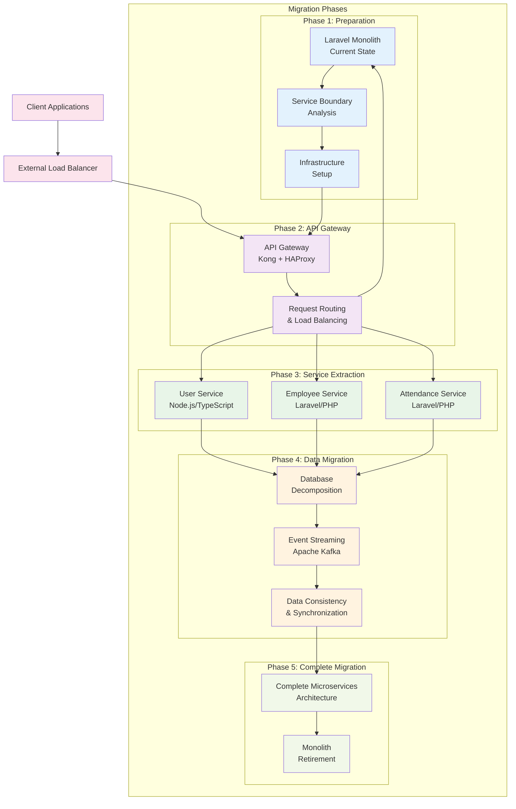

# Microservices Migration Guide

## 🎯 Overview

This comprehensive guide provides a step-by-step strategy for migrating from a Laravel monolith to a cloud-native microservices architecture. The migration follows industry best practices including the Strangler Fig pattern, database decomposition strategies, and zero-downtime deployment techniques.

## 📋 Migration Strategy

### 🏗️ Migration Architecture Pattern

We'll use the **Strangler Fig Pattern** combined with **API Gateway Pattern** for a safe, incremental migration:



## 📅 Migration Timeline

### Phase 1: Preparation (Weeks 1-2)
- **Week 1**: Service boundary analysis and architecture design
- **Week 2**: Infrastructure setup and CI/CD pipeline preparation

### Phase 2: API Gateway Setup (Weeks 3-4)
- **Week 3**: Kong API Gateway deployment and configuration
- **Week 4**: Request routing and monitoring setup

### Phase 3: Service Extraction (Weeks 5-10)
- **Weeks 5-6**: User Service extraction and deployment
- **Weeks 7-8**: Employee Service extraction and deployment
- **Weeks 9-10**: Attendance Service extraction and deployment

### Phase 4: Data Migration (Weeks 11-14)
- **Weeks 11-12**: Database decomposition and data migration
- **Weeks 13-14**: Event streaming setup and data synchronization

### Phase 5: Complete Migration (Weeks 15-16)
- **Week 15**: Final service migrations and testing
- **Week 16**: Monolith retirement and cleanup

## 🔄 Phase-by-Phase Migration

### Phase 1: Preparation and Analysis

#### Step 1.1: Service Boundary Analysis

1. **Domain Analysis**
   ```bash
   # Analyze current Laravel codebase
   cd /path/to/laravel-monolith
   
   # Generate dependency graph
   composer require --dev phpmetrics/phpmetrics
   vendor/bin/phpmetrics --report-html=metrics app/
   
   # Analyze service boundaries
   find app/ -name "*.php" | xargs grep -l "class.*Controller" | head -20
   ```

2. **Database Analysis**
   ```sql
   -- Analyze table relationships
   SELECT 
       tc.table_name, 
       kcu.column_name,
       ccu.table_name AS foreign_table_name,
       ccu.column_name AS foreign_column_name 
   FROM 
       information_schema.table_constraints AS tc 
       JOIN information_schema.key_column_usage AS kcu
         ON tc.constraint_name = kcu.constraint_name
       JOIN information_schema.constraint_column_usage AS ccu
         ON ccu.constraint_name = tc.constraint_name
   WHERE constraint_type = 'FOREIGN KEY';
   
   -- Analyze table sizes
   SELECT 
       schemaname,
       tablename,
       attname,
       n_distinct,
       correlation
   FROM pg_stats 
   WHERE schemaname = 'public'
   ORDER BY tablename, attname;
   ```

3. **Create Service Mapping Document**
   ```markdown
   # Service Boundaries Analysis
   
   ## User Management Domain
   - **Tables**: users, roles, permissions, user_roles, user_permissions
   - **Controllers**: UserController, AuthController, RoleController
   - **Models**: User, Role, Permission
   - **Business Logic**: Authentication, Authorization, User profiles
   
   ## Employee Management Domain
   - **Tables**: employees, departments, positions, employee_departments
   - **Controllers**: EmployeeController, DepartmentController
   - **Models**: Employee, Department, Position
   - **Business Logic**: Employee profiles, Organizational hierarchy
   
   ## Attendance Tracking Domain
   - **Tables**: attendance_records, time_entries, leave_requests
   - **Controllers**: AttendanceController, TimesheetController
   - **Models**: Attendance, TimeEntry, LeaveRequest
   - **Business Logic**: Time tracking, Attendance monitoring
   ```

#### Step 1.2: Infrastructure Preparation

1. **Set up Container Registry**
   ```bash
   # AWS ECR setup
   aws ecr create-repository --repository-name hr-user-service
   aws ecr create-repository --repository-name hr-employee-service
   aws ecr create-repository --repository-name hr-attendance-service
   
   # Docker login
   aws ecr get-login-password --region us-west-2 | docker login --username AWS --password-stdin <account-id>.dkr.ecr.us-west-2.amazonaws.com
   ```

2. **Set up Kubernetes Cluster**
   ```bash
   # EKS cluster setup
   eksctl create cluster --name hr-microservices --region us-west-2 --nodegroup-name standard-workers --node-type m5.large --nodes 3 --nodes-min 1 --nodes-max 4
   
   # Configure kubectl
   aws eks update-kubeconfig --region us-west-2 --name hr-microservices
   ```

3. **Set up CI/CD Pipeline**
   ```yaml
   # .github/workflows/microservices-ci.yml
   name: Microservices CI/CD
   
   on:
     push:
       branches: [main, develop]
       paths:
         - 'microservices/**'
   
   jobs:
     build-and-deploy:
       runs-on: ubuntu-latest
       strategy:
         matrix:
           service: [user-service, employee-service, attendance-service]
       
       steps:
       - uses: actions/checkout@v3
       
       - name: Configure AWS credentials
         uses: aws-actions/configure-aws-credentials@v2
         with:
           aws-access-key-id: ${{ secrets.AWS_ACCESS_KEY_ID }}
           aws-secret-access-key: ${{ secrets.AWS_SECRET_ACCESS_KEY }}
           aws-region: us-west-2
       
       - name: Build and push Docker image
         run: |
           cd microservices/services/${{ matrix.service }}
           docker build -t hr-${{ matrix.service }}:${{ github.sha }} .
           docker tag hr-${{ matrix.service }}:${{ github.sha }} <account-id>.dkr.ecr.us-west-2.amazonaws.com/hr-${{ matrix.service }}:${{ github.sha }}
           docker push <account-id>.dkr.ecr.us-west-2.amazonaws.com/hr-${{ matrix.service }}:${{ github.sha }}
       
       - name: Deploy to Kubernetes
         run: |
           helm upgrade --install ${{ matrix.service }} ./microservices/deployment/kubernetes/helm-charts/${{ matrix.service }} \
             --set image.tag=${{ github.sha }} \
             --namespace microservices
   ```

### Phase 2: API Gateway Setup

#### Step 2.1: Deploy Kong API Gateway

1. **Install Kong in Kubernetes**
   ```bash
   # Add Kong Helm repository
   helm repo add kong https://charts.konghq.com
   helm repo update
   
   # Install Kong
   helm install kong kong/kong \
     --namespace infrastructure \
     --create-namespace \
     --set ingressController.enabled=true \
     --set admin.enabled=true \
     --set admin.http.enabled=true \
     --set proxy.http.enabled=true \
     --set proxy.tls.enabled=true
   ```

2. **Configure Initial Routes**
   ```yaml
   # kong-routes.yaml
   apiVersion: configuration.konghq.com/v1
   kind: KongIngress
   metadata:
     name: monolith-routes
   upstream:
     algorithm: round-robin
   proxy:
     path: /
   route:
     strip_path: false
   ---
   apiVersion: v1
   kind: Service
   metadata:
     name: laravel-monolith
     annotations:
       konghq.com/override: monolith-routes
   spec:
     selector:
       app: laravel-monolith
     ports:
     - port: 80
       targetPort: 80
   ---
   apiVersion: networking.k8s.io/v1
   kind: Ingress
   metadata:
     name: api-gateway
     annotations:
       kubernetes.io/ingress.class: kong
   spec:
     rules:
     - host: api.yourdomain.com
       http:
         paths:
         - path: /
           pathType: Prefix
           backend:
             service:
               name: laravel-monolith
               port:
                 number: 80
   ```

#### Step 2.2: Implement Traffic Routing

1. **Create Route Migration Strategy**
   ```bash
   # Create Kong route for monolith (initial state)
   curl -X POST http://kong-admin:8001/services \
     --data name=laravel-monolith \
     --data url=http://laravel-monolith
   
   curl -X POST http://kong-admin:8001/services/laravel-monolith/routes \
     --data paths[]=/api \
     --data strip_path=false
   ```

2. **Add Rate Limiting and Authentication**
   ```bash
   # Add rate limiting plugin
   curl -X POST http://kong-admin:8001/services/laravel-monolith/plugins \
     --data name=rate-limiting \
     --data config.minute=1000 \
     --data config.hour=10000
   
   # Add JWT authentication plugin
   curl -X POST http://kong-admin:8001/services/laravel-monolith/plugins \
     --data name=jwt
   ```

### Phase 3: Service Extraction

#### Step 3.1: User Service Migration

1. **Deploy User Service**
   ```bash
   # Build and deploy User Service
   cd microservices/services/user-service
   docker build -t hr-user-service:v1.0.0 .
   docker tag hr-user-service:v1.0.0 <registry>/hr-user-service:v1.0.0
   docker push <registry>/hr-user-service:v1.0.0
   
   # Deploy with Helm
   helm install user-service ../deployment/kubernetes/helm-charts/user-service \
     --namespace microservices \
     --set image.tag=v1.0.0
   ```

2. **Configure Kong Route for User Service**
   ```bash
   # Create User Service route in Kong
   curl -X POST http://kong-admin:8001/services \
     --data name=user-service \
     --data url=http://user-service:3001
   
   curl -X POST http://kong-admin:8001/services/user-service/routes \
     --data paths[]=/api/v1/users \
     --data paths[]=/api/v1/auth \
     --data strip_path=false
   ```

3. **Data Migration Script**
   ```php
   <?php
   // database/migrations/user_service_migration.php
   
   use Illuminate\Database\Migrations\Migration;
   use Illuminate\Support\Facades\DB;
   
   class UserServiceMigration extends Migration
   {
       public function up()
       {
           // Export users data
           $users = DB::table('users')->get();
           
           foreach ($users as $user) {
               // Call User Service API to create user
               $response = Http::post('http://user-service:3001/api/v1/users', [
                   'id' => $user->id,
                   'email' => $user->email,
                   'name' => $user->name,
                   'created_at' => $user->created_at,
                   'updated_at' => $user->updated_at,
               ]);
               
               if (!$response->successful()) {
                   throw new Exception("Failed to migrate user: {$user->id}");
               }
           }
           
           // Export roles and permissions
           $roles = DB::table('roles')->get();
           foreach ($roles as $role) {
               Http::post('http://user-service:3001/api/v1/roles', [
                   'id' => $role->id,
                   'name' => $role->name,
                   'permissions' => DB::table('role_permissions')
                       ->where('role_id', $role->id)
                       ->pluck('permission_id')
                       ->toArray()
               ]);
           }
       }
   
       public function down()
       {
           // Rollback logic
       }
   }
   ```

4. **Traffic Gradual Routing**
   ```bash
   # Start with 10% traffic to User Service
   curl -X PATCH http://kong-admin:8001/services/user-service/routes/<route-id> \
     --data config.weight=10
   
   curl -X PATCH http://kong-admin:8001/services/laravel-monolith/routes/<route-id> \
     --data config.weight=90
   
   # Gradually increase User Service traffic
   # 25%
   curl -X PATCH http://kong-admin:8001/services/user-service/routes/<route-id> \
     --data config.weight=25
   curl -X PATCH http://kong-admin:8001/services/laravel-monolith/routes/<route-id> \
     --data config.weight=75
   
   # 50%
   curl -X PATCH http://kong-admin:8001/services/user-service/routes/<route-id> \
     --data config.weight=50
   curl -X PATCH http://kong-admin:8001/services/laravel-monolith/routes/<route-id> \
     --data config.weight=50
   
   # 100% (complete migration)
   curl -X PATCH http://kong-admin:8001/services/user-service/routes/<route-id> \
     --data config.weight=100
   curl -X DELETE http://kong-admin:8001/services/laravel-monolith/routes/<route-id>
   ```

#### Step 3.2: Employee Service Migration

1. **Data Synchronization Script**
   ```php
   <?php
   // app/Console/Commands/MigrateEmployeeData.php
   
   namespace App\Console\Commands;
   
   use Illuminate\Console\Command;
   use Illuminate\Support\Facades\DB;
   use Illuminate\Support\Facades\Http;
   
   class MigrateEmployeeData extends Command
   {
       protected $signature = 'migrate:employee-data {--batch-size=100}';
       protected $description = 'Migrate employee data to Employee Service';
   
       public function handle()
       {
           $batchSize = $this->option('batch-size');
           $totalEmployees = DB::table('employees')->count();
           $batches = ceil($totalEmployees / $batchSize);
   
           $this->info("Migrating {$totalEmployees} employees in {$batches} batches...");
   
           for ($i = 0; $i < $batches; $i++) {
               $offset = $i * $batchSize;
               $employees = DB::table('employees')
                   ->offset($offset)
                   ->limit($batchSize)
                   ->get();
   
               foreach ($employees as $employee) {
                   $this->migrateEmployee($employee);
               }
   
               $this->info("Batch " . ($i + 1) . " completed");
               sleep(1); // Rate limiting
           }
   
           $this->info("Employee data migration completed!");
       }
   
       private function migrateEmployee($employee)
       {
           // Migrate employee data
           $response = Http::post('http://employee-service/api/v1/employees', [
               'id' => $employee->id,
               'user_id' => $employee->user_id,
               'employee_id' => $employee->employee_id,
               'first_name' => $employee->first_name,
               'last_name' => $employee->last_name,
               'department_id' => $employee->department_id,
               'position_id' => $employee->position_id,
               'hire_date' => $employee->hire_date,
               'salary' => $employee->salary,
               'status' => $employee->status,
               'created_at' => $employee->created_at,
               'updated_at' => $employee->updated_at,
           ]);
   
           if (!$response->successful()) {
               $this->error("Failed to migrate employee: {$employee->id}");
               throw new Exception("Employee migration failed");
           }
   
           // Migrate employee skills
           $skills = DB::table('employee_skills')
               ->where('employee_id', $employee->id)
               ->get();
   
           foreach ($skills as $skill) {
               Http::post('http://employee-service/api/v1/employees/' . $employee->id . '/skills', [
                   'skill_id' => $skill->skill_id,
                   'proficiency_level' => $skill->proficiency_level,
                   'years_experience' => $skill->years_experience,
               ]);
           }
       }
   }
   ```

2. **Elasticsearch Index Migration**
   ```bash
   # Create Elasticsearch index for employee search
   curl -X PUT "elasticsearch:9200/employees" -H 'Content-Type: application/json' -d'
   {
     "mappings": {
       "properties": {
         "id": { "type": "keyword" },
         "employee_id": { "type": "keyword" },
         "first_name": { "type": "text", "analyzer": "standard" },
         "last_name": { "type": "text", "analyzer": "standard" },
         "email": { "type": "keyword" },
         "department": { "type": "text" },
         "position": { "type": "text" },
         "skills": {
           "type": "nested",
           "properties": {
             "name": { "type": "text" },
             "proficiency_level": { "type": "keyword" }
           }
         },
         "hire_date": { "type": "date" },
         "status": { "type": "keyword" }
       }
     }
   }'
   
   # Bulk index employee data
   php artisan employee:index-elasticsearch
   ```

#### Step 3.3: Attendance Service Migration

1. **TimescaleDB Schema Migration**
   ```sql
   -- Create TimescaleDB hypertable for attendance data
   CREATE TABLE attendance_records (
       id BIGSERIAL,
       employee_id BIGINT NOT NULL,
       clock_in_time TIMESTAMPTZ NOT NULL,
       clock_out_time TIMESTAMPTZ,
       break_duration INTEGER DEFAULT 0,
       total_hours NUMERIC(4,2),
       location_lat DECIMAL(10, 8),
       location_lng DECIMAL(11, 8),
       device_info JSONB,
       created_at TIMESTAMPTZ DEFAULT NOW(),
       updated_at TIMESTAMPTZ DEFAULT NOW()
   );
   
   -- Convert to hypertable
   SELECT create_hypertable('attendance_records', 'clock_in_time');
   
   -- Create indexes for performance
   CREATE INDEX idx_attendance_employee_time ON attendance_records (employee_id, clock_in_time DESC);
   CREATE INDEX idx_attendance_date ON attendance_records (DATE(clock_in_time));
   ```

2. **Real-time Data Migration**
   ```php
   <?php
   // app/Console/Commands/MigrateAttendanceData.php
   
   namespace App\Console\Commands;
   
   use Illuminate\Console\Command;
   use Illuminate\Support\Facades\DB;
   use Carbon\Carbon;
   
   class MigrateAttendanceData extends Command
   {
       protected $signature = 'migrate:attendance-data {--from-date=} {--to-date=}';
       protected $description = 'Migrate attendance data to TimescaleDB';
   
       public function handle()
       {
           $fromDate = $this->option('from-date') ?: '2023-01-01';
           $toDate = $this->option('to-date') ?: now()->format('Y-m-d');
   
           $this->info("Migrating attendance data from {$fromDate} to {$toDate}...");
   
           // Migrate in monthly chunks to handle large datasets
           $startDate = Carbon::parse($fromDate);
           $endDate = Carbon::parse($toDate);
   
           while ($startDate->lte($endDate)) {
               $monthEnd = $startDate->copy()->endOfMonth();
               if ($monthEnd->gt($endDate)) {
                   $monthEnd = $endDate;
               }
   
               $this->migrateMonth($startDate, $monthEnd);
               $startDate->addMonth()->startOfMonth();
           }
   
           $this->info("Attendance data migration completed!");
       }
   
       private function migrateMonth($startDate, $endDate)
       {
           $this->info("Migrating data for {$startDate->format('Y-m')}...");
   
           DB::table('attendance_records')
               ->whereBetween('created_at', [$startDate, $endDate])
               ->orderBy('created_at')
               ->chunk(1000, function ($records) {
                   $batchData = [];
   
                   foreach ($records as $record) {
                       $batchData[] = [
                           'employee_id' => $record->employee_id,
                           'clock_in_time' => $record->clock_in_time,
                           'clock_out_time' => $record->clock_out_time,
                           'break_duration' => $record->break_duration ?? 0,
                           'total_hours' => $record->total_hours,
                           'location_lat' => $record->location_lat,
                           'location_lng' => $record->location_lng,
                           'device_info' => json_encode($record->device_info ?? []),
                           'created_at' => $record->created_at,
                           'updated_at' => $record->updated_at,
                       ];
                   }
   
                   // Insert into TimescaleDB
                   $response = Http::post('http://attendance-service/api/v1/attendance/bulk-import', [
                       'records' => $batchData
                   ]);
   
                   if (!$response->successful()) {
                       $this->error("Failed to import batch");
                       throw new Exception("Batch import failed");
                   }
               });
       }
   }
   ```

### Phase 4: Data Migration and Event Streaming

#### Step 4.1: Database Decomposition

1. **Create Database Migration Plan**
   ```markdown
   # Database Decomposition Strategy
   
   ## Current Monolithic Database
   - Single PostgreSQL database with all tables
   - Complex foreign key relationships
   - Shared data access patterns
   
   ## Target Microservice Databases
   
   ### User Service Database
   - Tables: users, roles, permissions, user_roles, user_permissions
   - Technology: PostgreSQL
   - Characteristics: ACID compliance for authentication data
   
   ### Employee Service Database
   - Tables: employees, departments, positions, employee_departments, skills
   - Technology: PostgreSQL + Elasticsearch
   - Characteristics: Complex queries and search capabilities
   
   ### Attendance Service Database
   - Tables: attendance_records, time_entries, leave_requests
   - Technology: TimescaleDB (PostgreSQL extension)
   - Characteristics: Time-series data with high write volume
   
   ## Migration Strategy
   1. **Dual Write Phase**: Write to both monolith and microservice databases
   2. **Data Synchronization**: Use event streaming for consistency
   3. **Read Migration**: Gradually shift reads to microservice databases
   4. **Cleanup Phase**: Remove monolith database dependencies
   ```

2. **Implement Dual Write Pattern**
   ```php
   <?php
   // app/Services/DualWriteService.php
   
   namespace App\Services;
   
   use Illuminate\Support\Facades\DB;
   use Illuminate\Support\Facades\Http;
   use Illuminate\Support\Facades\Log;
   
   class DualWriteService
   {
       public function createUser(array $userData)
       {
           DB::beginTransaction();
           
           try {
               // Write to monolith database
               $user = DB::table('users')->insertGetId($userData);
               
               // Write to User Service
               $response = Http::timeout(5)->post('http://user-service:3001/api/v1/users', array_merge($userData, ['id' => $user]));
               
               if (!$response->successful()) {
                   Log::error('User Service write failed', [
                       'user_id' => $user,
                       'response' => $response->body()
                   ]);
                   
                   // Continue with monolith operation, log for later sync
                   $this->queueUserSyncJob($user, $userData);
               }
               
               DB::commit();
               return $user;
               
           } catch (\Exception $e) {
               DB::rollback();
               throw $e;
           }
       }
   
       public function updateUser($userId, array $userData)
       {
           DB::beginTransaction();
           
           try {
               // Update monolith database
               DB::table('users')->where('id', $userId)->update($userData);
               
               // Update User Service
               $response = Http::timeout(5)->put("http://user-service:3001/api/v1/users/{$userId}", $userData);
               
               if (!$response->successful()) {
                   Log::error('User Service update failed', [
                       'user_id' => $userId,
                       'response' => $response->body()
                   ]);
                   
                   $this->queueUserSyncJob($userId, $userData);
               }
               
               DB::commit();
               
           } catch (\Exception $e) {
               DB::rollback();
               throw $e;
           }
       }
   
       private function queueUserSyncJob($userId, $userData)
       {
           // Queue job for later synchronization
           dispatch(new SyncUserToMicroserviceJob($userId, $userData))->delay(now()->addMinutes(5));
       }
   }
   ```

#### Step 4.2: Event Streaming Implementation

1. **Kafka Topic Setup**
   ```bash
   # Create Kafka topics for event streaming
   kafka-topics.sh --create --topic user-events --bootstrap-server kafka-1:9092 --partitions 3 --replication-factor 3
   kafka-topics.sh --create --topic employee-events --bootstrap-server kafka-1:9092 --partitions 3 --replication-factor 3
   kafka-topics.sh --create --topic attendance-events --bootstrap-server kafka-1:9092 --partitions 3 --replication-factor 3
   
   # Create dead letter queue topics
   kafka-topics.sh --create --topic user-events-dlq --bootstrap-server kafka-1:9092 --partitions 3 --replication-factor 3
   kafka-topics.sh --create --topic employee-events-dlq --bootstrap-server kafka-1:9092 --partitions 3 --replication-factor 3
   kafka-topics.sh --create --topic attendance-events-dlq --bootstrap-server kafka-1:9092 --partitions 3 --replication-factor 3
   ```

2. **Event Publishing Service**
   ```php
   <?php
   // app/Services/EventPublishingService.php
   
   namespace App\Services;
   
   use RdKafka\Producer;
   use RdKafka\Conf;
   use Illuminate\Support\Facades\Log;
   
   class EventPublishingService
   {
       private $producer;
   
       public function __construct()
       {
           $conf = new Conf();
           $conf->set('bootstrap.servers', env('KAFKA_BROKERS', 'kafka-1:9092,kafka-2:9092,kafka-3:9092'));
           $conf->set('compression.codec', 'gzip');
           $conf->set('batch.num.messages', '100');
           $conf->set('queue.buffering.max.ms', '100');
           
           $this->producer = new Producer($conf);
       }
   
       public function publishUserEvent($eventType, $userId, $userData)
       {
           $event = [
               'event_type' => $eventType,
               'user_id' => $userId,
               'data' => $userData,
               'timestamp' => now()->toISOString(),
               'source' => 'monolith',
               'version' => '1.0'
           ];
   
           $topic = $this->producer->newTopic('user-events');
           
           $topic->produce(
               RD_KAFKA_PARTITION_UA,
               0,
               json_encode($event),
               (string) $userId
           );
   
           $this->producer->poll(0);
           
           Log::info('User event published', [
               'event_type' => $eventType,
               'user_id' => $userId
           ]);
       }
   
       public function publishEmployeeEvent($eventType, $employeeId, $employeeData)
       {
           $event = [
               'event_type' => $eventType,
               'employee_id' => $employeeId,
               'data' => $employeeData,
               'timestamp' => now()->toISOString(),
               'source' => 'monolith',
               'version' => '1.0'
           ];
   
           $topic = $this->producer->newTopic('employee-events');
           
           $topic->produce(
               RD_KAFKA_PARTITION_UA,
               0,
               json_encode($event),
               (string) $employeeId
           );
   
           $this->producer->poll(0);
       }
   
       public function publishAttendanceEvent($eventType, $attendanceId, $attendanceData)
       {
           $event = [
               'event_type' => $eventType,
               'attendance_id' => $attendanceId,
               'data' => $attendanceData,
               'timestamp' => now()->toISOString(),
               'source' => 'monolith',
               'version' => '1.0'
           ];
   
           $topic = $this->producer->newTopic('attendance-events');
           
           $topic->produce(
               RD_KAFKA_PARTITION_UA,
               0,
               json_encode($event),
               (string) $attendanceId
           );
   
           $this->producer->poll(0);
       }
   
       public function __destruct()
       {
           $this->producer->flush(10000);
       }
   }
   ```

3. **Event Consumer Service**
   ```php
   <?php
   // app/Console/Commands/ConsumeEvents.php
   
   namespace App\Console\Commands;
   
   use Illuminate\Console\Command;
   use RdKafka\Consumer;
   use RdKafka\Conf;
   use RdKafka\TopicConf;
   
   class ConsumeEvents extends Command
   {
       protected $signature = 'events:consume {topic}';
       protected $description = 'Consume events from Kafka topics';
   
       public function handle()
       {
           $topicName = $this->argument('topic');
           
           $conf = new Conf();
           $conf->set('group.id', 'monolith-consumer');
           $conf->set('bootstrap.servers', env('KAFKA_BROKERS'));
           $conf->set('auto.offset.reset', 'earliest');
           
           $topicConf = new TopicConf();
           $topicConf->set('auto.commit.interval.ms', 100);
           $conf->setDefaultTopicConf($topicConf);
           
           $consumer = new Consumer($conf);
           $topic = $consumer->newTopic($topicName);
           $topic->consumeStart(0, RD_KAFKA_OFFSET_STORED);
           
           $this->info("Started consuming events from topic: {$topicName}");
           
           while (true) {
               $message = $topic->consume(0, 1000);
               
               if ($message->err) {
                   if ($message->err === RD_KAFKA_RESP_ERR__PARTITION_EOF) {
                       continue;
                   }
                   $this->error("Error: " . $message->errstr());
                   break;
               }
               
               $this->processEvent($message->payload);
           }
       }
   
       private function processEvent($payload)
       {
           $event = json_decode($payload, true);
           
           if (!$event) {
               $this->error("Invalid event payload");
               return;
           }
           
           $this->info("Processing event: {$event['event_type']}");
           
           // Process event based on type
           switch ($event['event_type']) {
               case 'user.created':
                   $this->handleUserCreated($event);
                   break;
               case 'user.updated':
                   $this->handleUserUpdated($event);
                   break;
               case 'employee.created':
                   $this->handleEmployeeCreated($event);
                   break;
               // Add more event handlers
           }
       }
   
       private function handleUserCreated($event)
       {
           // Sync user data to other services that need it
           $this->info("User created: {$event['user_id']}");
       }
   
       private function handleUserUpdated($event)
       {
           // Sync user updates to other services
           $this->info("User updated: {$event['user_id']}");
       }
   
       private function handleEmployeeCreated($event)
       {
           // Sync employee data
           $this->info("Employee created: {$event['employee_id']}");
       }
   }
   ```

## 📊 Migration Monitoring and Validation

### Data Consistency Checks

1. **Data Validation Scripts**
   ```php
   <?php
   // app/Console/Commands/ValidateDataConsistency.php
   
   namespace App\Console\Commands;
   
   use Illuminate\Console\Command;
   use Illuminate\Support\Facades\DB;
   use Illuminate\Support\Facades\Http;
   
   class ValidateDataConsistency extends Command
   {
       protected $signature = 'validate:data-consistency {service}';
       protected $description = 'Validate data consistency between monolith and microservices';
   
       public function handle()
       {
           $service = $this->argument('service');
           
           switch ($service) {
               case 'user':
                   $this->validateUserService();
                   break;
               case 'employee':
                   $this->validateEmployeeService();
                   break;
               case 'attendance':
                   $this->validateAttendanceService();
                   break;
               default:
                   $this->error("Unknown service: {$service}");
           }
       }
   
       private function validateUserService()
       {
           $this->info("Validating User Service data consistency...");
           
           $monolithUsers = DB::table('users')->count();
           $microserviceResponse = Http::get('http://user-service:3001/api/v1/users/count');
           $microserviceUsers = $microserviceResponse->json()['count'] ?? 0;
           
           $this->info("Monolith users: {$monolithUsers}");
           $this->info("Microservice users: {$microserviceUsers}");
           
           if ($monolithUsers === $microserviceUsers) {
               $this->info("✅ User count is consistent");
           } else {
               $this->error("❌ User count mismatch!");
               $this->error("Difference: " . abs($monolithUsers - $microserviceUsers));
           }
           
           // Sample detailed validation
           $sampleUsers = DB::table('users')->limit(100)->get();
           $inconsistencies = 0;
           
           foreach ($sampleUsers as $user) {
               $microserviceUser = Http::get("http://user-service:3001/api/v1/users/{$user->id}");
               
               if (!$microserviceUser->successful()) {
                   $inconsistencies++;
                   continue;
               }
               
               $userData = $microserviceUser->json();
               
               if ($user->email !== $userData['email'] || $user->name !== $userData['name']) {
                   $inconsistencies++;
               }
           }
           
           $this->info("Inconsistencies found: {$inconsistencies}/100");
       }
   
       private function validateEmployeeService()
       {
           $this->info("Validating Employee Service data consistency...");
           
           $monolithEmployees = DB::table('employees')->count();
           $microserviceResponse = Http::get('http://employee-service/api/v1/employees/count');
           $microserviceEmployees = $microserviceResponse->json()['count'] ?? 0;
           
           $this->info("Monolith employees: {$monolithEmployees}");
           $this->info("Microservice employees: {$microserviceEmployees}");
           
           if ($monolithEmployees === $microserviceEmployees) {
               $this->info("✅ Employee count is consistent");
           } else {
               $this->error("❌ Employee count mismatch!");
           }
       }
   
       private function validateAttendanceService()
       {
           $this->info("Validating Attendance Service data consistency...");
           
           $monolithRecords = DB::table('attendance_records')->count();
           $microserviceResponse = Http::get('http://attendance-service/api/v1/attendance/count');
           $microserviceRecords = $microserviceResponse->json()['count'] ?? 0;
           
           $this->info("Monolith records: {$monolithRecords}");
           $this->info("Microservice records: {$microserviceRecords}");
           
           if ($monolithRecords === $microserviceRecords) {
               $this->info("✅ Attendance record count is consistent");
           } else {
               $this->error("❌ Attendance record count mismatch!");
           }
       }
   }
   ```

### Performance Monitoring

1. **Migration Performance Dashboard**
   ```yaml
   # grafana-dashboard-migration.json
   {
     "dashboard": {
       "title": "Microservices Migration Dashboard",
       "panels": [
         {
           "title": "API Gateway Traffic Split",
           "type": "stat",
           "targets": [
             {
               "expr": "sum(rate(kong_http_requests_total[5m])) by (service)"
             }
           ]
         },
         {
           "title": "Database Connection Pools",
           "type": "graph",
           "targets": [
             {
               "expr": "postgresql_connections_active"
             }
           ]
         },
         {
           "title": "Data Consistency Alerts",
           "type": "table",
           "targets": [
             {
               "expr": "data_consistency_check_failures"
             }
           ]
         },
         {
           "title": "Event Streaming Lag",
           "type": "graph",
           "targets": [
             {
               "expr": "kafka_consumer_lag_sum"
             }
           ]
         }
       ]
     }
   }
   ```

2. **Automated Health Checks**
   ```bash
   #!/bin/bash
   # scripts/migration-health-check.sh
   
   set -e
   
   echo "🔍 Running Migration Health Checks..."
   
   # Check service health
   services=("user-service" "employee-service" "attendance-service")
   
   for service in "${services[@]}"; do
       echo "Checking $service..."
       
       # Health endpoint check
       if curl -f -s "http://$service/health" > /dev/null; then
           echo "✅ $service is healthy"
       else
           echo "❌ $service is unhealthy"
           exit 1
       fi
       
       # Database connectivity check
       kubectl exec -n microservices deployment/$service -- curl -f "http://localhost/health/db" > /dev/null
       if [ $? -eq 0 ]; then
           echo "✅ $service database is connected"
       else
           echo "❌ $service database connection failed"
           exit 1
       fi
   done
   
   # Check data consistency
   echo "Checking data consistency..."
   kubectl exec -n microservices deployment/user-service -- php artisan validate:data-consistency user
   kubectl exec -n microservices deployment/employee-service -- php artisan validate:data-consistency employee
   kubectl exec -n microservices deployment/attendance-service -- php artisan validate:data-consistency attendance
   
   # Check Kafka lag
   echo "Checking Kafka consumer lag..."
   kafka-consumer-groups.sh --bootstrap-server kafka-1:9092 --describe --all-groups | grep LAG
   
   echo "✅ All health checks passed!"
   ```

## 🔄 Rollback Procedures

### Emergency Rollback Plan

1. **Traffic Rollback Script**
   ```bash
   #!/bin/bash
   # scripts/emergency-rollback.sh
   
   set -e
   
   echo "🚨 Emergency Rollback Initiated..."
   
   # Immediately route all traffic back to monolith
   curl -X PATCH http://kong-admin:8001/services/laravel-monolith/routes/monolith-route \
     --data config.weight=100
   
   # Disable microservice routes
   services=("user-service" "employee-service" "attendance-service")
   
   for service in "${services[@]}"; do
       echo "Disabling $service route..."
       curl -X PATCH "http://kong-admin:8001/services/$service/routes/$service-route" \
         --data config.weight=0
   done
   
   # Scale down microservices
   for service in "${services[@]}"; do
       echo "Scaling down $service..."
       kubectl scale deployment $service --replicas=0 -n microservices
   done
   
   # Verify monolith is handling all traffic
   sleep 30
   curl -f "http://api.yourdomain.com/health" > /dev/null
   
   if [ $? -eq 0 ]; then
       echo "✅ Emergency rollback completed successfully"
       echo "All traffic is now routed to the monolith"
   else
       echo "❌ Rollback verification failed"
       exit 1
   fi
   ```

2. **Data Rollback Procedures**
   ```php
   <?php
   // app/Console/Commands/RollbackData.php
   
   namespace App\Console\Commands;
   
   use Illuminate\Console\Command;
   use Illuminate\Support\Facades\DB;
   
   class RollbackData extends Command
   {
       protected $signature = 'rollback:data {service} {--backup-timestamp=}';
       protected $description = 'Rollback data from microservice to monolith';
   
       public function handle()
       {
           $service = $this->argument('service');
           $backupTimestamp = $this->option('backup-timestamp') ?: now()->subHour()->timestamp;
           
           $this->warn("This will rollback {$service} data to timestamp: {$backupTimestamp}");
           
           if (!$this->confirm('Are you sure you want to proceed?')) {
               return;
           }
           
           switch ($service) {
               case 'user':
                   $this->rollbackUserData($backupTimestamp);
                   break;
               case 'employee':
                   $this->rollbackEmployeeData($backupTimestamp);
                   break;
               case 'attendance':
                   $this->rollbackAttendanceData($backupTimestamp);
                   break;
           }
       }
   
       private function rollbackUserData($timestamp)
       {
           $this->info("Rolling back user data...");
           
           // Restore from backup
           $backupFile = "backups/users_backup_{$timestamp}.sql";
           
           if (file_exists($backupFile)) {
               $this->info("Restoring from backup: {$backupFile}");
               
               DB::unprepared(file_get_contents($backupFile));
               
               $this->info("✅ User data rollback completed");
           } else {
               $this->error("Backup file not found: {$backupFile}");
           }
       }
   
       private function rollbackEmployeeData($timestamp)
       {
           $this->info("Rolling back employee data...");
           
           $backupFile = "backups/employees_backup_{$timestamp}.sql";
           
           if (file_exists($backupFile)) {
               DB::unprepared(file_get_contents($backupFile));
               $this->info("✅ Employee data rollback completed");
           } else {
               $this->error("Backup file not found: {$backupFile}");
           }
       }
   
       private function rollbackAttendanceData($timestamp)
       {
           $this->info("Rolling back attendance data...");
           
           $backupFile = "backups/attendance_backup_{$timestamp}.sql";
           
           if (file_exists($backupFile)) {
               DB::unprepared(file_get_contents($backupFile));
               $this->info("✅ Attendance data rollback completed");
           } else {
               $this->error("Backup file not found: {$backupFile}");
           }
       }
   }
   ```

## 📝 Migration Checklist

### Pre-Migration Checklist

- [ ] **Service Boundaries Defined**: Clear boundaries and responsibilities identified
- [ ] **Infrastructure Ready**: Kubernetes cluster, databases, and messaging systems deployed
- [ ] **CI/CD Pipeline**: Automated build and deployment pipeline configured
- [ ] **Monitoring Setup**: Observability stack deployed and configured
- [ ] **Backup Strategy**: Complete data backup and restore procedures tested
- [ ] **Rollback Plan**: Emergency rollback procedures documented and tested
- [ ] **Team Training**: Development team trained on microservices architecture
- [ ] **Performance Baselines**: Current system performance metrics documented

### During Migration Checklist

- [ ] **Phase 1**: Service boundary analysis completed
- [ ] **Phase 2**: API Gateway deployed and routing configured
- [ ] **Phase 3**: Each microservice deployed and validated
- [ ] **Phase 4**: Data migration completed and validated
- [ ] **Phase 5**: Full traffic routing to microservices
- [ ] **Monitoring**: Real-time monitoring and alerting active
- [ ] **Performance**: Performance metrics within acceptable ranges
- [ ] **Data Consistency**: Data consistency checks passing

### Post-Migration Checklist

- [ ] **Monolith Cleanup**: Legacy code and database cleanup completed
- [ ] **Documentation**: All services and processes documented
- [ ] **Training**: Team training on new architecture completed
- [ ] **Performance Optimization**: System optimized for production load
- [ ] **Security Review**: Security assessment completed
- [ ] **Disaster Recovery**: DR procedures tested and validated
- [ ] **Cost Optimization**: Resource utilization optimized
- [ ] **Success Metrics**: Migration success criteria met

---

**Next**: [Complete System Overview](../README.md) | [Deployment Configurations](../deployment/README.md)