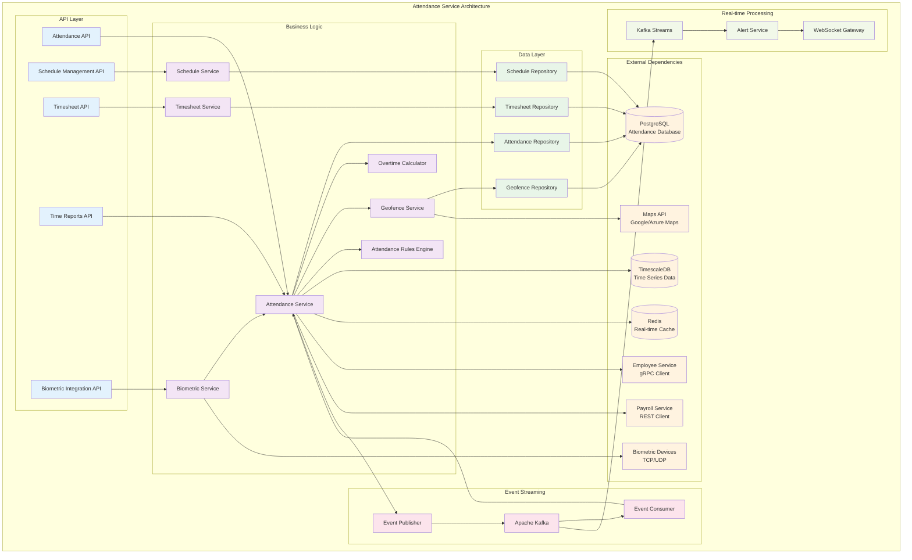

# Attendance & Time Tracking Service

## 🎯 Service Overview

The Attendance & Time Tracking Service manages employee check-ins, check-outs, work schedules, overtime calculations, and time-based analytics across the HR microservices ecosystem.

### 🏗️ Service Architecture



## 📊 Database Schema

```sql
-- Work schedules and shift patterns
CREATE TABLE work_schedules (
    id UUID PRIMARY KEY DEFAULT gen_random_uuid(),
    schedule_name VARCHAR(200) NOT NULL,
    description TEXT,
    schedule_type VARCHAR(50) NOT NULL, -- fixed, flexible, rotating, custom
    default_start_time TIME,
    default_end_time TIME,
    default_break_minutes INTEGER DEFAULT 0,
    weekly_hours DECIMAL(5,2),
    is_active BOOLEAN DEFAULT true,
    created_at TIMESTAMP DEFAULT NOW(),
    updated_at TIMESTAMP DEFAULT NOW(),
    created_by UUID
);

-- Employee schedule assignments
CREATE TABLE employee_schedules (
    id UUID PRIMARY KEY DEFAULT gen_random_uuid(),
    employee_id UUID NOT NULL, -- Reference to Employee Service
    schedule_id UUID REFERENCES work_schedules(id),
    effective_from DATE NOT NULL,
    effective_to DATE,
    monday_start TIME,
    monday_end TIME,
    monday_break_minutes INTEGER DEFAULT 0,
    tuesday_start TIME,
    tuesday_end TIME,
    tuesday_break_minutes INTEGER DEFAULT 0,
    wednesday_start TIME,
    wednesday_end TIME,
    wednesday_break_minutes INTEGER DEFAULT 0,
    thursday_start TIME,
    thursday_end TIME,
    thursday_break_minutes INTEGER DEFAULT 0,
    friday_start TIME,
    friday_end TIME,
    friday_break_minutes INTEGER DEFAULT 0,
    saturday_start TIME,
    saturday_end TIME,
    saturday_break_minutes INTEGER DEFAULT 0,
    sunday_start TIME,
    sunday_end TIME,
    sunday_break_minutes INTEGER DEFAULT 0,
    weekly_hours DECIMAL(5,2),
    overtime_threshold_daily DECIMAL(5,2) DEFAULT 8.0,
    overtime_threshold_weekly DECIMAL(5,2) DEFAULT 40.0,
    is_active BOOLEAN DEFAULT true,
    created_at TIMESTAMP DEFAULT NOW(),
    updated_at TIMESTAMP DEFAULT NOW(),
    assigned_by UUID
);

-- Daily attendance records
CREATE TABLE attendance_records (
    id UUID PRIMARY KEY DEFAULT gen_random_uuid(),
    employee_id UUID NOT NULL,
    attendance_date DATE NOT NULL,
    schedule_id UUID REFERENCES work_schedules(id),
    scheduled_start_time TIME,
    scheduled_end_time TIME,
    scheduled_break_minutes INTEGER,
    actual_start_time TIMESTAMP,
    actual_end_time TIMESTAMP,
    break_start_time TIMESTAMP,
    break_end_time TIMESTAMP,
    total_break_minutes INTEGER DEFAULT 0,
    total_work_minutes INTEGER,
    overtime_minutes INTEGER DEFAULT 0,
    undertime_minutes INTEGER DEFAULT 0,
    status VARCHAR(50) NOT NULL, -- present, absent, late, early_departure, partial
    check_in_method VARCHAR(50), -- biometric, mobile, web, manual, badge
    check_out_method VARCHAR(50),
    check_in_location JSONB, -- GPS coordinates, geofence info
    check_out_location JSONB,
    check_in_device_info JSONB, -- device details for mobile/web
    check_out_device_info JSONB,
    is_holiday BOOLEAN DEFAULT false,
    is_weekend BOOLEAN DEFAULT false,
    notes TEXT,
    approved_by UUID,
    approved_at TIMESTAMP,
    created_at TIMESTAMP DEFAULT NOW(),
    updated_at TIMESTAMP DEFAULT NOW(),
    
    UNIQUE(employee_id, attendance_date)
);

-- Individual check-in/check-out logs for detailed tracking
CREATE TABLE attendance_logs (
    id UUID PRIMARY KEY DEFAULT gen_random_uuid(),
    attendance_record_id UUID REFERENCES attendance_records(id) ON DELETE CASCADE,
    employee_id UUID NOT NULL,
    log_type VARCHAR(50) NOT NULL, -- check_in, check_out, break_start, break_end
    timestamp TIMESTAMP NOT NULL,
    method VARCHAR(50) NOT NULL, -- biometric, mobile, web, manual, badge
    device_info JSONB, -- device details, IP address, etc.
    location_info JSONB, -- GPS coordinates, geofence, office location
    biometric_data JSONB, -- fingerprint ID, face recognition confidence, etc.
    verification_status VARCHAR(50) DEFAULT 'verified', -- verified, suspicious, failed
    created_at TIMESTAMP DEFAULT NOW()
);

-- Geofenced work locations
CREATE TABLE work_locations (
    id UUID PRIMARY KEY DEFAULT gen_random_uuid(),
    location_name VARCHAR(200) NOT NULL,
    address TEXT,
    latitude DECIMAL(10, 8),
    longitude DECIMAL(11, 8),
    geofence_radius_meters INTEGER DEFAULT 100,
    location_type VARCHAR(50) DEFAULT 'office', -- office, remote, client_site, field
    is_active BOOLEAN DEFAULT true,
    timezone VARCHAR(100),
    created_at TIMESTAMP DEFAULT NOW(),
    updated_at TIMESTAMP DEFAULT NOW()
);

-- Employee location assignments
CREATE TABLE employee_work_locations (
    id UUID PRIMARY KEY DEFAULT gen_random_uuid(),
    employee_id UUID NOT NULL,
    location_id UUID REFERENCES work_locations(id),
    is_primary_location BOOLEAN DEFAULT false,
    effective_from DATE NOT NULL,
    effective_to DATE,
    created_at TIMESTAMP DEFAULT NOW()
);

-- Overtime requests and approvals
CREATE TABLE overtime_requests (
    id UUID PRIMARY KEY DEFAULT gen_random_uuid(),
    employee_id UUID NOT NULL,
    request_date DATE NOT NULL,
    planned_start_time TIME NOT NULL,
    planned_end_time TIME NOT NULL,
    planned_hours DECIMAL(5,2) NOT NULL,
    reason TEXT NOT NULL,
    justification TEXT,
    status VARCHAR(50) DEFAULT 'pending', -- pending, approved, rejected, cancelled
    requested_by UUID,
    approved_by UUID,
    approved_at TIMESTAMP,
    rejection_reason TEXT,
    actual_start_time TIMESTAMP,
    actual_end_time TIMESTAMP,
    actual_hours DECIMAL(5,2),
    created_at TIMESTAMP DEFAULT NOW(),
    updated_at TIMESTAMP DEFAULT NOW()
);

-- Leave and absence integration
CREATE TABLE attendance_adjustments (
    id UUID PRIMARY KEY DEFAULT gen_random_uuid(),
    employee_id UUID NOT NULL,
    adjustment_date DATE NOT NULL,
    adjustment_type VARCHAR(50) NOT NULL, -- leave, sick, holiday, training, business_trip
    reference_id UUID, -- Reference to leave request, holiday, etc.
    original_status VARCHAR(50), -- What the status would have been
    adjusted_status VARCHAR(50), -- What it should be (excused_absence, paid_leave, etc.)
    hours_adjustment DECIMAL(5,2) DEFAULT 0,
    reason TEXT,
    adjusted_by UUID,
    created_at TIMESTAMP DEFAULT NOW()
);

-- Monthly timesheet summaries
CREATE TABLE monthly_timesheets (
    id UUID PRIMARY KEY DEFAULT gen_random_uuid(),
    employee_id UUID NOT NULL,
    year INTEGER NOT NULL,
    month INTEGER NOT NULL,
    total_scheduled_hours DECIMAL(8,2),
    total_worked_hours DECIMAL(8,2),
    total_overtime_hours DECIMAL(8,2),
    total_break_hours DECIMAL(8,2),
    total_leave_hours DECIMAL(8,2),
    total_absent_hours DECIMAL(8,2),
    days_present INTEGER DEFAULT 0,
    days_absent INTEGER DEFAULT 0,
    days_late INTEGER DEFAULT 0,
    days_early_departure INTEGER DEFAULT 0,
    average_daily_hours DECIMAL(5,2),
    status VARCHAR(50) DEFAULT 'draft', -- draft, submitted, approved, finalized
    submitted_at TIMESTAMP,
    approved_by UUID,
    approved_at TIMESTAMP,
    created_at TIMESTAMP DEFAULT NOW(),
    updated_at TIMESTAMP DEFAULT NOW(),
    
    UNIQUE(employee_id, year, month)
);

-- Attendance rules and policies
CREATE TABLE attendance_policies (
    id UUID PRIMARY KEY DEFAULT gen_random_uuid(),
    policy_name VARCHAR(200) NOT NULL,
    description TEXT,
    late_threshold_minutes INTEGER DEFAULT 15,
    early_departure_threshold_minutes INTEGER DEFAULT 15,
    minimum_work_hours_daily DECIMAL(5,2) DEFAULT 8.0,
    maximum_work_hours_daily DECIMAL(5,2) DEFAULT 12.0,
    overtime_multiplier DECIMAL(3,2) DEFAULT 1.5,
    weekend_multiplier DECIMAL(3,2) DEFAULT 2.0,
    holiday_multiplier DECIMAL(3,2) DEFAULT 2.5,
    grace_period_minutes INTEGER DEFAULT 5,
    auto_clock_out_hours INTEGER DEFAULT 24,
    require_break_after_hours DECIMAL(3,1) DEFAULT 6.0,
    maximum_break_minutes INTEGER DEFAULT 90,
    geofence_required BOOLEAN DEFAULT false,
    biometric_required BOOLEAN DEFAULT false,
    is_active BOOLEAN DEFAULT true,
    effective_from DATE NOT NULL,
    effective_to DATE,
    created_at TIMESTAMP DEFAULT NOW(),
    updated_at TIMESTAMP DEFAULT NOW()
);

-- Employee policy assignments
CREATE TABLE employee_attendance_policies (
    id UUID PRIMARY KEY DEFAULT gen_random_uuid(),
    employee_id UUID NOT NULL,
    policy_id UUID REFERENCES attendance_policies(id),
    effective_from DATE NOT NULL,
    effective_to DATE,
    created_at TIMESTAMP DEFAULT NOW(),
    assigned_by UUID
);

-- Time series data for analytics (using TimescaleDB)
CREATE TABLE attendance_metrics_hourly (
    time TIMESTAMPTZ NOT NULL,
    employee_id UUID NOT NULL,
    location_id UUID,
    hours_worked DECIMAL(4,2),
    overtime_hours DECIMAL(4,2),
    productivity_score DECIMAL(5,2),
    created_at TIMESTAMPTZ DEFAULT NOW()
);

-- Convert to hypertable for time series optimization
SELECT create_hypertable('attendance_metrics_hourly', 'time');

-- Indexes for performance optimization
CREATE INDEX idx_attendance_records_employee_date ON attendance_records(employee_id, attendance_date);
CREATE INDEX idx_attendance_records_date ON attendance_records(attendance_date);
CREATE INDEX idx_attendance_records_status ON attendance_records(status);
CREATE INDEX idx_attendance_records_schedule ON attendance_records(schedule_id);

CREATE INDEX idx_attendance_logs_record_id ON attendance_logs(attendance_record_id);
CREATE INDEX idx_attendance_logs_employee_id ON attendance_logs(employee_id);
CREATE INDEX idx_attendance_logs_timestamp ON attendance_logs(timestamp);
CREATE INDEX idx_attendance_logs_type ON attendance_logs(log_type);

CREATE INDEX idx_employee_schedules_employee_id ON employee_schedules(employee_id);
CREATE INDEX idx_employee_schedules_effective ON employee_schedules(effective_from, effective_to);
CREATE INDEX idx_employee_schedules_active ON employee_schedules(is_active);

CREATE INDEX idx_work_locations_coords ON work_locations(latitude, longitude);
CREATE INDEX idx_work_locations_active ON work_locations(is_active);

CREATE INDEX idx_employee_work_locations_employee_id ON employee_work_locations(employee_id);
CREATE INDEX idx_employee_work_locations_location_id ON employee_work_locations(location_id);
CREATE INDEX idx_employee_work_locations_primary ON employee_work_locations(is_primary_location);

CREATE INDEX idx_overtime_requests_employee_id ON overtime_requests(employee_id);
CREATE INDEX idx_overtime_requests_date ON overtime_requests(request_date);
CREATE INDEX idx_overtime_requests_status ON overtime_requests(status);

CREATE INDEX idx_monthly_timesheets_employee_period ON monthly_timesheets(employee_id, year, month);
CREATE INDEX idx_monthly_timesheets_status ON monthly_timesheets(status);

CREATE INDEX idx_attendance_policies_active ON attendance_policies(is_active);
CREATE INDEX idx_attendance_policies_effective ON attendance_policies(effective_from, effective_to);

CREATE INDEX idx_employee_attendance_policies_employee_id ON employee_attendance_policies(employee_id);
CREATE INDEX idx_employee_attendance_policies_effective ON employee_attendance_policies(effective_from, effective_to);

-- Time series indexes
CREATE INDEX idx_attendance_metrics_employee_time ON attendance_metrics_hourly(employee_id, time DESC);
CREATE INDEX idx_attendance_metrics_location_time ON attendance_metrics_hourly(location_id, time DESC);
```

## 🔗 API Endpoints

### Attendance Management Endpoints

```yaml
# Real-time Attendance API
/api/v1/attendance/clock-in:
  post:
    summary: Employee clock-in
    security:
      - bearerAuth: []
    requestBody:
      required: true
      content:
        application/json:
          schema:
            type: object
            properties:
              employee_id:
                type: string
                format: uuid
                description: Employee ID (auto-filled for self check-in)
              timestamp:
                type: string
                format: date-time
                description: Clock-in time (defaults to current time)
              location:
                type: object
                properties:
                  latitude:
                    type: number
                    format: double
                  longitude:
                    type: number
                    format: double
                  accuracy:
                    type: number
                    description: GPS accuracy in meters
                  address:
                    type: string
              device_info:
                type: object
                properties:
                  device_type:
                    type: string
                    enum: [mobile, web, biometric, badge]
                  device_id:
                    type: string
                  platform:
                    type: string
                  app_version:
                    type: string
              method:
                type: string
                enum: [biometric, mobile, web, manual, badge]
                default: mobile
              biometric_data:
                type: object
                description: Biometric verification data (if applicable)
              notes:
                type: string
                description: Optional notes for manual entries
            required:
              - method
    responses:
      201:
        description: Clock-in successful
        content:
          application/json:
            schema:
              type: object
              properties:
                attendance_record_id:
                  type: string
                  format: uuid
                log_id:
                  type: string
                  format: uuid
                timestamp:
                  type: string
                  format: date-time
                status:
                  type: string
                  enum: [on_time, late, early]
                message:
                  type: string
                scheduled_time:
                  type: string
                  format: time
                actual_time:
                  type: string
                  format: time
                location_verified:
                  type: boolean
                warnings:
                  type: array
                  items:
                    type: string
      400:
        description: Invalid request or business rule violation
        content:
          application/json:
            schema:
              type: object
              properties:
                error:
                  type: string
                details:
                  type: object
                suggested_actions:
                  type: array
                  items:
                    type: string
      409:
        description: Already clocked in

/api/v1/attendance/clock-out:
  post:
    summary: Employee clock-out
    security:
      - bearerAuth: []
    requestBody:
      required: true
      content:
        application/json:
          schema:
            type: object
            properties:
              employee_id:
                type: string
                format: uuid
              timestamp:
                type: string
                format: date-time
              location:
                $ref: '#/components/schemas/LocationData'
              device_info:
                $ref: '#/components/schemas/DeviceInfo'
              method:
                type: string
                enum: [biometric, mobile, web, manual, badge]
              biometric_data:
                type: object
              notes:
                type: string
            required:
              - method
    responses:
      200:
        description: Clock-out successful
        content:
          application/json:
            schema:
              type: object
              properties:
                attendance_record_id:
                  type: string
                  format: uuid
                total_work_hours:
                  type: number
                  format: decimal
                overtime_hours:
                  type: number
                  format: decimal
                summary:
                  type: object
                  properties:
                    scheduled_hours:
                      type: number
                    actual_hours:
                      type: number
                    break_hours:
                      type: number
                    status:
                      type: string
                    performance:
                      type: string
                      enum: [excellent, good, satisfactory, needs_improvement]

/api/v1/attendance/break/start:
  post:
    summary: Start break period
    security:
      - bearerAuth: []
    requestBody:
      required: true
      content:
        application/json:
          schema:
            type: object
            properties:
              employee_id:
                type: string
                format: uuid
              break_type:
                type: string
                enum: [lunch, coffee, personal, medical]
                default: lunch
              expected_duration_minutes:
                type: integer
                description: Expected break duration
              timestamp:
                type: string
                format: date-time
              location:
                $ref: '#/components/schemas/LocationData'
              notes:
                type: string
    responses:
      201:
        description: Break started successfully
        content:
          application/json:
            schema:
              type: object
              properties:
                break_log_id:
                  type: string
                  format: uuid
                break_start_time:
                  type: string
                  format: date-time
                expected_end_time:
                  type: string
                  format: date-time
                remaining_break_time_today:
                  type: integer
                  description: Remaining break minutes for the day

/api/v1/attendance/break/end:
  post:
    summary: End break period
    security:
      - bearerAuth: []
    requestBody:
      required: true
      content:
        application/json:
          schema:
            type: object
            properties:
              employee_id:
                type: string
                format: uuid
              timestamp:
                type: string
                format: date-time
              location:
                $ref: '#/components/schemas/LocationData'
              notes:
                type: string
    responses:
      200:
        description: Break ended successfully
        content:
          application/json:
            schema:
              type: object
              properties:
                break_duration_minutes:
                  type: integer
                total_break_time_today:
                  type: integer
                status:
                  type: string
                  enum: [normal, extended, excessive]

/api/v1/attendance/records:
  get:
    summary: Get attendance records with filtering
    security:
      - bearerAuth: []
    parameters:
      - name: employee_id
        in: query
        schema:
          type: string
          format: uuid
      - name: start_date
        in: query
        required: true
        schema:
          type: string
          format: date
      - name: end_date
        in: query
        required: true
        schema:
          type: string
          format: date
      - name: status
        in: query
        schema:
          type: array
          items:
            type: string
            enum: [present, absent, late, early_departure, partial]
      - name: include_logs
        in: query
        schema:
          type: boolean
          default: false
      - name: include_breaks
        in: query
        schema:
          type: boolean
          default: false
      - name: page
        in: query
        schema:
          type: integer
          default: 1
      - name: limit
        in: query
        schema:
          type: integer
          default: 30
    responses:
      200:
        description: Attendance records
        content:
          application/json:
            schema:
              type: object
              properties:
                data:
                  type: array
                  items:
                    $ref: '#/components/schemas/AttendanceRecord'
                pagination:
                  $ref: '#/components/schemas/Pagination'
                summary:
                  type: object
                  properties:
                    total_days:
                      type: integer
                    present_days:
                      type: integer
                    absent_days:
                      type: integer
                    late_days:
                      type: integer
                    total_hours:
                      type: number
                    overtime_hours:
                      type: number
                    average_daily_hours:
                      type: number

/api/v1/attendance/current-status:
  get:
    summary: Get current attendance status for employee
    security:
      - bearerAuth: []
    parameters:
      - name: employee_id
        in: query
        schema:
          type: string
          format: uuid
          description: Employee ID (defaults to current user)
    responses:
      200:
        description: Current attendance status
        content:
          application/json:
            schema:
              type: object
              properties:
                employee_id:
                  type: string
                  format: uuid
                current_status:
                  type: string
                  enum: [not_clocked_in, clocked_in, on_break, clocked_out]
                attendance_record:
                  $ref: '#/components/schemas/AttendanceRecord'
                today_summary:
                  type: object
                  properties:
                    scheduled_hours:
                      type: number
                    worked_hours:
                      type: number
                    remaining_hours:
                      type: number
                    break_time_used:
                      type: integer
                    overtime_hours:
                      type: number
                    status:
                      type: string
                next_action:
                  type: string
                  enum: [clock_in, clock_out, start_break, end_break]
                warnings:
                  type: array
                  items:
                    type: string

/api/v1/schedules:
  get:
    summary: Get work schedules
    security:
      - bearerAuth: []
    parameters:
      - name: employee_id
        in: query
        schema:
          type: string
          format: uuid
      - name: active_only
        in: query
        schema:
          type: boolean
          default: true
      - name: effective_date
        in: query
        schema:
          type: string
          format: date
          description: Get schedule effective on this date
    responses:
      200:
        description: Work schedules
        content:
          application/json:
            schema:
              type: object
              properties:
                schedules:
                  type: array
                  items:
                    $ref: '#/components/schemas/WorkSchedule'
  
  post:
    summary: Create work schedule
    security:
      - bearerAuth: []
    requestBody:
      required: true
      content:
        application/json:
          schema:
            $ref: '#/components/schemas/CreateScheduleRequest'
    responses:
      201:
        description: Schedule created successfully
        content:
          application/json:
            schema:
              $ref: '#/components/schemas/WorkSchedule'

/api/v1/overtime/requests:
  get:
    summary: Get overtime requests
    security:
      - bearerAuth: []
    parameters:
      - name: employee_id
        in: query
        schema:
          type: string
          format: uuid
      - name: status
        in: query
        schema:
          type: string
          enum: [pending, approved, rejected, cancelled]
      - name: start_date
        in: query
        schema:
          type: string
          format: date
      - name: end_date
        in: query
        schema:
          type: string
          format: date
    responses:
      200:
        description: Overtime requests
        content:
          application/json:
            schema:
              type: object
              properties:
                requests:
                  type: array
                  items:
                    $ref: '#/components/schemas/OvertimeRequest'
  
  post:
    summary: Submit overtime request
    security:
      - bearerAuth: []
    requestBody:
      required: true
      content:
        application/json:
          schema:
            type: object
            properties:
              employee_id:
                type: string
                format: uuid
              request_date:
                type: string
                format: date
              planned_start_time:
                type: string
                format: time
              planned_end_time:
                type: string
                format: time
              reason:
                type: string
              justification:
                type: string
            required:
              - request_date
              - planned_start_time
              - planned_end_time
              - reason
    responses:
      201:
        description: Overtime request submitted
        content:
          application/json:
            schema:
              $ref: '#/components/schemas/OvertimeRequest'

/api/v1/timesheets:
  get:
    summary: Get employee timesheets
    security:
      - bearerAuth: []
    parameters:
      - name: employee_id
        in: query
        schema:
          type: string
          format: uuid
      - name: year
        in: query
        required: true
        schema:
          type: integer
      - name: month
        in: query
        schema:
          type: integer
          description: Specific month (1-12), omit for entire year
      - name: status
        in: query
        schema:
          type: string
          enum: [draft, submitted, approved, finalized]
    responses:
      200:
        description: Employee timesheets
        content:
          application/json:
            schema:
              type: object
              properties:
                timesheets:
                  type: array
                  items:
                    $ref: '#/components/schemas/MonthlyTimesheet'
                year_summary:
                  type: object
                  properties:
                    total_worked_hours:
                      type: number
                    total_overtime_hours:
                      type: number
                    total_leave_hours:
                      type: number
                    average_monthly_hours:
                      type: number

/api/v1/analytics/attendance:
  get:
    summary: Attendance analytics and insights
    security:
      - bearerAuth: []
    parameters:
      - name: metric
        in: query
        required: true
        schema:
          type: string
          enum: [punctuality, productivity, overtime_trends, absenteeism, schedule_adherence]
      - name: period
        in: query
        schema:
          type: string
          enum: [daily, weekly, monthly, quarterly, yearly]
          default: monthly
      - name: employee_id
        in: query
        schema:
          type: string
          format: uuid
      - name: department_id
        in: query
        schema:
          type: string
          format: uuid
      - name: start_date
        in: query
        schema:
          type: string
          format: date
      - name: end_date
        in: query
        schema:
          type: string
          format: date
    responses:
      200:
        description: Attendance analytics
        content:
          application/json:
            schema:
              type: object
              properties:
                metric:
                  type: string
                period:
                  type: string
                data:
                  type: object
                  description: Metric-specific analytics data
                trends:
                  type: object
                insights:
                  type: array
                  items:
                    type: string
                recommendations:
                  type: array
                  items:
                    type: string
```

## 🐳 Docker Configuration

### Dockerfile (Laravel + TimescaleDB)
```dockerfile
# Laravel Attendance Service with TimescaleDB support
FROM php:8.3-fpm-alpine AS base

# Install system dependencies
RUN apk add --no-cache \
    git \
    curl \
    libpng-dev \
    libxml2-dev \
    zip \
    unzip \
    postgresql-dev \
    oniguruma-dev \
    freetype-dev \
    libjpeg-turbo-dev \
    libzip-dev \
    gmp-dev \
    icu-dev

# Install PHP extensions
RUN docker-php-ext-configure gd --with-freetype --with-jpeg
RUN docker-php-ext-install \
    pdo \
    pdo_pgsql \
    mbstring \
    exif \
    pcntl \
    bcmath \
    gd \
    zip \
    intl \
    xml \
    gmp \
    sockets

# Install Redis extension
RUN pecl install redis && docker-php-ext-enable redis

# Install additional PHP extensions for time series processing
RUN pecl install timezonedb && docker-php-ext-enable timezonedb

# Install Composer
COPY --from=composer:latest /usr/bin/composer /usr/bin/composer

# Set working directory
WORKDIR /var/www

# Copy composer files
COPY composer.json composer.lock ./

# Install dependencies with time series libraries
RUN composer install --no-dev --optimize-autoloader --no-scripts

# Copy application code
COPY . .

# Generate optimized autoload files
RUN composer dump-autoload --optimize

# Set permissions
RUN chown -R www-data:www-data /var/www \
    && chmod -R 755 /var/www/storage \
    && chmod -R 755 /var/www/bootstrap/cache

# Install Supervisor and Nginx
RUN apk add --no-cache supervisor nginx

# Copy configurations
COPY docker/nginx.conf /etc/nginx/nginx.conf
COPY docker/default.conf /etc/nginx/conf.d/default.conf
COPY docker/supervisord.conf /etc/supervisor/conf.d/supervisord.conf

# Create run directory for nginx
RUN mkdir -p /run/nginx

# Health check
HEALTHCHECK --interval=30s --timeout=3s --start-period=5s --retries=3 \
  CMD curl -f http://localhost/health || exit 1

# Expose port
EXPOSE 80

# Start supervisor
CMD ["/usr/bin/supervisord", "-c", "/etc/supervisor/conf.d/supervisord.conf"]
```

### Docker Compose Configuration
```yaml
# Attendance Service in docker-compose.microservices.yml
services:
  attendance-service:
    build:
      context: ./microservices/services/attendance-service
      dockerfile: Dockerfile
    container_name: hr_attendance_service
    ports:
      - "3003:80"
    environment:
      - APP_ENV=production
      - APP_KEY=your-32-character-secret-key
      - DB_CONNECTION=pgsql
      - DB_HOST=timescaledb
      - DB_PORT=5432
      - DB_DATABASE=attendance_service
      - DB_USERNAME=postgres
      - DB_PASSWORD=password
      - REDIS_HOST=redis-cluster
      - REDIS_PORT=6379
      - KAFKA_BROKERS=kafka1:9092,kafka2:9092,kafka3:9092
      - EMPLOYEE_SERVICE_URL=http://employee-service:3002
      - PAYROLL_SERVICE_URL=http://payroll-service:3004
      - TIMEZONE=UTC
      - MAPS_API_KEY=your-maps-api-key
      - WEBSOCKET_PORT=6001
    depends_on:
      - timescaledb
      - redis-cluster
      - kafka1
      - employee-service
    volumes:
      - ./logs/attendance-service:/var/www/storage/logs
      - attendance_storage:/var/www/storage/app
    restart: unless-stopped
    networks:
      - microservices-network
    deploy:
      resources:
        limits:
          memory: 1.5G
          cpus: '1.5'
        reservations:
          memory: 768M
          cpus: '0.75'
    healthcheck:
      test: ["CMD", "curl", "-f", "http://localhost/health"]
      interval: 30s
      timeout: 10s
      retries: 3
      start_period: 60s

  # TimescaleDB for time series attendance data
  timescaledb:
    image: timescale/timescaledb:latest-pg15
    container_name: hr_timescaledb
    environment:
      - POSTGRES_DB=attendance_service
      - POSTGRES_USER=postgres
      - POSTGRES_PASSWORD=password
      - POSTGRES_INITDB_ARGS="-A md5"
    volumes:
      - timescaledb_data:/var/lib/postgresql/data
      - ./microservices/services/attendance-service/database/schema.sql:/docker-entrypoint-initdb.d/01-schema.sql
      - ./microservices/services/attendance-service/database/timescale.sql:/docker-entrypoint-initdb.d/02-timescale.sql
      - ./microservices/services/attendance-service/database/indexes.sql:/docker-entrypoint-initdb.d/03-indexes.sql
      - ./microservices/services/attendance-service/database/seed.sql:/docker-entrypoint-initdb.d/04-seed.sql
    ports:
      - "5434:5432"
    restart: unless-stopped
    networks:
      - microservices-network
    deploy:
      resources:
        limits:
          memory: 1G
          cpus: '1.0'
        reservations:
          memory: 512M
          cpus: '0.5'
    command: ["postgres", "-c", "shared_preload_libraries=timescaledb"]

  # WebSocket server for real-time attendance updates
  attendance-websocket:
    build:
      context: ./microservices/services/attendance-service
      dockerfile: Dockerfile.websocket
    container_name: hr_attendance_websocket
    ports:
      - "6001:6001"
    environment:
      - NODE_ENV=production
      - REDIS_HOST=redis-cluster
      - REDIS_PORT=6379
      - KAFKA_BROKERS=kafka1:9092,kafka2:9092,kafka3:9092
      - JWT_SECRET=your-jwt-secret
    depends_on:
      - redis-cluster
      - kafka1
    restart: unless-stopped
    networks:
      - microservices-network
    deploy:
      resources:
        limits:
          memory: 256M
          cpus: '0.5'

volumes:
  timescaledb_data:
  attendance_storage:

networks:
  microservices-network:
    driver: bridge
```

## 🔄 Event Handling & Real-time Processing

### Event Publisher (Laravel)
```php
<?php
// app/Services/AttendanceEventPublisher.php

namespace App\Services;

use Illuminate\Support\Facades\Log;
use Junges\Kafka\Facades\Kafka;
use Junges\Kafka\Message\Message;

class AttendanceEventPublisher
{
    private string $topic = 'attendance-events';

    public function publishClockIn(array $attendanceData): void
    {
        $event = [
            'eventId' => (string) \Illuminate\Support\Str::uuid(),
            'eventType' => 'attendance.clock_in',
            'timestamp' => now()->toISOString(),
            'version' => '1.0',
            'source' => 'attendance-service',
            'data' => [
                'attendanceRecordId' => $attendanceData['id'],
                'employeeId' => $attendanceData['employee_id'],
                'clockInTime' => $attendanceData['actual_start_time'],
                'scheduledTime' => $attendanceData['scheduled_start_time'],
                'status' => $attendanceData['status'], // on_time, late
                'method' => $attendanceData['check_in_method'],
                'location' => $attendanceData['check_in_location'],
                'deviceInfo' => $attendanceData['check_in_device_info'],
                'lateMinutes' => $this->calculateLateMinutes($attendanceData),
                'attendanceDate' => $attendanceData['attendance_date']
            ]
        ];

        $this->publishEvent($event, $attendanceData['employee_id']);
    }

    public function publishClockOut(array $attendanceData): void
    {
        $event = [
            'eventId' => (string) \Illuminate\Support\Str::uuid(),
            'eventType' => 'attendance.clock_out',
            'timestamp' => now()->toISOString(),
            'version' => '1.0',
            'source' => 'attendance-service',
            'data' => [
                'attendanceRecordId' => $attendanceData['id'],
                'employeeId' => $attendanceData['employee_id'],
                'clockOutTime' => $attendanceData['actual_end_time'],
                'scheduledEndTime' => $attendanceData['scheduled_end_time'],
                'totalWorkMinutes' => $attendanceData['total_work_minutes'],
                'overtimeMinutes' => $attendanceData['overtime_minutes'],
                'totalBreakMinutes' => $attendanceData['total_break_minutes'],
                'status' => $attendanceData['status'],
                'method' => $attendanceData['check_out_method'],
                'location' => $attendanceData['check_out_location'],
                'attendanceDate' => $attendanceData['attendance_date'],
                'workSummary' => [
                    'scheduledHours' => $this->minutesToHours($attendanceData['scheduled_work_minutes'] ?? 480),
                    'actualHours' => $this->minutesToHours($attendanceData['total_work_minutes']),
                    'overtimeHours' => $this->minutesToHours($attendanceData['overtime_minutes']),
                    'efficiency' => $this->calculateEfficiency($attendanceData)
                ]
            ]
        ];

        $this->publishEvent($event, $attendanceData['employee_id']);
    }

    public function publishOvertimeRequest(array $overtimeData): void
    {
        $event = [
            'eventId' => (string) \Illuminate\Support\Str::uuid(),
            'eventType' => 'attendance.overtime_requested',
            'timestamp' => now()->toISOString(),
            'version' => '1.0',
            'source' => 'attendance-service',
            'data' => [
                'overtimeRequestId' => $overtimeData['id'],
                'employeeId' => $overtimeData['employee_id'],
                'requestDate' => $overtimeData['request_date'],
                'plannedHours' => $overtimeData['planned_hours'],
                'reason' => $overtimeData['reason'],
                'status' => $overtimeData['status'],
                'requestedBy' => $overtimeData['requested_by'],
                'requestedAt' => $overtimeData['created_at']
            ]
        ];

        $this->publishEvent($event, $overtimeData['employee_id']);
    }

    public function publishAbsence(array $attendanceData): void
    {
        $event = [
            'eventId' => (string) \Illuminate\Support\Str::uuid(),
            'eventType' => 'attendance.absence_detected',
            'timestamp' => now()->toISOString(),
            'version' => '1.0',
            'source' => 'attendance-service',
            'data' => [
                'employeeId' => $attendanceData['employee_id'],
                'absenceDate' => $attendanceData['attendance_date'],
                'scheduledStartTime' => $attendanceData['scheduled_start_time'],
                'scheduledEndTime' => $attendanceData['scheduled_end_time'],
                'absenceType' => 'no_show', // no_show, partial, unauthorized
                'scheduledHours' => $this->minutesToHours($attendanceData['scheduled_work_minutes'] ?? 480),
                'detectedAt' => now()->toISOString()
            ]
        ];

        $this->publishEvent($event, $attendanceData['employee_id']);
    }

    public function publishTimesheetSubmitted(array $timesheetData): void
    {
        $event = [
            'eventId' => (string) \Illuminate\Support\Str::uuid(),
            'eventType' => 'attendance.timesheet_submitted',
            'timestamp' => now()->toISOString(),
            'version' => '1.0',
            'source' => 'attendance-service',
            'data' => [
                'timesheetId' => $timesheetData['id'],
                'employeeId' => $timesheetData['employee_id'],
                'period' => [
                    'year' => $timesheetData['year'],
                    'month' => $timesheetData['month']
                ],
                'summary' => [
                    'totalWorkedHours' => $timesheetData['total_worked_hours'],
                    'totalOvertimeHours' => $timesheetData['total_overtime_hours'],
                    'totalLeaveHours' => $timesheetData['total_leave_hours'],
                    'daysPresent' => $timesheetData['days_present'],
                    'daysAbsent' => $timesheetData['days_absent'],
                    'averageDailyHours' => $timesheetData['average_daily_hours']
                ],
                'submittedAt' => $timesheetData['submitted_at']
            ]
        ];

        $this->publishEvent($event, $timesheetData['employee_id']);
    }

    private function publishEvent(array $event, string $partitionKey): void
    {
        try {
            $message = new Message(
                body: $event,
                headers: [
                    'event-type' => $event['eventType'],
                    'event-version' => $event['version'],
                    'content-type' => 'application/json'
                ]
            );

            Kafka::publishOn($this->topic)
                ->withMessage($message)
                ->withKey($partitionKey)
                ->send();

            Log::info('Attendance event published', [
                'event_type' => $event['eventType'],
                'event_id' => $event['eventId'],
                'employee_id' => $partitionKey
            ]);

        } catch (\Exception $e) {
            Log::error('Failed to publish attendance event', [
                'event_type' => $event['eventType'],
                'error' => $e->getMessage(),
                'employee_id' => $partitionKey
            ]);

            throw $e;
        }
    }

    private function calculateLateMinutes(array $attendanceData): int
    {
        if (!$attendanceData['scheduled_start_time'] || !$attendanceData['actual_start_time']) {
            return 0;
        }

        $scheduled = \Carbon\Carbon::parse($attendanceData['scheduled_start_time']);
        $actual = \Carbon\Carbon::parse($attendanceData['actual_start_time']);

        return max(0, $actual->diffInMinutes($scheduled));
    }

    private function minutesToHours(int $minutes): float
    {
        return round($minutes / 60, 2);
    }

    private function calculateEfficiency(array $attendanceData): float
    {
        $scheduledMinutes = $attendanceData['scheduled_work_minutes'] ?? 480;
        $actualMinutes = $attendanceData['total_work_minutes'];

        if ($scheduledMinutes == 0) return 1.0;

        return round($actualMinutes / $scheduledMinutes, 2);
    }
}
```

### Real-time Stream Processing (Kafka Streams)
```php
<?php
// app/Services/AttendanceStreamProcessor.php

namespace App\Services;

use App\Models\AttendanceRecord;
use App\Models\Employee;
use App\Services\AlertService;
use App\Services\WebSocketService;
use Illuminate\Support\Facades\Log;
use Junges\Kafka\Contracts\ConsumerMessage;

class AttendanceStreamProcessor
{
    private AlertService $alertService;
    private WebSocketService $webSocketService;

    public function __construct(AlertService $alertService, WebSocketService $webSocketService)
    {
        $this->alertService = $alertService;
        $this->webSocketService = $webSocketService;
    }

    public function processAttendanceEvents(ConsumerMessage $message): void
    {
        $payload = $message->getBody();
        $eventType = $payload['eventType'];

        Log::info('Processing attendance event', [
            'event_type' => $eventType,
            'event_id' => $payload['eventId']
        ]);

        switch ($eventType) {
            case 'attendance.clock_in':
                $this->handleClockIn($payload['data']);
                break;
            case 'attendance.clock_out':
                $this->handleClockOut($payload['data']);
                break;
            case 'attendance.absence_detected':
                $this->handleAbsence($payload['data']);
                break;
            case 'attendance.overtime_requested':
                $this->handleOvertimeRequest($payload['data']);
                break;
        }
    }

    private function handleClockIn(array $data): void
    {
        $employeeId = $data['employeeId'];
        
        // Check for late arrival and send alerts
        if ($data['status'] === 'late') {
            $lateMinutes = $data['lateMinutes'];
            
            if ($lateMinutes > 30) {
                $this->alertService->sendLateArrivalAlert($employeeId, $lateMinutes);
            }
        }

        // Send real-time update to dashboard
        $this->webSocketService->sendToChannel("attendance.{$employeeId}", [
            'type' => 'clock_in',
            'timestamp' => $data['clockInTime'],
            'status' => $data['status'],
            'location' => $data['location']
        ]);

        // Send to management dashboard
        $this->webSocketService->sendToChannel('management.attendance', [
            'type' => 'employee_clock_in',
            'employee_id' => $employeeId,
            'timestamp' => $data['clockInTime'],
            'status' => $data['status']
        ]);

        // Update real-time metrics
        $this->updateRealTimeMetrics($employeeId, 'clock_in', $data);
    }

    private function handleClockOut(array $data): void
    {
        $employeeId = $data['employeeId'];
        $workSummary = $data['workSummary'];

        // Check for overtime alerts
        if ($workSummary['overtimeHours'] > 2) {
            $this->alertService->sendOvertimeAlert($employeeId, $workSummary['overtimeHours']);
        }

        // Check for low productivity
        if ($workSummary['efficiency'] < 0.8) {
            $this->alertService->sendProductivityAlert($employeeId, $workSummary['efficiency']);
        }

        // Send real-time update
        $this->webSocketService->sendToChannel("attendance.{$employeeId}", [
            'type' => 'clock_out',
            'timestamp' => $data['clockOutTime'],
            'work_summary' => $workSummary
        ]);

        // Update metrics
        $this->updateRealTimeMetrics($employeeId, 'clock_out', $data);
    }

    private function handleAbsence(array $data): void
    {
        $employeeId = $data['employeeId'];

        // Send absence alert to management
        $this->alertService->sendAbsenceAlert($employeeId, $data['absenceDate']);

        // Update dashboard
        $this->webSocketService->sendToChannel('management.attendance', [
            'type' => 'employee_absence',
            'employee_id' => $employeeId,
            'absence_date' => $data['absenceDate'],
            'scheduled_hours' => $data['scheduledHours']
        ]);
    }

    private function handleOvertimeRequest(array $data): void
    {
        $employeeId = $data['employeeId'];

        // Notify manager for approval
        $this->alertService->sendOvertimeRequestAlert($data);

        // Update management dashboard
        $this->webSocketService->sendToChannel('management.overtime', [
            'type' => 'overtime_request',
            'request_id' => $data['overtimeRequestId'],
            'employee_id' => $employeeId,
            'planned_hours' => $data['plannedHours'],
            'reason' => $data['reason']
        ]);
    }

    private function updateRealTimeMetrics(string $employeeId, string $action, array $data): void
    {
        // Store time series data for real-time analytics
        \DB::table('attendance_metrics_hourly')->insert([
            'time' => now(),
            'employee_id' => $employeeId,
            'location_id' => $data['location']['locationId'] ?? null,
            'hours_worked' => $action === 'clock_out' ? $data['workSummary']['actualHours'] ?? 0 : 0,
            'overtime_hours' => $action === 'clock_out' ? $data['workSummary']['overtimeHours'] ?? 0 : 0,
            'productivity_score' => $action === 'clock_out' ? $data['workSummary']['efficiency'] ?? 1.0 : null,
            'created_at' => now()
        ]);
    }
}
```

---

**Next**: [Leave Management Service](../leave-service/README.md) | [Payroll Service](../payroll-service/README.md)