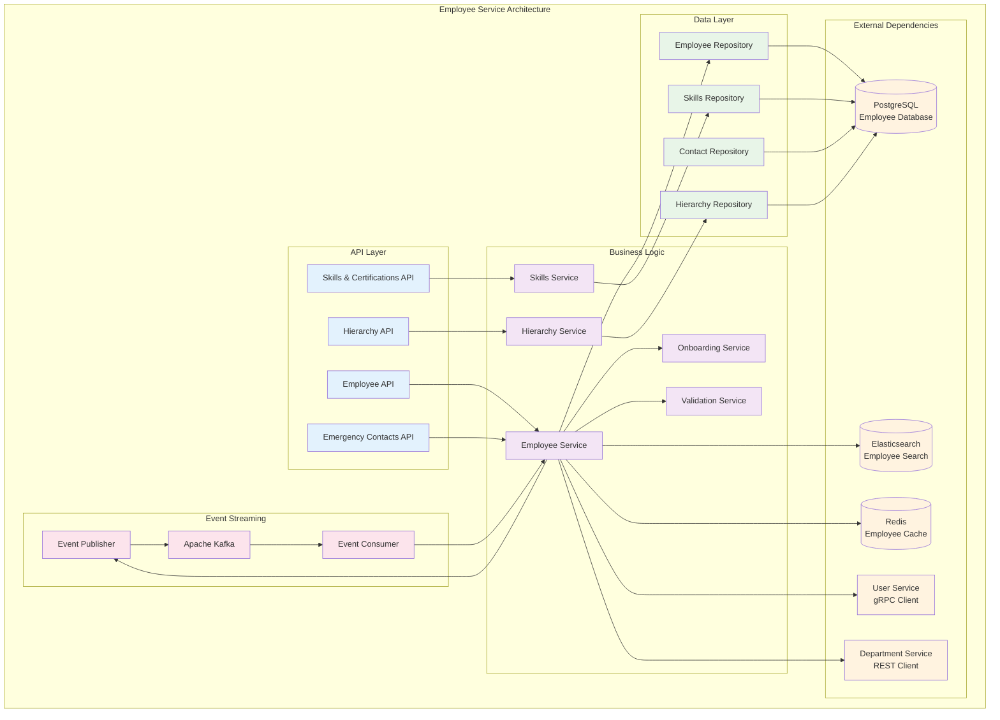

# Employee Management Service

## 🎯 Service Overview

The Employee Management Service handles employee lifecycle management, organizational hierarchy, and employee-related data across the HR microservices ecosystem.

### 🏗️ Service Architecture



## 📊 Database Schema

```sql
-- Employees table
CREATE TABLE employees (
    id UUID PRIMARY KEY DEFAULT gen_random_uuid(),
    user_id UUID UNIQUE NOT NULL, -- Reference to User Service
    employee_id VARCHAR(20) UNIQUE NOT NULL, -- Human-readable employee ID
    first_name VARCHAR(100) NOT NULL,
    last_name VARCHAR(100) NOT NULL,
    middle_name VARCHAR(100),
    preferred_name VARCHAR(100),
    date_of_birth DATE,
    gender VARCHAR(20),
    marital_status VARCHAR(20),
    nationality VARCHAR(100),
    personal_email VARCHAR(255),
    personal_phone VARCHAR(20),
    address JSONB, -- Flexible address structure
    department_id UUID, -- Reference to Department Service
    job_title VARCHAR(200) NOT NULL,
    job_level VARCHAR(50),
    employment_type VARCHAR(50) NOT NULL, -- full-time, part-time, contract, intern
    employment_status VARCHAR(50) NOT NULL, -- active, inactive, terminated, on_leave
    hire_date DATE NOT NULL,
    probation_end_date DATE,
    termination_date DATE,
    termination_reason TEXT,
    manager_id UUID REFERENCES employees(id),
    work_location VARCHAR(200),
    work_schedule VARCHAR(100),
    salary_grade VARCHAR(20),
    cost_center VARCHAR(50),
    is_manager BOOLEAN DEFAULT false,
    profile_picture_url VARCHAR(500),
    bio TEXT,
    created_at TIMESTAMP DEFAULT NOW(),
    updated_at TIMESTAMP DEFAULT NOW(),
    created_by UUID,
    updated_by UUID
);

-- Employee skills and certifications
CREATE TABLE employee_skills (
    id UUID PRIMARY KEY DEFAULT gen_random_uuid(),
    employee_id UUID REFERENCES employees(id) ON DELETE CASCADE,
    skill_name VARCHAR(200) NOT NULL,
    skill_category VARCHAR(100),
    proficiency_level VARCHAR(50), -- beginner, intermediate, advanced, expert
    years_of_experience INTEGER,
    is_certified BOOLEAN DEFAULT false,
    certification_name VARCHAR(200),
    certification_authority VARCHAR(200),
    certification_date DATE,
    expiry_date DATE,
    verification_status VARCHAR(50) DEFAULT 'pending',
    created_at TIMESTAMP DEFAULT NOW(),
    updated_at TIMESTAMP DEFAULT NOW()
);

-- Emergency contacts
CREATE TABLE emergency_contacts (
    id UUID PRIMARY KEY DEFAULT gen_random_uuid(),
    employee_id UUID REFERENCES employees(id) ON DELETE CASCADE,
    contact_name VARCHAR(200) NOT NULL,
    relationship VARCHAR(100) NOT NULL,
    phone_primary VARCHAR(20) NOT NULL,
    phone_secondary VARCHAR(20),
    email VARCHAR(255),
    address JSONB,
    is_primary_contact BOOLEAN DEFAULT false,
    created_at TIMESTAMP DEFAULT NOW(),
    updated_at TIMESTAMP DEFAULT NOW()
);

-- Employee documents metadata
CREATE TABLE employee_documents (
    id UUID PRIMARY KEY DEFAULT gen_random_uuid(),
    employee_id UUID REFERENCES employees(id) ON DELETE CASCADE,
    document_type VARCHAR(100) NOT NULL, -- resume, id_copy, contract, etc.
    document_name VARCHAR(255) NOT NULL,
    file_path VARCHAR(500) NOT NULL,
    file_size INTEGER,
    mime_type VARCHAR(100),
    upload_date TIMESTAMP DEFAULT NOW(),
    uploaded_by UUID,
    expiry_date DATE,
    is_confidential BOOLEAN DEFAULT false,
    access_level VARCHAR(50) DEFAULT 'employee', -- employee, manager, hr, admin
    verification_status VARCHAR(50) DEFAULT 'pending',
    verified_by UUID,
    verified_at TIMESTAMP
);

-- Employee hierarchy (for reporting relationships)
CREATE TABLE employee_hierarchy (
    id UUID PRIMARY KEY DEFAULT gen_random_uuid(),
    employee_id UUID REFERENCES employees(id) ON DELETE CASCADE,
    manager_id UUID REFERENCES employees(id) ON DELETE CASCADE,
    hierarchy_level INTEGER NOT NULL,
    is_direct_report BOOLEAN DEFAULT false,
    effective_from DATE NOT NULL,
    effective_to DATE,
    created_at TIMESTAMP DEFAULT NOW()
);

-- Employee work history (job changes within organization)
CREATE TABLE employee_work_history (
    id UUID PRIMARY KEY DEFAULT gen_random_uuid(),
    employee_id UUID REFERENCES employees(id) ON DELETE CASCADE,
    department_id UUID,
    job_title VARCHAR(200) NOT NULL,
    manager_id UUID,
    employment_type VARCHAR(50),
    salary_grade VARCHAR(20),
    effective_from DATE NOT NULL,
    effective_to DATE,
    change_reason VARCHAR(200),
    notes TEXT,
    created_at TIMESTAMP DEFAULT NOW(),
    created_by UUID
);

-- Employee performance ratings (basic tracking)
CREATE TABLE employee_performance_summary (
    id UUID PRIMARY KEY DEFAULT gen_random_uuid(),
    employee_id UUID REFERENCES employees(id) ON DELETE CASCADE,
    review_period VARCHAR(50) NOT NULL, -- 2024-Q1, 2024-Annual, etc.
    overall_rating DECIMAL(3,2), -- 1.00 to 5.00
    goals_rating DECIMAL(3,2),
    competency_rating DECIMAL(3,2),
    reviewer_id UUID,
    review_date DATE,
    status VARCHAR(50) DEFAULT 'draft', -- draft, submitted, approved, finalized
    created_at TIMESTAMP DEFAULT NOW(),
    updated_at TIMESTAMP DEFAULT NOW()
);

-- Indexes for performance optimization
CREATE INDEX idx_employees_user_id ON employees(user_id);
CREATE INDEX idx_employees_employee_id ON employees(employee_id);
CREATE INDEX idx_employees_department_id ON employees(department_id);
CREATE INDEX idx_employees_manager_id ON employees(manager_id);
CREATE INDEX idx_employees_status ON employees(employment_status);
CREATE INDEX idx_employees_hire_date ON employees(hire_date);
CREATE INDEX idx_employees_search ON employees USING gin(to_tsvector('english', first_name || ' ' || last_name || ' ' || job_title));

CREATE INDEX idx_employee_skills_employee_id ON employee_skills(employee_id);
CREATE INDEX idx_employee_skills_category ON employee_skills(skill_category);
CREATE INDEX idx_employee_skills_proficiency ON employee_skills(proficiency_level);

CREATE INDEX idx_emergency_contacts_employee_id ON emergency_contacts(employee_id);
CREATE INDEX idx_emergency_contacts_primary ON emergency_contacts(is_primary_contact);

CREATE INDEX idx_employee_documents_employee_id ON employee_documents(employee_id);
CREATE INDEX idx_employee_documents_type ON employee_documents(document_type);
CREATE INDEX idx_employee_documents_expiry ON employee_documents(expiry_date);

CREATE INDEX idx_employee_hierarchy_employee_id ON employee_hierarchy(employee_id);
CREATE INDEX idx_employee_hierarchy_manager_id ON employee_hierarchy(manager_id);
CREATE INDEX idx_employee_hierarchy_level ON employee_hierarchy(hierarchy_level);

CREATE INDEX idx_employee_work_history_employee_id ON employee_work_history(employee_id);
CREATE INDEX idx_employee_work_history_effective ON employee_work_history(effective_from, effective_to);

CREATE INDEX idx_employee_performance_employee_id ON employee_performance_summary(employee_id);
CREATE INDEX idx_employee_performance_period ON employee_performance_summary(review_period);
```

## 🔗 API Endpoints

### Employee Management Endpoints

```yaml
# Employee Management API
/api/v1/employees:
  get:
    summary: List employees with advanced filtering and search
    security:
      - bearerAuth: []
    parameters:
      - name: page
        in: query
        schema:
          type: integer
          default: 1
      - name: limit
        in: query
        schema:
          type: integer
          default: 20
          maximum: 100
      - name: search
        in: query
        description: Search by name, employee ID, or job title
        schema:
          type: string
      - name: department_id
        in: query
        schema:
          type: string
          format: uuid
      - name: manager_id
        in: query
        schema:
          type: string
          format: uuid
      - name: employment_status
        in: query
        schema:
          type: string
          enum: [active, inactive, terminated, on_leave]
      - name: employment_type
        in: query
        schema:
          type: string
          enum: [full-time, part-time, contract, intern]
      - name: job_level
        in: query
        schema:
          type: string
      - name: hire_date_from
        in: query
        schema:
          type: string
          format: date
      - name: hire_date_to
        in: query
        schema:
          type: string
          format: date
      - name: include
        in: query
        description: Include related data (skills, contacts, hierarchy, documents)
        schema:
          type: array
          items:
            type: string
            enum: [skills, contacts, hierarchy, documents, manager, direct_reports]
    responses:
      200:
        description: List of employees
        content:
          application/json:
            schema:
              type: object
              properties:
                data:
                  type: array
                  items:
                    $ref: '#/components/schemas/Employee'
                pagination:
                  $ref: '#/components/schemas/Pagination'
                filters:
                  type: object
                  description: Applied filters for reference
  
  post:
    summary: Create new employee profile
    security:
      - bearerAuth: []
    requestBody:
      required: true
      content:
        application/json:
          schema:
            $ref: '#/components/schemas/CreateEmployeeRequest'
    responses:
      201:
        description: Employee created successfully
        content:
          application/json:
            schema:
              $ref: '#/components/schemas/Employee'
      400:
        description: Validation error
      409:
        description: Employee ID or User ID already exists

/api/v1/employees/{id}:
  get:
    summary: Get employee details by ID
    security:
      - bearerAuth: []
    parameters:
      - name: id
        in: path
        required: true
        schema:
          type: string
          format: uuid
      - name: include
        in: query
        description: Include related data
        schema:
          type: array
          items:
            type: string
            enum: [skills, contacts, hierarchy, documents, manager, direct_reports, work_history, performance]
    responses:
      200:
        description: Employee details
        content:
          application/json:
            schema:
              $ref: '#/components/schemas/EmployeeDetailed'
      404:
        description: Employee not found
  
  put:
    summary: Update employee profile
    security:
      - bearerAuth: []
    parameters:
      - name: id
        in: path
        required: true
        schema:
          type: string
          format: uuid
    requestBody:
      required: true
      content:
        application/json:
          schema:
            $ref: '#/components/schemas/UpdateEmployeeRequest'
    responses:
      200:
        description: Employee updated successfully
        content:
          application/json:
            schema:
              $ref: '#/components/schemas/Employee'
      404:
        description: Employee not found
      400:
        description: Validation error
  
  patch:
    summary: Partially update employee profile
    security:
      - bearerAuth: []
    parameters:
      - name: id
        in: path
        required: true
        schema:
          type: string
          format: uuid
    requestBody:
      required: true
      content:
        application/json:
          schema:
            $ref: '#/components/schemas/PatchEmployeeRequest'
    responses:
      200:
        description: Employee updated successfully
      404:
        description: Employee not found

/api/v1/employees/{id}/hierarchy:
  get:
    summary: Get employee organizational hierarchy
    security:
      - bearerAuth: []
    parameters:
      - name: id
        in: path
        required: true
        schema:
          type: string
          format: uuid
      - name: direction
        in: query
        schema:
          type: string
          enum: [up, down, both]
          default: both
      - name: levels
        in: query
        description: Number of hierarchy levels to include
        schema:
          type: integer
          default: 3
          maximum: 10
    responses:
      200:
        description: Employee hierarchy tree
        content:
          application/json:
            schema:
              type: object
              properties:
                employee:
                  $ref: '#/components/schemas/Employee'
                hierarchy:
                  type: object
                  properties:
                    managers:
                      type: array
                      items:
                        $ref: '#/components/schemas/HierarchyNode'
                    direct_reports:
                      type: array
                      items:
                        $ref: '#/components/schemas/HierarchyNode'
                    all_reports:
                      type: array
                      items:
                        $ref: '#/components/schemas/HierarchyNode'

/api/v1/employees/{id}/skills:
  get:
    summary: Get employee skills and certifications
    security:
      - bearerAuth: []
    parameters:
      - name: id
        in: path
        required: true
        schema:
          type: string
          format: uuid
      - name: category
        in: query
        schema:
          type: string
      - name: certified_only
        in: query
        schema:
          type: boolean
          default: false
    responses:
      200:
        description: Employee skills
        content:
          application/json:
            schema:
              type: object
              properties:
                employee_id:
                  type: string
                  format: uuid
                skills:
                  type: array
                  items:
                    $ref: '#/components/schemas/EmployeeSkill'
                skill_categories:
                  type: array
                  items:
                    type: string
                certification_summary:
                  type: object
                  properties:
                    total_certifications:
                      type: integer
                    active_certifications:
                      type: integer
                    expiring_soon:
                      type: integer
  
  post:
    summary: Add skill or certification to employee
    security:
      - bearerAuth: []
    parameters:
      - name: id
        in: path
        required: true
        schema:
          type: string
          format: uuid
    requestBody:
      required: true
      content:
        application/json:
          schema:
            $ref: '#/components/schemas/AddSkillRequest'
    responses:
      201:
        description: Skill added successfully
        content:
          application/json:
            schema:
              $ref: '#/components/schemas/EmployeeSkill'
      400:
        description: Validation error

/api/v1/employees/{id}/contacts:
  get:
    summary: Get employee emergency contacts
    security:
      - bearerAuth: []
    parameters:
      - name: id
        in: path
        required: true
        schema:
          type: string
          format: uuid
    responses:
      200:
        description: Emergency contacts
        content:
          application/json:
            schema:
              type: object
              properties:
                employee_id:
                  type: string
                  format: uuid
                contacts:
                  type: array
                  items:
                    $ref: '#/components/schemas/EmergencyContact'
  
  post:
    summary: Add emergency contact
    security:
      - bearerAuth: []
    parameters:
      - name: id
        in: path
        required: true
        schema:
          type: string
          format: uuid
    requestBody:
      required: true
      content:
        application/json:
          schema:
            $ref: '#/components/schemas/AddContactRequest'
    responses:
      201:
        description: Contact added successfully
        content:
          application/json:
            schema:
              $ref: '#/components/schemas/EmergencyContact'

/api/v1/employees/search:
  get:
    summary: Advanced employee search with full-text search
    security:
      - bearerAuth: []
    parameters:
      - name: q
        in: query
        required: true
        description: Search query (name, skills, job title, etc.)
        schema:
          type: string
      - name: filters
        in: query
        description: JSON string of additional filters
        schema:
          type: string
      - name: sort
        in: query
        schema:
          type: string
          enum: [relevance, name, hire_date, last_updated]
          default: relevance
      - name: page
        in: query
        schema:
          type: integer
          default: 1
      - name: limit
        in: query
        schema:
          type: integer
          default: 20
    responses:
      200:
        description: Search results
        content:
          application/json:
            schema:
              type: object
              properties:
                query:
                  type: string
                results:
                  type: array
                  items:
                    $ref: '#/components/schemas/EmployeeSearchResult'
                total_results:
                  type: integer
                search_time_ms:
                  type: integer
                pagination:
                  $ref: '#/components/schemas/Pagination'

/api/v1/employees/analytics:
  get:
    summary: Employee analytics and insights
    security:
      - bearerAuth: []
    parameters:
      - name: metric
        in: query
        required: true
        schema:
          type: string
          enum: [headcount, demographics, skills_gap, hierarchy_depth, tenure, diversity]
      - name: department_id
        in: query
        schema:
          type: string
          format: uuid
      - name: period
        in: query
        schema:
          type: string
          enum: [current, ytd, last_year, custom]
          default: current
      - name: start_date
        in: query
        schema:
          type: string
          format: date
      - name: end_date
        in: query
        schema:
          type: string
          format: date
    responses:
      200:
        description: Analytics data
        content:
          application/json:
            schema:
              type: object
              properties:
                metric:
                  type: string
                period:
                  type: string
                data:
                  type: object
                  description: Metric-specific data structure
                generated_at:
                  type: string
                  format: date-time
```

## 🐳 Docker Configuration

### Dockerfile (Laravel-based)
```dockerfile
# Laravel Employee Service
FROM php:8.3-fpm-alpine AS base

# Install system dependencies
RUN apk add --no-cache \
    git \
    curl \
    libpng-dev \
    libxml2-dev \
    zip \
    unzip \
    postgresql-dev \
    oniguruma-dev \
    freetype-dev \
    libjpeg-turbo-dev \
    libzip-dev

# Install PHP extensions
RUN docker-php-ext-configure gd --with-freetype --with-jpeg
RUN docker-php-ext-install \
    pdo \
    pdo_pgsql \
    mbstring \
    exif \
    pcntl \
    bcmath \
    gd \
    zip \
    intl \
    xml

# Install Redis extension
RUN pecl install redis && docker-php-ext-enable redis

# Install Composer
COPY --from=composer:latest /usr/bin/composer /usr/bin/composer

# Set working directory
WORKDIR /var/www

# Copy composer files
COPY composer.json composer.lock ./

# Install dependencies
RUN composer install --no-dev --optimize-autoloader --no-scripts

# Copy application code
COPY . .

# Generate optimized autoload files
RUN composer dump-autoload --optimize

# Set permissions
RUN chown -R www-data:www-data /var/www \
    && chmod -R 755 /var/www/storage \
    && chmod -R 755 /var/www/bootstrap/cache

# Production stage
FROM base AS production

# Copy Nginx configuration
COPY docker/nginx.conf /etc/nginx/nginx.conf
COPY docker/default.conf /etc/nginx/conf.d/default.conf

# Install Supervisor
RUN apk add --no-cache supervisor nginx

# Copy supervisor configuration
COPY docker/supervisord.conf /etc/supervisor/conf.d/supervisord.conf

# Create run directory for nginx
RUN mkdir -p /run/nginx

# Health check
HEALTHCHECK --interval=30s --timeout=3s --start-period=5s --retries=3 \
  CMD curl -f http://localhost/health || exit 1

# Expose port
EXPOSE 80

# Start supervisor
CMD ["/usr/bin/supervisord", "-c", "/etc/supervisor/conf.d/supervisord.conf"]
```

### Docker Compose Configuration
```yaml
# Employee Service in docker-compose.microservices.yml
services:
  employee-service:
    build:
      context: ./microservices/services/employee-service
      dockerfile: Dockerfile
      target: production
    container_name: hr_employee_service
    ports:
      - "3002:80"
    environment:
      - APP_ENV=production
      - APP_KEY=your-32-character-secret-key
      - DB_CONNECTION=pgsql
      - DB_HOST=employee-db
      - DB_PORT=5432
      - DB_DATABASE=employee_service
      - DB_USERNAME=postgres
      - DB_PASSWORD=password
      - REDIS_HOST=redis-cluster
      - REDIS_PORT=6379
      - ELASTICSEARCH_HOST=elasticsearch
      - ELASTICSEARCH_PORT=9200
      - KAFKA_BROKERS=kafka1:9092,kafka2:9092,kafka3:9092
      - USER_SERVICE_URL=http://user-service:3001
      - DEPARTMENT_SERVICE_URL=http://department-service:3003
    depends_on:
      - employee-db
      - redis-cluster
      - elasticsearch
      - kafka1
      - user-service
    volumes:
      - ./logs/employee-service:/var/www/storage/logs
      - employee_storage:/var/www/storage/app
    restart: unless-stopped
    networks:
      - microservices-network
    deploy:
      resources:
        limits:
          memory: 1G
          cpus: '1.0'
        reservations:
          memory: 512M
          cpus: '0.5'
    healthcheck:
      test: ["CMD", "curl", "-f", "http://localhost/health"]
      interval: 30s
      timeout: 10s
      retries: 3
      start_period: 60s

  employee-db:
    image: postgres:15-alpine
    container_name: hr_employee_db
    environment:
      - POSTGRES_DB=employee_service
      - POSTGRES_USER=postgres
      - POSTGRES_PASSWORD=password
    volumes:
      - employee_db_data:/var/lib/postgresql/data
      - ./microservices/services/employee-service/database/schema.sql:/docker-entrypoint-initdb.d/01-schema.sql
      - ./microservices/services/employee-service/database/indexes.sql:/docker-entrypoint-initdb.d/02-indexes.sql
      - ./microservices/services/employee-service/database/seed.sql:/docker-entrypoint-initdb.d/03-seed.sql
    ports:
      - "5433:5432"
    restart: unless-stopped
    networks:
      - microservices-network
    deploy:
      resources:
        limits:
          memory: 512M
          cpus: '0.5'

  # Elasticsearch for employee search
  elasticsearch:
    image: elasticsearch:8.11.0
    container_name: hr_elasticsearch
    environment:
      - discovery.type=single-node
      - xpack.security.enabled=false
      - "ES_JAVA_OPTS=-Xms512m -Xmx512m"
    volumes:
      - elasticsearch_data:/usr/share/elasticsearch/data
    ports:
      - "9200:9200"
    restart: unless-stopped
    networks:
      - microservices-network
    deploy:
      resources:
        limits:
          memory: 1G
          cpus: '0.5'

volumes:
  employee_db_data:
  employee_storage:
  elasticsearch_data:

networks:
  microservices-network:
    driver: bridge
```

## 🔄 Event Handling

### Event Publisher (Laravel)
```php
<?php
// app/Services/EventPublisher.php

namespace App\Services;

use App\Events\EmployeeCreated;
use App\Events\EmployeeUpdated;
use App\Events\EmployeeTerminated;
use Illuminate\Support\Facades\Log;
use Junges\Kafka\Facades\Kafka;
use Junges\Kafka\Message\Message;

class EmployeeEventPublisher
{
    private string $topic = 'employee-events';

    public function publishEmployeeCreated(array $employeeData): void
    {
        $event = [
            'eventId' => (string) \Illuminate\Support\Str::uuid(),
            'eventType' => 'employee.created',
            'timestamp' => now()->toISOString(),
            'version' => '1.0',
            'source' => 'employee-service',
            'data' => [
                'employeeId' => $employeeData['id'],
                'userId' => $employeeData['user_id'],
                'employeeCode' => $employeeData['employee_id'],
                'firstName' => $employeeData['first_name'],
                'lastName' => $employeeData['last_name'],
                'email' => $employeeData['email'] ?? null,
                'departmentId' => $employeeData['department_id'],
                'managerId' => $employeeData['manager_id'],
                'jobTitle' => $employeeData['job_title'],
                'employmentType' => $employeeData['employment_type'],
                'employmentStatus' => $employeeData['employment_status'],
                'hireDate' => $employeeData['hire_date'],
                'workLocation' => $employeeData['work_location'],
                'salaryGrade' => $employeeData['salary_grade'],
                'costCenter' => $employeeData['cost_center'],
                'isManager' => $employeeData['is_manager'],
                'createdAt' => $employeeData['created_at'],
                'createdBy' => $employeeData['created_by']
            ]
        ];

        $this->publishEvent($event, $employeeData['id']);
    }

    public function publishEmployeeUpdated(array $employeeData, array $changes): void
    {
        $event = [
            'eventId' => (string) \Illuminate\Support\Str::uuid(),
            'eventType' => 'employee.updated',
            'timestamp' => now()->toISOString(),
            'version' => '1.0',
            'source' => 'employee-service',
            'data' => [
                'employeeId' => $employeeData['id'],
                'userId' => $employeeData['user_id'],
                'employeeCode' => $employeeData['employee_id'],
                'changes' => $changes,
                'updatedAt' => now()->toISOString(),
                'updatedBy' => auth()->id()
            ]
        ];

        $this->publishEvent($event, $employeeData['id']);
    }

    public function publishEmployeeTerminated(array $employeeData): void
    {
        $event = [
            'eventId' => (string) \Illuminate\Support\Str::uuid(),
            'eventType' => 'employee.terminated',
            'timestamp' => now()->toISOString(),
            'version' => '1.0',
            'source' => 'employee-service',
            'data' => [
                'employeeId' => $employeeData['id'],
                'userId' => $employeeData['user_id'],
                'employeeCode' => $employeeData['employee_id'],
                'terminationDate' => $employeeData['termination_date'],
                'terminationReason' => $employeeData['termination_reason'],
                'finalWorkDate' => $employeeData['final_work_date'] ?? $employeeData['termination_date'],
                'terminatedBy' => auth()->id(),
                'terminatedAt' => now()->toISOString()
            ]
        ];

        $this->publishEvent($event, $employeeData['id']);
    }

    public function publishDepartmentChanged(array $employeeData, string $previousDepartmentId): void
    {
        $event = [
            'eventId' => (string) \Illuminate\Support\Str::uuid(),
            'eventType' => 'employee.department_changed',
            'timestamp' => now()->toISOString(),
            'version' => '1.0',
            'source' => 'employee-service',
            'data' => [
                'employeeId' => $employeeData['id'],
                'userId' => $employeeData['user_id'],
                'previousDepartmentId' => $previousDepartmentId,
                'newDepartmentId' => $employeeData['department_id'],
                'effectiveDate' => $employeeData['department_change_date'] ?? now()->toDateString(),
                'changedBy' => auth()->id(),
                'changedAt' => now()->toISOString()
            ]
        ];

        $this->publishEvent($event, $employeeData['id']);
    }

    private function publishEvent(array $event, string $partitionKey): void
    {
        try {
            $message = new Message(
                body: $event,
                headers: [
                    'event-type' => $event['eventType'],
                    'event-version' => $event['version'],
                    'content-type' => 'application/json'
                ]
            );

            Kafka::publishOn($this->topic)
                ->withMessage($message)
                ->withKey($partitionKey)
                ->send();

            Log::info('Employee event published', [
                'event_type' => $event['eventType'],
                'event_id' => $event['eventId'],
                'employee_id' => $partitionKey
            ]);

        } catch (\Exception $e) {
            Log::error('Failed to publish employee event', [
                'event_type' => $event['eventType'],
                'error' => $e->getMessage(),
                'employee_id' => $partitionKey
            ]);

            // Could implement retry mechanism or dead letter queue here
            throw $e;
        }
    }
}
```

### Event Consumer (Laravel)
```php
<?php
// app/Services/EventConsumer.php

namespace App\Services;

use App\Models\Employee;
use Illuminate\Support\Facades\Log;
use Junges\Kafka\Contracts\ConsumerMessage;

class EmployeeEventConsumer
{
    public function handleUserCreated(ConsumerMessage $message): void
    {
        $payload = $message->getBody();
        
        Log::info('Received user.created event', [
            'event_id' => $payload['eventId'],
            'user_id' => $payload['data']['userId']
        ]);

        // If this user should have an employee profile, create one
        // This could be triggered by specific roles or user types
        if ($this->shouldCreateEmployeeProfile($payload['data'])) {
            $this->createEmployeeProfileFromUser($payload['data']);
        }
    }

    public function handleDepartmentUpdated(ConsumerMessage $message): void
    {
        $payload = $message->getBody();
        
        Log::info('Received department.updated event', [
            'event_id' => $payload['eventId'],
            'department_id' => $payload['data']['departmentId']
        ]);

        // Update employees who belong to this department
        Employee::where('department_id', $payload['data']['departmentId'])
            ->update([
                'updated_at' => now()
            ]);

        // Could trigger additional processing like hierarchy recalculation
    }

    public function handleLeaveApproved(ConsumerMessage $message): void
    {
        $payload = $message->getBody();
        
        Log::info('Received leave.approved event', [
            'event_id' => $payload['eventId'],
            'employee_id' => $payload['data']['employeeId']
        ]);

        // Update employee status if it's a long-term leave
        if ($payload['data']['leaveType'] === 'maternity' || 
            $payload['data']['leaveType'] === 'medical' ||
            $payload['data']['duration'] >= 30) {
            
            Employee::where('id', $payload['data']['employeeId'])
                ->update([
                    'employment_status' => 'on_leave',
                    'updated_at' => now()
                ]);
        }
    }

    private function shouldCreateEmployeeProfile(array $userData): bool
    {
        // Business logic to determine if user needs employee profile
        // Could be based on roles, user type, or other criteria
        return in_array('employee', $userData['roles'] ?? []) || 
               in_array('manager', $userData['roles'] ?? []);
    }

    private function createEmployeeProfileFromUser(array $userData): void
    {
        try {
            $employee = Employee::create([
                'user_id' => $userData['userId'],
                'employee_id' => $this->generateEmployeeId(),
                'first_name' => $userData['firstName'],
                'last_name' => $userData['lastName'],
                'employment_type' => 'full-time',
                'employment_status' => 'active',
                'hire_date' => now()->toDateString(),
                'job_title' => 'TBD', // To be updated by HR
                'created_by' => $userData['createdBy'] ?? null
            ]);

            Log::info('Employee profile created from user event', [
                'employee_id' => $employee->id,
                'user_id' => $userData['userId']
            ]);

        } catch (\Exception $e) {
            Log::error('Failed to create employee profile from user event', [
                'user_id' => $userData['userId'],
                'error' => $e->getMessage()
            ]);
        }
    }

    private function generateEmployeeId(): string
    {
        // Generate unique employee ID
        $prefix = 'EMP';
        $year = date('Y');
        $sequence = Employee::whereYear('created_at', $year)->count() + 1;
        
        return sprintf('%s%s%04d', $prefix, $year, $sequence);
    }
}
```

## 🔍 Search Implementation (Elasticsearch)

```php
<?php
// app/Services/EmployeeSearchService.php

namespace App\Services;

use Elasticsearch\Client;
use Illuminate\Support\Collection;

class EmployeeSearchService
{
    private Client $elasticsearch;
    private string $index = 'employees';

    public function __construct(Client $elasticsearch)
    {
        $this->elasticsearch = $elasticsearch;
    }

    public function search(string $query, array $filters = [], int $page = 1, int $limit = 20): array
    {
        $from = ($page - 1) * $limit;

        $searchParams = [
            'index' => $this->index,
            'body' => [
                'from' => $from,
                'size' => $limit,
                'query' => $this->buildQuery($query, $filters),
                'sort' => $this->buildSort($filters['sort'] ?? 'relevance'),
                'highlight' => [
                    'fields' => [
                        'first_name' => new \stdClass(),
                        'last_name' => new \stdClass(),
                        'job_title' => new \stdClass(),
                        'skills.skill_name' => new \stdClass()
                    ]
                ],
                'aggs' => [
                    'departments' => [
                        'terms' => ['field' => 'department_id.keyword']
                    ],
                    'employment_types' => [
                        'terms' => ['field' => 'employment_type.keyword']
                    ],
                    'job_levels' => [
                        'terms' => ['field' => 'job_level.keyword']
                    ]
                ]
            ]
        ];

        $response = $this->elasticsearch->search($searchParams);

        return [
            'results' => $this->formatResults($response['hits']['hits']),
            'total' => $response['hits']['total']['value'],
            'aggregations' => $response['aggregations'] ?? [],
            'took' => $response['took']
        ];
    }

    public function indexEmployee(array $employeeData): void
    {
        $doc = [
            'index' => $this->index,
            'id' => $employeeData['id'],
            'body' => [
                'employee_id' => $employeeData['employee_id'],
                'first_name' => $employeeData['first_name'],
                'last_name' => $employeeData['last_name'],
                'full_name' => $employeeData['first_name'] . ' ' . $employeeData['last_name'],
                'job_title' => $employeeData['job_title'],
                'department_id' => $employeeData['department_id'],
                'employment_type' => $employeeData['employment_type'],
                'employment_status' => $employeeData['employment_status'],
                'job_level' => $employeeData['job_level'],
                'hire_date' => $employeeData['hire_date'],
                'is_manager' => $employeeData['is_manager'],
                'skills' => $employeeData['skills'] ?? [],
                'work_location' => $employeeData['work_location'],
                'indexed_at' => now()->toISOString()
            ]
        ];

        $this->elasticsearch->index($doc);
    }

    private function buildQuery(string $query, array $filters): array
    {
        $must = [];
        $filter = [];

        // Full-text search
        if (!empty($query)) {
            $must[] = [
                'multi_match' => [
                    'query' => $query,
                    'fields' => [
                        'full_name^3',
                        'employee_id^2',
                        'job_title^2',
                        'skills.skill_name'
                    ],
                    'type' => 'best_fields',
                    'fuzziness' => 'AUTO'
                ]
            ];
        }

        // Filters
        if (!empty($filters['department_id'])) {
            $filter[] = ['term' => ['department_id.keyword' => $filters['department_id']]];
        }

        if (!empty($filters['employment_status'])) {
            $filter[] = ['term' => ['employment_status.keyword' => $filters['employment_status']]];
        }

        if (!empty($filters['employment_type'])) {
            $filter[] = ['term' => ['employment_type.keyword' => $filters['employment_type']]];
        }

        if (!empty($filters['is_manager'])) {
            $filter[] = ['term' => ['is_manager' => $filters['is_manager']]];
        }

        $queryBody = ['bool' => []];

        if (!empty($must)) {
            $queryBody['bool']['must'] = $must;
        } else {
            $queryBody['bool']['must'] = [['match_all' => new \stdClass()]];
        }

        if (!empty($filter)) {
            $queryBody['bool']['filter'] = $filter;
        }

        return $queryBody;
    }

    private function buildSort(string $sortBy): array
    {
        switch ($sortBy) {
            case 'name':
                return [['full_name.keyword' => ['order' => 'asc']]];
            case 'hire_date':
                return [['hire_date' => ['order' => 'desc']]];
            case 'relevance':
            default:
                return [['_score' => ['order' => 'desc']]];
        }
    }

    private function formatResults(array $hits): array
    {
        return array_map(function ($hit) {
            return [
                'id' => $hit['_id'],
                'score' => $hit['_score'],
                'source' => $hit['_source'],
                'highlights' => $hit['highlight'] ?? []
            ];
        }, $hits);
    }
}
```

---

**Next**: [Attendance Service](../attendance-service/README.md) | [API Gateway Implementation](../../infrastructure/api-gateway.md)