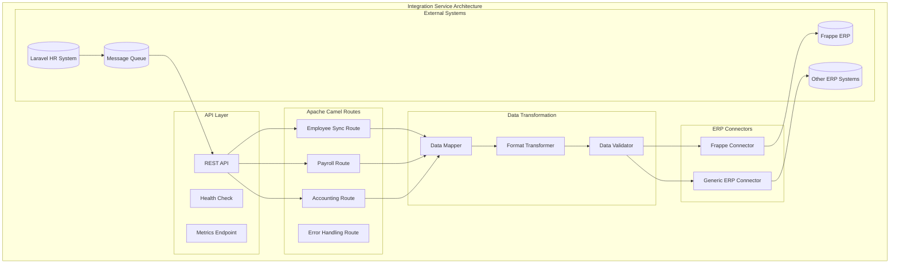

# ERP Integration Service

## Overview

This microservice provides integration capabilities with legacy ERP systems like Frappe for accounting and payroll data synchronization.

## Architecture

## Features

- **Real-time Data Synchronization**: Sync employee, payroll, and accounting data
- **Multiple ERP Support**: Extensible architecture for various ERP systems
- **Data Transformation**: Automatic mapping between different data formats
- **Error Handling**: Comprehensive error handling and retry mechanisms
- **Monitoring**: Built-in metrics and health checks
- **Security**: Secure authentication and data encryption

## Supported ERP Systems

### Frappe/ERPNext
- Employee management synchronization
- Payroll processing integration
- Accounting data exchange
- Leave management integration

### Generic ERP
- Configurable API endpoints
- Custom data mapping
- Flexible authentication methods

## Quick Start

1. Configure your ERP system connection details
2. Set up authentication credentials
3. Define data mapping rules
4. Start the integration service
5. Monitor data flow through provided endpoints

## Configuration

See `application.yml` for detailed configuration options.

## API Documentation

The service provides REST APIs for:
- Triggering manual synchronization
- Monitoring integration status
- Managing configuration
- Health checks and metrics

## Monitoring

- Health check endpoint: `/health`
- Metrics endpoint: `/metrics`
- Integration status: `/api/integration/status`